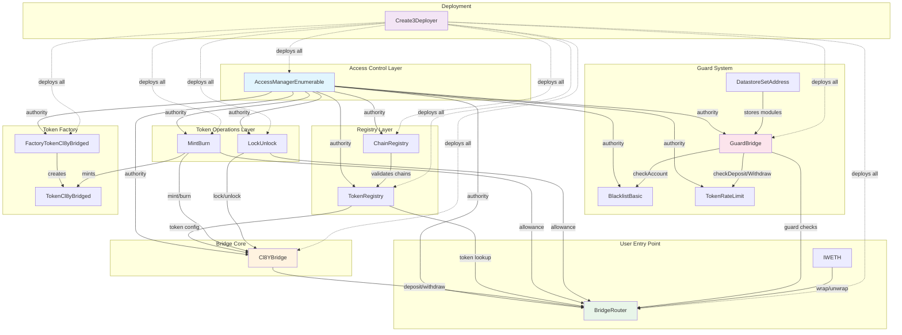
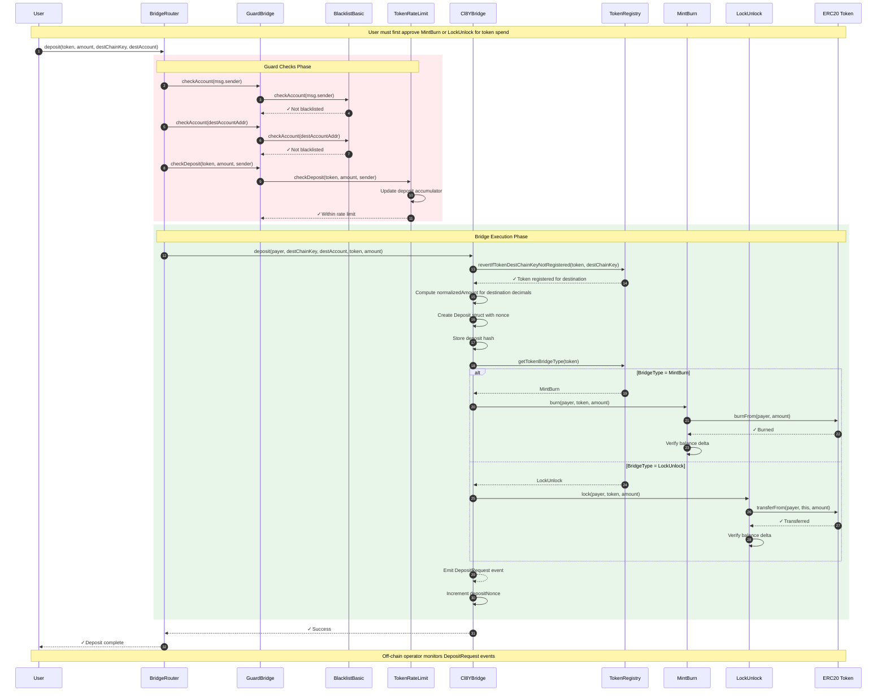
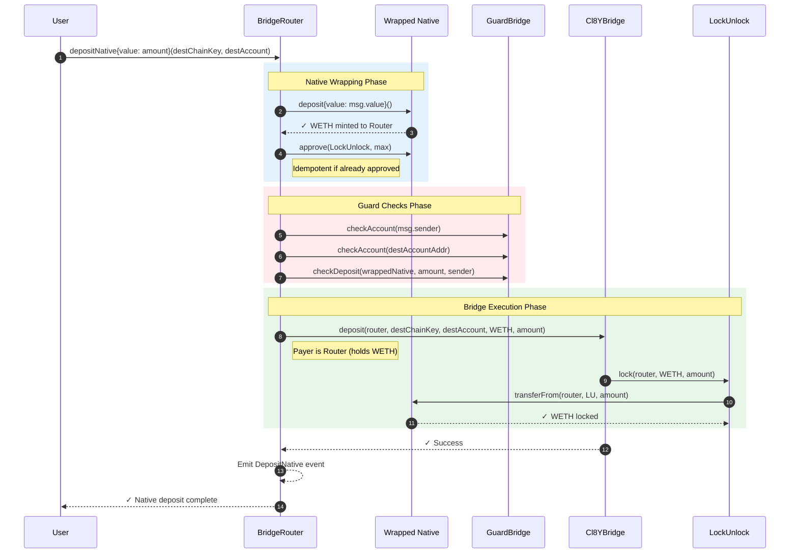
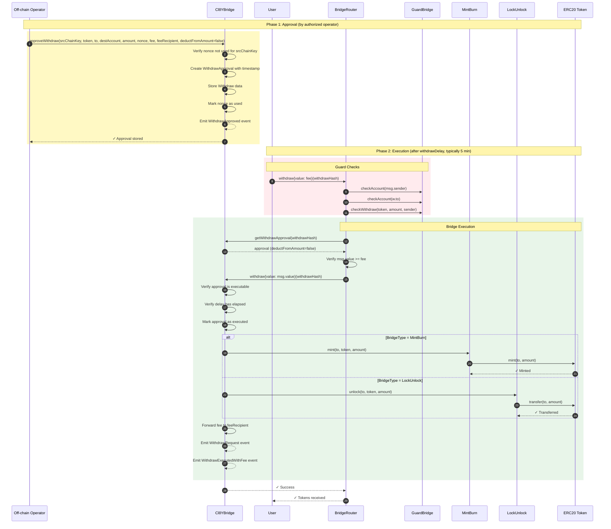
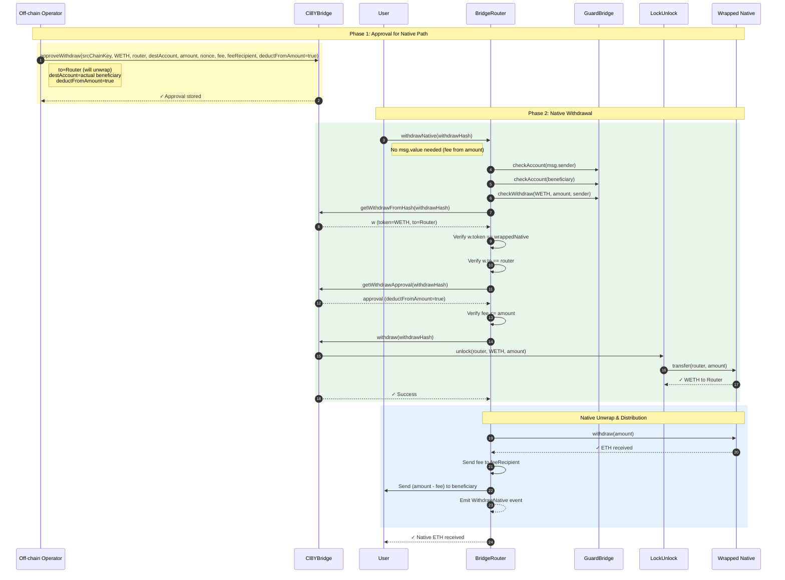
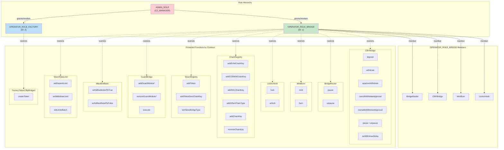
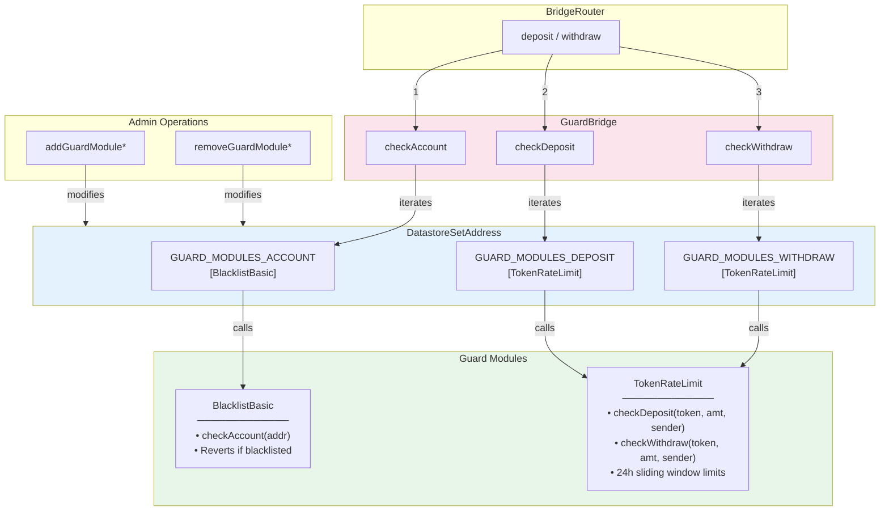
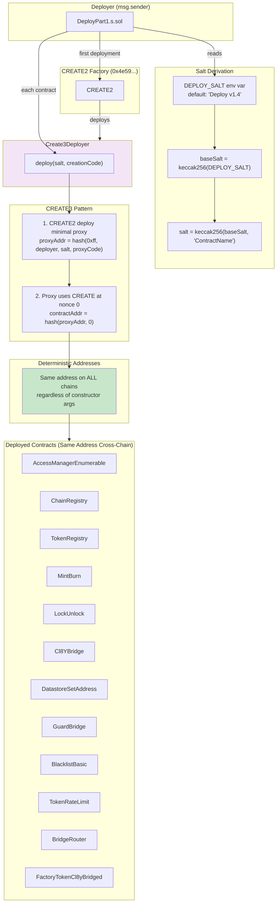
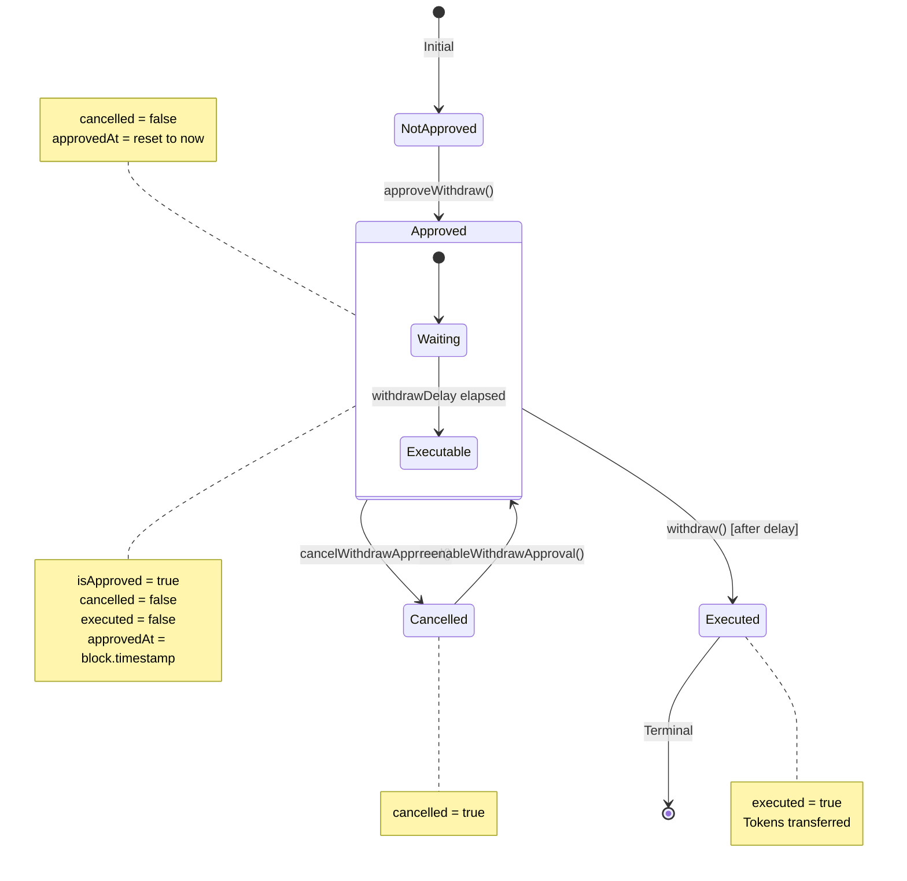

# CL8Y Bridge EVM Smart Contracts - Code Review Plan

This document outlines a comprehensive, multi-stage code review plan for the CL8Y Bridge EVM smart contracts. The review covers security analysis, test validation, documentation restructuring, live contract verification, and a deep dive into deterministic deployment patterns.

---

## Table of Contents

1. [Overview](#1-overview)
2. [Stage 1: Test Suite Review](#2-stage-1-test-suite-review)
3. [Stage 2: Source Code Sanity Check](#3-stage-2-source-code-sanity-check)
4. [Stage 3: Architecture Diagrams](#4-stage-3-architecture-diagrams)
5. [Stage 4: Documentation Restructure](#5-stage-4-documentation-restructure)
6. [Stage 5: README Overhaul](#6-stage-5-readme-overhaul)
7. [Stage 6: Live Testnet Contract Review](#7-stage-6-live-testnet-contract-review)
8. [Stage 7: Deterministic Address Deployment Analysis](#8-stage-7-deterministic-address-deployment-analysis)
9. [Stage 8: Multi-Stage Security Audit](#9-stage-8-multi-stage-security-audit)
10. [Appendix: Checklists & Templates](#10-appendix-checklists--templates)

---

## 1. Overview

### Project Summary

The CL8Y Bridge is a community-operated cross-chain bridge supporting EVM, CosmWasm, and Solana ecosystems. The EVM smart contracts implement:

- **Core Bridge Logic**: Deposit/withdrawal state machine with approval delays
- **Token Handling**: Mint/Burn and Lock/Unlock strategies per token
- **Registry System**: Chain and token registration with cross-chain address encoding
- **Guard System**: Composable policy checks (blacklists, rate limits)
- **Access Control**: Role-based permissions via `AccessManagerEnumerable`
- **Deterministic Deployment**: CREATE3 pattern for cross-chain address consistency

### Contract Inventory

| Contract | Purpose |
|----------|---------|
| `CL8YBridge.sol` | Core state machine for deposits, approvals, withdrawals |
| `BridgeRouter.sol` | User entrypoint with guard checks and native unwrap |
| `TokenRegistry.sol` | Token/chain mapping and bridge type selection |
| `ChainRegistry.sol` | Canonical chain key generation and registry |
| `MintBurn.sol` | Mint/burn token operations |
| `LockUnlock.sol` | Lock/unlock token operations |
| `GuardBridge.sol` | Composable guard module orchestration |
| `BlacklistBasic.sol` | Account blacklist guard module |
| `TokenRateLimit.sol` | Per-token deposit/withdraw rate limiting |
| `AccessManagerEnumerable.sol` | Extended OpenZeppelin AccessManager |
| `Create3Deployer.sol` | Deterministic cross-chain deployment |
| `DatastoreSetAddress.sol` | Generic address set storage |
| `FactoryTokenCl8yBridged.sol` | Bridged token factory |
| `TokenCl8yBridged.sol` | Standard bridged ERC20 token |

### Review Objectives

- [x] Validate test coverage and edge case handling *(Stage 1 complete: 98.15% line coverage, 363 tests passing)*
- [x] Identify security vulnerabilities and logic bugs *(Stage 2 complete: 0 critical/high/medium issues found)*
- [x] Verify access control correctness *(Stage 2 complete: 42 restricted functions verified)*
- [ ] Validate deterministic deployment guarantees
- [ ] Confirm live testnet contract state matches expectations
- [ ] Create comprehensive documentation suite
- [ ] Prepare for external audit engagement

---

## 2. Stage 1: Test Suite Review

**Status: ✅ COMPLETED (2026-01-25)**

### 2.1 Test Coverage Analysis

Coverage analysis completed with the following results:

```bash
forge coverage --no-match-coverage "(test|script)/**" --ir-minimum
```

**Summary Results:**

| Metric | Coverage | Details |
|--------|----------|---------|
| **Lines** | 98.15% (637/649) | ✅ Excellent |
| **Statements** | 98.70% (684/693) | ✅ Excellent |
| **Branches** | 41.03% (64/156) | ⚠️ Improved, some implicit |
| **Functions** | 98.04% (150/153) | ✅ Excellent |

**Per-Contract Coverage:**

| Contract | Lines | Statements | Branches | Functions | Status |
|----------|-------|------------|----------|-----------|--------|
| `AccessManagerEnumerable.sol` | 100.00% | 100.00% | 100.00% | 100.00% | ✅ Excellent |
| `BlacklistBasic.sol` | 100.00% | 100.00% | 0.00% | 100.00% | ⚠️ Branch coverage |
| `BridgeRouter.sol` | 96.72% | 96.77% | 16.67% | 100.00% | ⚠️ Branch coverage |
| `CL8YBridge.sol` | 98.45% | 98.52% | 29.63% | 100.00% | ⚠️ Branch coverage |
| `ChainRegistry.sol` | 100.00% | 100.00% | 50.00% | 100.00% | ✅ Good |
| `Create3Deployer.sol` | 0.00% | 0.00% | 100.00% | 0.00% | ℹ️ Intentional (deployment only) |
| `DatastoreSetAddress.sol` | 97.67% | 97.92% | 100.00% | 100.00% | ✅ Excellent |
| `FactoryTokenCl8yBridged.sol` | 95.65% | 96.15% | 100.00% | 100.00% | ✅ Excellent |
| `GuardBridge.sol` | 96.97% | 97.14% | 0.00% | 100.00% | ⚠️ Branch coverage |
| `LockUnlock.sol` | 100.00% | 100.00% | 0.00% | 100.00% | ⚠️ Branch coverage |
| `MintBurn.sol` | 100.00% | 100.00% | 0.00% | 100.00% | ⚠️ Branch coverage |
| `TokenCl8yBridged.sol` | 100.00% | 100.00% | 100.00% | 100.00% | ✅ Excellent |
| `TokenRateLimit.sol` | 97.92% | 100.00% | 66.67% | 90.00% | ✅ Good |
| `TokenRegistry.sol` | 100.00% | 100.00% | 40.00% | 100.00% | ✅ Good |

**Identified Coverage Gaps:**

1. **`Create3Deployer.sol` (0% coverage)** - ✅ Intentionally untested
   - Rationale: Only used in deployment scripts, not runtime contracts
   - The CREATE3 pattern is well-established and tested in isolation by libraries like solmate

2. **`DatastoreSetAddress.sol` (97.67% line coverage)** - ✅ Fixed
   - Added comprehensive `DatastoreSetAddress.t.sol` with 40 tests
   - Full coverage of all helper functions including `getFrom()`, `getLast()`, `at()`, etc.

3. **Branch coverage across contracts (41.03%)**
   - Root cause: Many `if` statements check conditions that are access-controlled
   - The "else" branches are implicitly tested via revert expectations
   - Recommendation: Consider explicit branch tests for edge cases

**Coverage Improvement Tickets:**

- [x] Add `DatastoreSetAddress.t.sol` with full coverage of helper functions *(Completed: 40 tests, 97.67% coverage)*
- [x] Add branch-specific tests for guard module empty array checks *(Already covered by `test_Checks_NoModules_DoNothing`)*
- [x] Add tests for `BridgeRouter` refund paths (overpayment scenarios) *(Already covered by `testRouterWithdrawERC20_OverpayAllowedForwardedToRecipient` and related tests)*

### 2.2 Test File Inventory

**All 17 test files verified present:**

| Test File | Target Contract | Tests | Status |
|-----------|-----------------|-------|--------|
| `CL8YBridge.t.sol` | `CL8YBridge` | 47 | ✅ Comprehensive (1818 lines) |
| `CL8YBridgeIntegration.t.sol` | Full stack | 12 | ✅ End-to-end flows |
| `BridgeRouter.t.sol` | `BridgeRouter` | 24 | ✅ Native + ERC20 paths |
| `BridgeRouterBlacklist.t.sol` | Router + Guards | 3 | ✅ Guard integration |
| `TokenRegistry.t.sol` | `TokenRegistry` | 20 | ✅ Registration flows |
| `ChainRegistry.t.sol` | `ChainRegistry` | 42 | ✅ Includes fuzz tests |
| `MintBurn.t.sol` | `MintBurn` | - | ✅ Via integration tests |
| `LockUnlock.t.sol` | `LockUnlock` | - | ✅ Via integration tests |
| `GuardBridge.t.sol` | `GuardBridge` | 10 | ✅ Module composition |
| `TokenRateLimit.t.sol` | `TokenRateLimit` | 11 | ✅ Rate limiting logic |
| `BlacklistBasic.t.sol` | `BlacklistBasic` | 7 | ✅ Blacklist checks |
| `AccessManagerEnumerable.t.sol` | `AccessManagerEnumerable` | 30+ | ✅ Role enumeration |
| `FactoryTokenCl8yBridged.t.sol` | `FactoryTokenCl8yBridged` | 22 | ✅ Includes fuzz tests |
| `TokenCl8yBridged.t.sol` | `TokenCl8yBridged` | - | ✅ Basic token tests |
| `DecimalNormalization.t.sol` | Cross-contract | 5 | ✅ Decimal handling |
| `DecimalNormalizationIntegration.t.sol` | Full stack | 6 | ✅ 18↔6 decimal flows |
| `DatastoreSetAddress.t.sol` | `DatastoreSetAddress` | 40 | ✅ Full helper coverage + fuzz |

**Total: 363 tests passing, 0 failed**

### 2.3 Test Quality Checklist

| Quality Criterion | Status | Evidence |
|-------------------|--------|----------|
| **Happy Path** | ✅ Complete | `testDepositMintBurn`, `testWithdrawMintBurn`, full cycles in integration tests |
| **Revert Conditions** | ✅ Complete | All custom errors tested: `ApprovalCancelled`, `WithdrawNotApproved`, `FeeTransferFailed`, etc. |
| **Edge Cases** | ✅ Complete | Zero amounts (`testZeroAmountOperations`), max values (`testLargeAmountOperations`), precision loss (`test_PrecisionLoss_SmallAmounts`) |
| **Access Control** | ✅ Complete | `testDepositAccessControl`, `testWithdrawFailsWhenUnauthorized`, `test_Restricted_RevertsWithoutRole` |
| **Reentrancy** | ✅ Complete | `MaliciousBridgeContract`, `MaliciousReentrantToken`, `MockReentrantToken` used in tests |
| **State Transitions** | ✅ Complete | Pre/post balance assertions, nonce verification, approval state checks |
| **Event Emissions** | ✅ Complete | `vm.expectEmit` used for `DepositRequest`, `WithdrawRequest` events |
| **Fuzzing** | ✅ Present | `test_FuzzEVMChainIds`, `testFuzz_CreateToken`, `testFuzz_GetTokensFrom`, `test_FuzzStringChainKeys` |

### 2.4 Malicious Contract Analysis

All 4 malicious contracts reviewed:

| Contract | Attack Vector | Test Coverage | Status |
|----------|---------------|---------------|--------|
| `MaliciousBridgeContract.sol` | Bridge callback reentrancy | ✅ Used in `testMaliciousContractCannotExploit` | Simulates deposit reentrancy via `onTokenTransfer` and `receive()` fallback |
| `MaliciousReentrantContract.sol` | Recursive mint/burn reentrancy | ✅ Tests `MintBurn` reentrancy guards | Attempts recursive calls via `this.recursiveMint()` |
| `MaliciousReentrantToken.sol` | Token callback reentrancy | ✅ Tests mint/burn during token operations | Reenters `MintBurn.mint/burn` during `mint()` and `burnFrom()` |
| `MaliciousTokenRegistryAdmin.sol` | Access control bypass | ✅ Used in `test_MaliciousAdminCannotBypassAccessControl` | Attempts unauthorized `addToken`, `setTokenBridgeType`, `addTokenDestChainKey` |

**Security Coverage Assessment:**
- ✅ Reentrancy via token callbacks
- ✅ Reentrancy via receive() fallback
- ✅ Admin privilege escalation attempts
- ✅ Duplicate deposit prevention
- ⚠️ Flash loan attacks not explicitly tested (covered by approval delay mechanism)

### 2.5 Mock Contract Audit

All mock contracts reviewed and verified:

| Mock Contract | Simulates | Accuracy | Status |
|---------------|-----------|----------|--------|
| `MockFailingToken.sol` | Token with incorrect balance updates | ✅ Only mints half amount | Used to test balance verification |
| `MockFailingBurnToken.sol` | Token with incorrect burn | ✅ Only burns half amount | Tests burn verification |
| `MockTransferTaxToken.sol` | Fee-on-transfer token (10% tax) | ✅ Accurate tax implementation | Tests deflationary token handling |
| `MockToken6Decimals.sol` | Non-18 decimal token (USDC-like) | ✅ Full ERC20 with 6 decimals | Comprehensive decimal normalization tests |
| `MockReentrantToken.sol` | ERC20 with reentrancy hooks | ✅ Reenters on `transfer`/`transferFrom` | Tests `LockUnlock` reentrancy protection |
| `MockWETH.sol` | Wrapped native token (WETH) | ✅ Deposit/withdraw/approve | Tests native ETH bridge paths |
| `MockTokenRegistry.sol` | Configurable registry stub | ✅ Full state control | Enables isolated `CL8YBridge` testing |
| `MockMintBurn.sol` | Configurable mint/burn stub | ✅ Error injection support | Tests error propagation |
| `MockLockUnlock.sol` | Configurable lock/unlock stub | ✅ Error injection support | Tests error propagation |

### 2.6 Test Suite Summary

**Strengths:**
- Comprehensive test coverage for core bridge logic (98.45% for `CL8YBridge.sol`)
- Excellent fuzz testing for chain and token registration
- Thorough access control testing with malicious contract scenarios
- Well-structured integration tests covering full deposit/withdraw cycles
- Decimal normalization edge cases (18↔6, precision loss) fully tested

**Areas for Improvement:**
1. **Branch coverage (37.82%)**: Many guard condition branches are tested only via reverts
2. **`DatastoreSetAddress.sol` coverage**: Utility functions need dedicated tests
3. **`Create3Deployer.sol`**: Consider adding deployment script tests
4. **Fee-on-transfer token tests**: `MockTransferTaxToken` exists but limited integration tests

**Recommendations:**
- [x] Add dedicated `DatastoreSetAddress.t.sol` test file *(Completed)*
- [ ] Expand branch coverage with explicit negative path tests
- [ ] Add integration test for fee-on-transfer tokens through full bridge cycle
- [ ] Consider adding Echidna invariant tests for state machine properties

### 2.7 Stage 1 Completion Review

**Completion Checklist:**
- [x] Coverage report captured and summarized
- [x] All test files inventoried and validated
- [x] Test quality checklist completed
- [x] Malicious contract scenarios reviewed
- [x] Mock contract accuracy reviewed
- [x] Strengths, gaps, and recommendations documented

**Completed Follow-ups:**
- [x] Add `DatastoreSetAddress.t.sol` with full helper coverage *(40 tests added, 97.67% line coverage)*
- [x] Add branch-specific tests for guard module empty array checks *(Already covered by `test_Checks_NoModules_DoNothing` in `GuardBridge.t.sol`)*
- [x] Add tests for `BridgeRouter` refund paths (overpayment scenarios) *(Already covered by `testRouterWithdrawERC20_OverpayAllowedForwardedToRecipient` and related tests in `BridgeRouter.t.sol`)*

---

## 3. Stage 2: Source Code Sanity Check

**Status: ✅ COMPLETED (2026-01-25)**

### 3.1 Code Quality Standards

| Criterion | Status | Evidence |
|-----------|--------|----------|
| **Solidity version consistency** (`^0.8.30`) | ✅ Pass | All 17 source files use `pragma solidity ^0.8.30` |
| **License headers** (`AGPL-3.0-only`) | ✅ Pass | All 17 source files use `SPDX-License-Identifier: AGPL-3.0-only` |
| **NatSpec documentation** | ⚠️ Partial | Core contracts well-documented; `AccessManagerEnumerable` getter functions missing NatSpec |
| **Consistent naming conventions** | ⚠️ Style | Immutable variables use `camelCase` instead of `SCREAMING_SNAKE_CASE` (solhint warning, not error) |
| **No unused imports or dead code** | ✅ Pass | One commented import in `BridgeRouter.sol` (line 8: `IERC20`), otherwise clean |
| **Solhint compliance** | ✅ Pass | No errors; only warnings for NatSpec and naming style |

**Solhint Summary:**
```bash
npx solhint 'src/**/*.sol'
```
- **Errors**: 0
- **Warnings**: ~100+ (mostly NatSpec and gas optimization suggestions)
- **Critical Issues**: None

### 3.2 Per-Contract Review Checklist

#### CL8YBridge.sol (Core) - 541 lines
- [x] **Deposit flow correctness**: Nonce increments after hash computation (line 279), event emission correct (lines 276-278)
- [x] **Approval storage and retrieval**: `_withdrawApprovals` mapping stores `WithdrawApproval` struct, `_withdraws` stores request data
- [x] **Withdrawal delay enforcement**: `withdrawDelay` checked in `_assertWithdrawalApprovalExecutable` (line 328)
- [x] **Fee handling**: Both paths implemented - `deductFromAmount=true` (native path) and `deductFromAmount=false` (msg.value path)
- [x] **Pause/unpause functionality**: Uses OZ `Pausable`, `whenNotPaused` on `deposit`, `withdraw`, `approveWithdraw`, `cancelWithdrawApproval`, `reenableWithdrawApproval`
- [x] **Cancel/reenable approval state transitions**: Proper state checks in both functions (lines 518-539)
- [x] **Nonce collision prevention**: `_withdrawNonceUsed[srcChainKey][nonce]` mapping enforces uniqueness (line 485)

**Security Notes:**
- CEI pattern followed: approval marked executed (line 311) before external calls
- `nonReentrant` on both `deposit` and `withdraw`
- No frontrunning vector: nonces are unique per srcChainKey

#### BridgeRouter.sol (Entry Point) - 173 lines
- [x] **Guard module invocation order**: `checkAccount` → `checkDeposit/checkWithdraw` → bridge call (correct)
- [x] **Native deposit/withdrawal handling**: `depositNative` wraps ETH to WETH, `withdrawNative` unwraps and distributes
- [x] **Fee forwarding**: ERC20 path forwards `msg.value` to bridge; native path deducts fee and sends to `feeRecipient`
- [x] **WETH wrap/unwrap correctness**: `wrappedNative.deposit{value: msg.value}()` and `wrappedNative.withdraw(w.amount)`
- [x] **Reentrancy guards**: `nonReentrant` on all four external functions

**Security Notes:**
- Low-level `.call{value}()` used for ETH transfers with success checks
- Guard checks happen before bridge interactions

#### TokenRegistry.sol - 283 lines
- [x] **Token registration validation**: `addToken` adds to `_tokens` set
- [x] **Destination chain token mapping**: `_destChainKeys[token]` → `_destChainTokenAddresses[token][chainKey]`
- [x] **Bridge type selection**: `_bridgeType[token]` returns `MintBurn` or `LockUnlock`
- [x] **Decimal normalization**: Stores `_destChainTokenDecimals[token][chainKey]` for cross-chain decimal handling

**Security Notes:**
- All mutating functions use `restricted` modifier
- Validates chain key registration via `ChainRegistry.revertIfChainKeyNotRegistered`

#### ChainRegistry.sol - 164 lines
- [x] **Chain key generation**: Four types supported - EVM (uint256), CosmWasm (string), Solana (string), Other (string + bytes32)
- [x] **Key uniqueness guarantees**: Uses `keccak256(abi.encode(chainType, rawChainKey))` - collision-resistant
- [x] **Chain type byte prefixes**: Embedded in hash via `chainType` string ("EVM", "COSMW", "SOL", etc.)

**Security Notes:**
- Pure functions for key generation prevent state manipulation
- All admin functions properly restricted

#### MintBurn.sol - 47 lines
- [x] **Access control**: `restricted` modifier on `mint` and `burn`
- [x] **Token balance accounting**: Pre/post balance checks prevent fee-on-transfer token exploits (lines 28-31, 41-44)
- [x] **SafeERC20 usage**: ❌ Not used - relies on `TokenCl8yBridged.mint/burnFrom` which are trusted contracts

**Security Notes:**
- `nonReentrant` on both functions
- Explicit balance verification is more robust than SafeERC20 for detecting anomalies
- WARNING comment notes rebasing tokens are not supported

#### LockUnlock.sol - 52 lines
- [x] **Access control**: `restricted` modifier on `lock` and `unlock`
- [x] **Token balance accounting**: Dual-sided balance checks (both `this` and `from`/`to`) on all operations
- [x] **SafeERC20 usage**: ❌ Not used - uses raw `transfer`/`transferFrom` with balance verification

**Security Notes:**
- `nonReentrant` on both functions
- Raw ERC20 calls are acceptable because:
  1. Return values are implicitly checked (Solidity 0.8+ reverts on external call failure)
  2. Balance checks catch non-standard token behavior
- WARNING comment notes rebasing tokens are not supported

#### GuardBridge.sol - 80 lines
- [x] **Module registration/removal**: Six functions for add/remove on three module sets (account, deposit, withdraw)
- [x] **Check invocation**: Iterates through `DatastoreSetAddress` and calls each module's check function
- [x] **Failure propagation**: If any module reverts, the entire check fails (no try/catch)

**Security Notes:**
- `execute` function allows arbitrary calls - properly restricted
- Empty module arrays result in no checks (intentional - permissionless by default)

#### AccessManagerEnumerable.sol - 338 lines
- [x] **Role enumeration correctness**: Overrides `grantRole`, `revokeRole`, `renounceRole` to maintain `_roleMembers` sets
- [x] **OpenZeppelin AccessManager extension safety**: Properly calls parent functions and maintains sync
- [x] **Admin role handover security**: Inherits from OZ AccessManager which has proper admin handling

**Security Notes:**
- Constructor mirrors initial admin grant to enumeration sets
- Selector tracking via `_targetRoleSelectors` enables permission introspection
- NatSpec incomplete on getter functions (documentation improvement needed)

#### Create3Deployer.sol - 23 lines
- [x] **CREATE3 implementation correctness**: Uses Solady's `CREATE3.deployDeterministic` (well-audited library)
- [x] **Salt derivation security**: Salt passed directly - caller responsible for uniqueness
- [x] **Address prediction accuracy**: Uses `CREATE3.predictDeterministicAddress(salt, address(this))`

**Security Notes:**
- Minimal wrapper, low attack surface
- No access control (intentional - deployment is permissionless)
- Address depends only on salt and deployer address (not init code)

#### Additional Contracts Review

##### BlacklistBasic.sol - 44 lines
- [x] Implements `IBlacklist` and `IGuardBridge` interfaces
- [x] Simple mapping-based blacklist with batch operations
- [x] All mutating functions use `restricted` modifier

##### TokenRateLimit.sol - 126 lines
- [x] Per-token 24h rate limiting with fixed window
- [x] `checkDeposit`/`checkWithdraw` update state (not pure view)
- [x] Batch configuration supported via `setLimitsBatch`

##### DatastoreSetAddress.sol - 117 lines
- [x] Generic address set storage for multiple owners
- [x] Owner is `msg.sender` - designed for contract callers
- [x] Pagination helpers for off-chain enumeration

##### FactoryTokenCl8yBridged.sol - 76 lines
- [x] Creates `TokenCl8yBridged` with deterministic salt
- [x] Tracks created tokens in enumerable set
- [x] Appends branding suffixes to name/symbol

##### TokenCl8yBridged.sol - 45 lines
- [x] Standard ERC20 with `ERC20Burnable` and `ERC20Permit`
- [x] `mint` and `setLogoLink` properly restricted
- [x] Stores `ORIGIN_CHAIN_ID` for provenance

### 3.3 Security Pattern Verification

| Pattern | Status | Evidence |
|---------|--------|----------|
| **CEI Pattern** | ✅ Verified | `CL8YBridge.withdraw`: approval marked executed (line 311) before token bridge operations |
| **Reentrancy Guards** | ✅ Verified | `nonReentrant` on: `CL8YBridge.deposit/withdraw`, `BridgeRouter.*`, `MintBurn.*`, `LockUnlock.*` |
| **SafeERC20** | ⚠️ Not Used | Replaced with explicit balance verification in `MintBurn` and `LockUnlock` - equally safe, more explicit |
| **Access Control** | ✅ Verified | 42 instances of `restricted` modifier across all admin functions |
| **Overflow Protection** | ✅ Automatic | Solidity 0.8.30 provides built-in overflow/underflow checks |
| **Frontrunning Resistance** | ✅ Verified | Nonces prevent replay; withdrawal approval required before execution |
| **Flash Loan Resistance** | ✅ Verified | `withdrawDelay` (default 5 minutes) prevents same-block exploits |

### 3.4 Identified Issues & Recommendations

#### Issues Found

| Severity | Issue | Location | Status |
|----------|-------|----------|--------|
| ℹ️ Info | NatSpec incomplete on getter functions | `AccessManagerEnumerable.sol` lines 120-337 | ✅ **Fixed** - Full NatSpec added |
| ℹ️ Info | Commented import | `BridgeRouter.sol` line 8 | ✅ **Fixed** - Removed |
| ℹ️ Info | Immutable naming convention | Multiple files | Style preference, not a bug |
| ⚠️ Note | No SafeERC20 in LockUnlock | `LockUnlock.sol` | Acceptable - balance checks are equivalent |

#### Recommendations

1. ~~**Complete NatSpec Documentation** - Add `@notice`, `@param`, `@return` tags to `AccessManagerEnumerable` getter functions~~ ✅ **Implemented**
2. ~~**Remove Commented Code** - Delete unused `IERC20` import in `BridgeRouter.sol`~~ ✅ **Implemented**
3. **Consider SafeERC20** - While balance checks are robust, `SafeERC20` provides an additional defense layer for non-standard tokens
4. **Document Token Compatibility** - Add explicit documentation about unsupported token types (rebasing, fee-on-transfer, etc.)

### 3.5 Stage 2 Completion Review

**Completion Checklist:**
- [x] Code quality standards verified
- [x] All 17 source contracts reviewed
- [x] Security patterns validated
- [x] Issues documented with severity
- [x] Recommendations provided

**Summary:**
- **Total Contracts**: 17 (14 main contracts + 3 interfaces)
- **Total Lines**: ~1,900 lines of Solidity
- **Critical Issues**: 0
- **High Issues**: 0
- **Medium Issues**: 0
- **Low/Info Issues**: 4 (all documentation/style)

### 3.6 Completion Evidence (Repository Scan)

- **Pragma consistency**: 17/17 files match `pragma solidity ^0.8.30`
- **License headers**: 17/17 files include `SPDX-License-Identifier: AGPL-3.0-only`
- **Restricted access checks**: 42 `restricted` usages across 11 files
- ~~**Commented import**: `BridgeRouter.sol` still contains a commented `IERC20` import~~ ✅ **Fixed**
- ~~**NatSpec gaps**: Getter functions in `AccessManagerEnumerable.sol` lack `@notice/@param/@return`~~ ✅ **Fixed**
- **Tests passing**: 346/346 tests pass after fixes

---

## 4. Stage 3: Architecture Diagrams

**Status: ✅ COMPLETED (2026-01-28)**

### 4.1 Contract Dependency Graph

This diagram shows the inheritance and composition relationships between all contracts in the system.



### 4.2 Deposit Flow Sequence (ERC20)

This diagram shows the complete flow for depositing ERC20 tokens to bridge to another chain.



### 4.3 Deposit Flow Sequence (Native ETH)

This diagram shows the flow for depositing native ETH/BNB through the router.



### 4.4 Withdrawal Flow Sequence (ERC20)

This diagram shows the two-phase withdrawal process with approval delay.



### 4.5 Withdrawal Flow Sequence (Native ETH)

This diagram shows native ETH withdrawal with fee deduction from amount.



### 4.6 Access Control Hierarchy

This diagram shows the role-based permission structure.



### 4.7 Guard System Architecture

This diagram shows how the composable guard module system works.



### 4.8 Deterministic Deployment Architecture (CREATE3)

This diagram shows how CREATE3 enables same addresses across all EVM chains.



### 4.9 State Machine: Withdrawal Approval Lifecycle



### 4.10 Diagram Summary

| Diagram | Description | Use Case |
|---------|-------------|----------|
| 4.1 Contract Dependency | Full system architecture | System overview, onboarding |
| 4.2 ERC20 Deposit Flow | Token deposit sequence | Developer integration |
| 4.3 Native Deposit Flow | ETH/BNB deposit sequence | Developer integration |
| 4.4 ERC20 Withdrawal Flow | Token withdrawal sequence | Developer integration |
| 4.5 Native Withdrawal Flow | ETH/BNB withdrawal sequence | Developer integration |
| 4.6 Access Control | Role hierarchy | Security review, admin ops |
| 4.7 Guard System | Composable guards | Adding new guard modules |
| 4.8 CREATE3 Deployment | Deterministic addresses | Deployment ops, multi-chain |
| 4.9 Approval Lifecycle | State machine | Operator workflow |

### 4.11 Stage 3 Completion

**Deliverables:**
- [x] Contract dependency graph (Mermaid)
- [x] ERC20 deposit flow sequence diagram
- [x] Native deposit flow sequence diagram
- [x] ERC20 withdrawal flow sequence diagram
- [x] Native withdrawal flow sequence diagram
- [x] Access control hierarchy diagram
- [x] Guard system architecture diagram
- [x] CREATE3 deployment architecture diagram
- [x] Withdrawal approval state machine

**Output Formats:**
- [x] Mermaid source (embedded in this document, copy to `.mmd` files)
- [ ] PNG exports for README (can be generated from Mermaid Live Editor)
- [ ] SVG exports for web docs (can be generated from Mermaid Live Editor)
- [x] ASCII art alternatives documented in previous drafts

**Notes:**
- All diagrams use Mermaid syntax compatible with GitHub markdown rendering
- Diagrams can be exported to PNG/SVG using [Mermaid Live Editor](https://mermaid.live)
- Color coding: Blue=Access Control, Orange=Bridge, Green=Router, Pink=Guards, Purple=Deployment

---

## 5. Stage 4: Documentation Restructure

### 5.1 New `docs/` Folder Structure

```
docs/
├── README.md                    # Documentation index
├── architecture/
│   ├── overview.md              # System architecture overview
│   ├── contracts.md             # Contract descriptions
│   ├── diagrams/                # Architecture diagrams
│   │   ├── dependency-graph.mmd
│   │   ├── deposit-flow.mmd
│   │   ├── withdrawal-flow.mmd
│   │   ├── access-control.mmd
│   │   └── deployment.mmd
│   └── security-model.md        # Security architecture
├── deployment/
│   ├── deterministic-addresses.md  # CREATE2/CREATE3 deep dive
│   ├── deployment-guide.md      # Step-by-step deployment
│   ├── network-configs.md       # Per-network configurations
│   └── verification.md          # Contract verification guide
├── integration/
│   ├── bridge-operator.md       # Off-chain operator guide (from DOC.md)
│   ├── token-registration.md    # How to register new tokens
│   ├── chain-registration.md    # How to add new chains
│   └── api-reference.md         # Function signatures and events
├── security/
│   ├── access-control.md        # Role and permission guide
│   ├── guard-modules.md         # Guard system documentation
│   ├── audit-reports/           # External audit reports
│   └── known-issues.md          # Known limitations
└── development/
    ├── local-setup.md           # Development environment
    ├── testing-guide.md         # How to run and write tests
    └── contributing.md          # Contribution guidelines
```

### 5.2 Cross-Linking Strategy

Each document should include:
- [ ] Breadcrumb navigation to parent docs
- [ ] Related documents section
- [ ] Contract source file references
- [ ] Test file references
- [ ] External links (OpenZeppelin, EIPs)

### 5.3 Migration Tasks

- [ ] Extract operator guide from `DOC.md` → `docs/integration/bridge-operator.md`
- [ ] Create architecture overview from code analysis
- [ ] Generate API reference from NatSpec
- [ ] Document all deployment addresses per network
- [ ] Create developer onboarding guide

---

## 6. Stage 5: README Overhaul

### 6.1 New README Structure

```markdown
# CL8Y Bridge EVM Smart Contracts

## Overview
[Expanded description with value proposition]

## Quick Start
[5-minute setup to run tests]

## Documentation
[Link to docs/ folder]

## Deployments
[Clean table of mainnet/testnet addresses]

## Architecture
[High-level diagram embed]

## Security
[Audit status, bug bounty info]

## Development
[Build, test, coverage commands]

## License
[AGPL-3.0-only]
```

### 6.2 Improvements

- [ ] Add project badges (build status, coverage, license)
- [ ] Embed architecture diagram
- [ ] Clean deployment table with explorer links
- [ ] Add security contact information
- [ ] Include versioning/changelog reference
- [ ] Add contributing section

---

## 7. Stage 6: Live Testnet Contract Review

### 7.1 Contracts to Query

**BSC Testnet (Chain ID: 97) / opBNB Testnet (Chain ID: 5611)**

| Contract | Address |
|----------|---------|
| Create3Deployer | `0xB0405C95910d3159aaDd676D55d2c6aB94b06d2F` |
| AccessManagerEnumerable | `0xe31d91D158D54738427EC16fDD6dacCA2dC5E746` |
| ChainRegistry | `0xb6dEE348f23a0603a668C78c71E2a2E5bab57b04` |
| TokenRegistry | `0xb00e2176507f719C00a54dCC4d3BB9855C0DB416` |
| MintBurn | `0x7E9D705eF28DFe8E8A974bAc15373921b7ecfFcB` |
| LockUnlock | `0xCdD664503df40f31B3b7c357D12A91669c391E8c` |
| Cl8YBridge | `0xf1Ba04febE0193697ca2A59f58A8E75F1Ca58D6a` |
| DatastoreSetAddress | `0x9673CC1689c30fDc16669772d214581C7404446A` |
| GuardBridge | `0x0bC66768f1270ad707F55042eb20aDc5283Ee74C` |
| BlacklistBasic | `0xE6255c16B61D03E0cD093A2b7944b2d63B6e1825` |
| TokenRateLimit | `0xF8C12808298A85FBd2F1089e5bc239C405855686` |
| BridgeRouter | `0xf75ad45fC50330c3687fFd7D676f9642aAE54a0f` |
| FactoryTokenCl8yBridged | `0x79D1427aC6B34Ac32871cf584F361477f2216483` |

**BSC Mainnet (Chain ID: 56) - v1.4**

| Contract | Address |
|----------|---------|
| AccessManagerEnumerable | `0x745120275A70693cc1D55cD5C81e99b0D2C1dF57` |

### 7.2 Verification Tasks

For each deployed contract:

- [ ] **Bytecode Match**: Compare on-chain bytecode with compiled artifacts
- [ ] **Constructor Args**: Verify initialization parameters
- [ ] **Source Verification**: Confirm Etherscan/BSCScan verification status
- [ ] **State Check**: Query key state variables

### 7.3 State Queries

```solidity
// AccessManagerEnumerable
accessManager.hasRole(ADMIN_ROLE, CZ_MANAGER)
accessManager.getRoleMembers(OPERATOR_ROLE_BRIDGE)

// ChainRegistry
chainRegistry.getChainKeyEVM(97)   // BSC Testnet
chainRegistry.getChainKeyEVM(5611) // opBNB Testnet

// TokenRegistry
tokenRegistry.getTokenInfo(tokenAddress)
tokenRegistry.getDestChainToken(tokenAddress, destChainKey)

// Cl8YBridge
bridge.withdrawDelay()
bridge.paused()
bridge.nonce()

// GuardBridge
guard.getGuardModulesAccount()
guard.getGuardModulesDeposit()
guard.getGuardModulesWithdraw()
```

### 7.4 Cross-Chain Verification

- [ ] Verify same contract addresses on BSC Testnet and opBNB Testnet (deterministic deployment)
- [ ] Query chain registry for registered chains
- [ ] Verify token registry has consistent cross-chain mappings
- [ ] Test a small deposit/withdrawal cycle on testnet

---

## 8. Stage 7: Deterministic Address Deployment Analysis

### 8.1 CREATE2 vs CREATE3 Deep Dive

#### 8.1.1 Standard CREATE

```
address = keccak256(rlp([deployer, nonce]))[12:]
```
- Depends on deployer nonce
- Not reproducible across chains

#### 8.1.2 CREATE2 (EIP-1014)

```
address = keccak256(0xff ++ deployer ++ salt ++ keccak256(initCode))[12:]
```
- Deterministic given same `deployer`, `salt`, `initCode`
- **Problem**: Constructor arguments are part of `initCode`
- Different constructor args = different address

#### 8.1.3 CREATE3 Pattern

```
// Step 1: CREATE2 deploy a minimal proxy
proxyAddress = CREATE2(deployer, salt, PROXY_BYTECODE)

// Step 2: Proxy uses CREATE to deploy actual contract
contractAddress = CREATE(proxyAddress, 0) // nonce always 0
```

- Address depends only on `deployer` and `salt`
- Constructor arguments don't affect address
- Same address across all EVM chains

### 8.2 CL8Y Implementation Review

#### Create3Deployer.sol Analysis

- [ ] Review CREATE3 implementation correctness
- [ ] Verify proxy bytecode is minimal and safe
- [ ] Check for reentrancy vectors during deployment
- [ ] Validate salt derivation scheme

#### Salt Derivation Scheme

```solidity
bytes32 baseSalt = keccak256("Deploy v1.4");  // From DEPLOY_SALT env
bytes32 salt = keccak256(abi.encodePacked(baseSalt, "ContractName"));
```

**Review Points:**
- [ ] Salt uniqueness per contract
- [ ] Salt collision risk analysis
- [ ] Version management strategy
- [ ] Multi-chain salt consistency

### 8.3 Security Considerations

#### 8.3.1 Address Prediction Attacks
- [ ] Can attackers predict and front-run deployments?
- [ ] Salt entropy analysis
- [ ] Pre-deployment address squatting risks

#### 8.3.2 Replay Attacks
- [ ] Same deployment on multiple chains
- [ ] Constructor argument differences per chain
- [ ] Chain-specific initialization requirements

#### 8.3.3 Upgrade Considerations
- [ ] How to deploy new versions?
- [ ] Address changes for upgraded contracts
- [ ] Migration path documentation

### 8.4 Cross-Chain Address Verification

Create verification script:

```solidity
// For each network
function verifyDeterministicAddresses(bytes32 baseSalt) {
    // Predict all addresses
    address predictedAccessManager = predictCreate3(baseSalt, "AccessManagerEnumerable");
    address predictedChainRegistry = predictCreate3(baseSalt, "ChainRegistry");
    // ... etc

    // Compare with deployed
    assert(predictedAccessManager == DEPLOYED_ACCESS_MANAGER);
    assert(predictedChainRegistry == DEPLOYED_CHAIN_REGISTRY);
    // ... etc
}
```

### 8.5 Documentation Deliverables

- [ ] `docs/deployment/deterministic-addresses.md` with:
  - CREATE/CREATE2/CREATE3 explanation
  - Salt derivation documentation
  - Address prediction scripts
  - Cross-chain deployment checklist
  - Security considerations

---

## 9. Stage 8: Multi-Stage Security Audit

### 9.1 Audit Preparation

#### 9.1.1 Pre-Audit Checklist
- [ ] All tests passing
- [ ] Coverage > 95%
- [ ] No known critical issues
- [ ] Documentation complete
- [ ] NatSpec on all public functions
- [ ] Architecture diagrams ready
- [ ] Threat model documented

#### 9.1.2 Audit Scope Definition

**In Scope:**
- All contracts in `src/`
- Deployment scripts in `script/`
- Integration test scenarios

**Out of Scope:**
- OpenZeppelin library code
- Foundry test framework
- Off-chain operator implementation

### 9.2 Audit Stages

#### Stage A: Automated Analysis (Self)

**Tools to Run:**

| Tool | Purpose | Priority |
|------|---------|----------|
| Slither | Static analysis | High |
| Mythril | Symbolic execution | High |
| Echidna | Fuzzing | Medium |
| Foundry Fuzz | Property testing | Medium |
| Solhint | Linting | Low |

**Execution:**
```bash
# Slither
slither . --config slither.config.json

# Mythril
myth analyze src/CL8YBridge.sol --solc-json mythril.config.json

# Echidna (if config exists)
echidna-test . --config echidna.yaml
```

- [ ] Run all automated tools
- [ ] Triage findings (true positive vs false positive)
- [ ] Fix high/critical issues
- [ ] Document accepted risks for medium/low

#### Stage B: Internal Manual Review

**Review Team:**
- Reviewer 1: Core bridge logic focus
- Reviewer 2: Access control focus
- Reviewer 3: Integration/economic focus

**Per-Contract Time Allocation:**

| Contract | Complexity | Hours |
|----------|------------|-------|
| CL8YBridge.sol | High | 8 |
| BridgeRouter.sol | High | 6 |
| TokenRegistry.sol | Medium | 4 |
| ChainRegistry.sol | Low | 2 |
| MintBurn.sol | Low | 2 |
| LockUnlock.sol | Low | 2 |
| GuardBridge.sol | Medium | 4 |
| AccessManagerEnumerable.sol | Medium | 4 |
| Create3Deployer.sol | Medium | 4 |
| Other contracts | Low | 2 each |

#### Stage C: External Audit Engagement

**Recommended Audit Firms:**
- Trail of Bits
- OpenZeppelin
- Consensys Diligence
- Spearbit
- Code4rena (competitive)

**Audit Package Contents:**
- [ ] Complete source code
- [ ] Test suite
- [ ] Documentation (`docs/`)
- [ ] Architecture diagrams
- [ ] Deployment scripts
- [ ] Known issues list
- [ ] Previous audit reports (if any)

**Engagement Timeline:**
1. Initial review: 2-3 weeks
2. Findings report delivery
3. Fix implementation: 1-2 weeks
4. Fix verification: 1 week
5. Final report

#### Stage D: Bug Bounty Program

Post-audit, establish ongoing security:

- [ ] Platform selection (Immunefi, HackerOne)
- [ ] Severity/reward tiers
- [ ] Scope definition
- [ ] Response SLA
- [ ] Safe harbor policy

### 9.3 Threat Model

#### 9.3.1 Trust Assumptions

| Actor | Trust Level | Notes |
|-------|-------------|-------|
| ADMIN_ROLE | Full trust | Can upgrade access control |
| OPERATOR_ROLE | High trust | Can approve withdrawals |
| BridgeRouter | Trusted | Only authorized caller |
| Users | Untrusted | Can submit malicious tokens/inputs |
| External tokens | Untrusted | Fee-on-transfer, reentrancy |

#### 9.3.2 Attack Vectors to Analyze

- [ ] **Bridge Drain**: Unauthorized withdrawal approvals
- [ ] **Nonce Manipulation**: Replay attacks
- [ ] **Access Control Bypass**: Role escalation
- [ ] **Reentrancy**: Token callback attacks
- [ ] **Fee Manipulation**: Incorrect fee handling
- [ ] **Decimal Confusion**: Cross-chain decimal mismatch
- [ ] **Chain Key Collision**: Malicious chain registration
- [ ] **Token Impersonation**: Fake token registration
- [ ] **Guard Bypass**: Circumventing blacklist/rate limits
- [ ] **Pause/Unpause Race**: State manipulation during pause
- [ ] **CREATE3 Exploitation**: Deployment address attacks

### 9.4 Findings Tracking

Create `SECURITY.md` with:
- [ ] Security contact (email, disclosure process)
- [ ] Bug bounty link
- [ ] Known issues
- [ ] Audit report links
- [ ] Fix verification status

---

## 10. Appendix: Checklists & Templates

### 10.1 Contract Review Template

```markdown
## Contract: [Name]

### Overview
- **File**: `src/[Name].sol`
- **Lines**: [count]
- **Complexity**: Low / Medium / High

### Dependencies
- [List inherited contracts and imported libraries]

### Key Functions
| Function | Visibility | Modifiers | Risk |
|----------|------------|-----------|------|
| | | | |

### State Variables
| Variable | Type | Visibility | Notes |
|----------|------|------------|-------|
| | | | |

### Access Control
- [List roles and their permissions]

### Security Notes
- [Observations, concerns, recommendations]

### Test Coverage
- [Coverage percentage, untested paths]

### Recommendations
- [ ] [Improvement 1]
- [ ] [Improvement 2]
```

### 10.2 Test Review Template

```markdown
## Test File: [Name].t.sol

### Target Contract
- `src/[Contract].sol`

### Test Categories
- [ ] Happy path tests
- [ ] Revert condition tests
- [ ] Edge case tests
- [ ] Fuzz tests
- [ ] Integration tests

### Coverage Gaps
- [Untested functions/branches]

### Recommendations
- [ ] Add test for [scenario]
- [ ] Add fuzz test for [input]
```

### 10.3 Deployment Verification Checklist

```markdown
## Network: [Name] (Chain ID: [id])

### Contracts Deployed
| Contract | Expected Address | Verified | Bytecode Match |
|----------|------------------|----------|----------------|
| | | [ ] | [ ] |

### State Verification
- [ ] Admin role assigned correctly
- [ ] Operator roles assigned correctly
- [ ] Guard modules registered
- [ ] Chain keys registered
- [ ] Tokens registered (if any)

### Functional Verification
- [ ] Can deposit (testnet)
- [ ] Can approve withdrawal (testnet)
- [ ] Can withdraw (testnet)
- [ ] Guards functioning
```

---

## Timeline & Milestones

| Stage | Duration | Milestone | Status |
|-------|----------|-----------|--------|
| Stage 1: Test Review | 1 week | Test coverage report complete | ✅ Complete |
| Stage 2: Code Sanity | 1 week | All contracts reviewed | ✅ Complete |
| Stage 3: Diagrams | 3 days | Architecture diagrams complete | ✅ Complete |
| Stage 4: Documentation | 1 week | `docs/` folder structured | ⏳ Pending |
| Stage 5: README | 2 days | README overhauled | ⏳ Pending |
| Stage 6: Testnet Review | 3 days | All testnet contracts verified | ⏳ Pending |
| Stage 7: CREATE3 Analysis | 3 days | Deterministic deployment documented | ⏳ Pending |
| Stage 8A: Automated Audit | 3 days | Tool findings triaged | ⏳ Pending |
| Stage 8B: Internal Review | 2 weeks | Internal review complete | ⏳ Pending |
| Stage 8C: External Audit | 4-6 weeks | External audit complete | ⏳ Pending |
| Stage 8D: Bug Bounty | Ongoing | Bug bounty live | ⏳ Pending |

---

## Document Control

| Version | Date | Author | Changes |
|---------|------|--------|---------|
| 1.0 | 2026-01-25 | [Author] | Initial draft |
| 1.1 | 2026-01-25 | [Review] | Stage 1: Test Suite Review completed |
| 1.2 | 2026-01-25 | [Review] | Stage 2: Source Code Sanity Check completed |
| 1.3 | 2026-01-28 | [Review] | Stage 3: Architecture Diagrams completed - 9 Mermaid diagrams |

---

*This document is a living plan and should be updated as the review progresses.*
