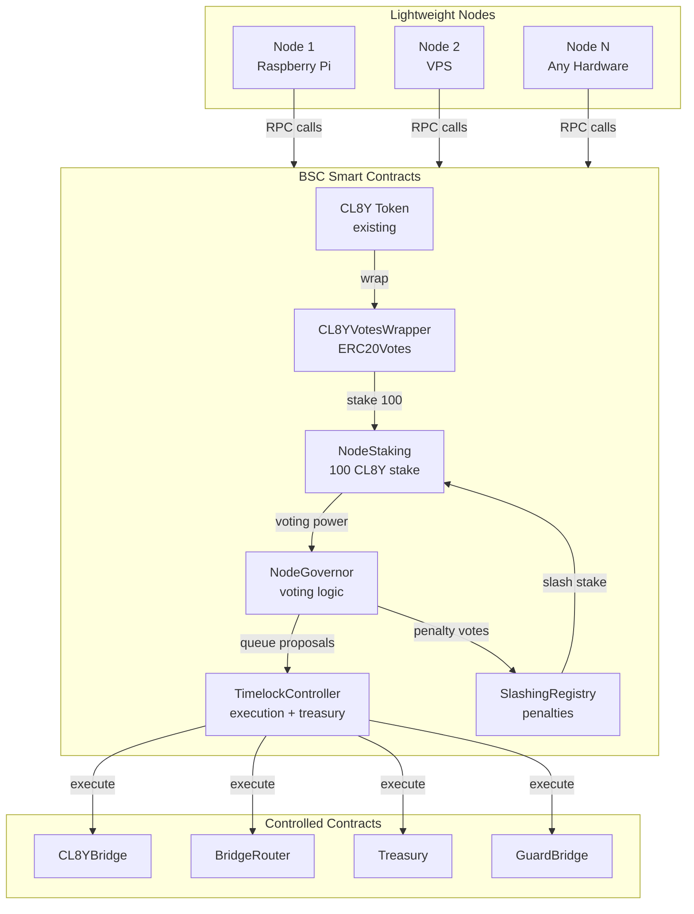
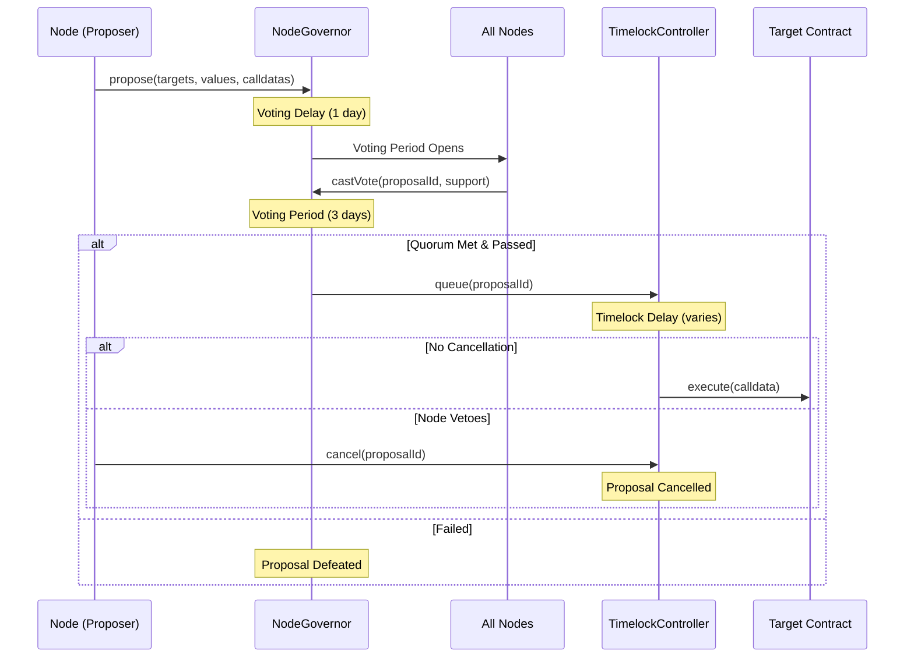
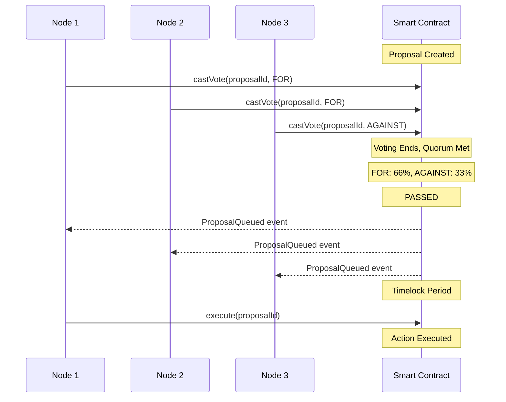

# DAO Nodes Governance System

A lightweight, staking-based DAO governance system for CL8Y Bridge on BSC. Nodes stake 100 CL8Y tokens to participate in governance, vote on proposals, control treasury, penalize misbehavior, and cancel malicious bridge transactions.

---

## Table of Contents

1. [Overview](#overview)
2. [Research: DAO Governance Patterns](#research-dao-governance-patterns)
3. [Architecture](#architecture)
4. [Tiered Proposal System](#tiered-proposal-system)
5. [Smart Contracts](#smart-contracts)
6. [Node Requirements](#node-requirements)
7. [Security Model](#security-model)
8. [Configuration Parameters](#configuration-parameters)
9. [Implementation Plan](#implementation-plan)

---

## Overview

### Goals

- **Decentralized Control**: No single entity controls the bridge or treasury
- **Lightweight Nodes**: Run on Raspberry Pi, communicate via RPC/smart contracts
- **Scalable**: Support dozens to thousands of nodes
- **Tiered Security**: Different thresholds for different action severity
- **Economic Security**: Slashable stakes penalize misbehavior

### Key Features

| Feature | Description |
|---------|-------------|
| **Staking** | 100 CL8Y required to become a voting node |
| **1-Node-1-Vote** | Equal voting power prevents whale domination |
| **Tiered Thresholds** | Bridge ops, treasury, emergency, and slashing have different requirements |
| **On-chain Voting** | All votes on BSC (gas is cheap) |
| **Cancellation Rights** | Nodes can veto malicious proposals during timelock |
| **Slashing** | Highest threshold protects against malicious penalty votes |

---

## Research: DAO Governance Patterns

### Successful Patterns Analyzed

| Pattern | Used By | Outcome |
|---------|---------|---------|
| **Timelock + Governor** | Compound, Uniswap | Industry standard, battle-tested |
| **Optimistic Governance** | Lido, Aragon | Efficient for routine ops, veto-based |
| **Multi-sig** | Gnosis Safe | Proven for small groups (<20) |
| **Staking-based Voting** | Ethereum PoS, Polkadot | Economic security, slashable |

### Common Failure Modes

| Failure | Cause | Our Mitigation |
|---------|-------|----------------|
| **Governance Attacks** | Flash loans acquire voting power | Voting delay + stake lock |
| **Whale Domination** | Large holders control votes | 1-node-1-vote (not token-weighted) |
| **Low Participation** | Quorum never reached | Tiered quorums by proposal type |
| **Malicious Proposals** | Attacker passes harmful changes | Timelock + any-node cancellation |
| **Collusion for Slashing** | Majority slashes innocent nodes | 75% supermajority for slashing |

### Why Hybrid Approach (Governor + Optimistic)

We combine OpenZeppelin Governor's battle-tested voting with optimistic elements:

```
┌─────────────────────────────────────────────────────────────────┐
│                     HYBRID GOVERNANCE                            │
├─────────────────────────────────────────────────────────────────┤
│  ┌───────────────────┐    ┌───────────────────┐                 │
│  │  GOVERNOR (Vote)  │    │ OPTIMISTIC (Veto) │                 │
│  ├───────────────────┤    ├───────────────────┤                 │
│  │ - Treasury spend  │    │ - Bridge approve  │                 │
│  │ - Parameter change│    │ - Routine ops     │                 │
│  │ - Slashing        │    │ - Config updates  │                 │
│  │ - Emergency pause │    │                   │                 │
│  └───────────────────┘    └───────────────────┘                 │
│           │                        │                             │
│           ▼                        ▼                             │
│  ┌─────────────────────────────────────────────────────────────┐│
│  │                    TIMELOCK CONTROLLER                      ││
│  │  - Execution delay (cancellation window)                    ││
│  │  - Treasury custody                                          ││
│  │  - Target contract management                                ││
│  └─────────────────────────────────────────────────────────────┘│
└─────────────────────────────────────────────────────────────────┘
```

---

## Architecture

### System Overview



### Data Flow: Proposal Lifecycle



---

## Tiered Proposal System

Different actions require different security levels. This prevents both gridlock (everything requiring supermajority) and vulnerability (low-security actions compromising high-value assets).

### Proposal Tiers

| Tier | Actions | Quorum | Pass Threshold | Timelock | Rationale |
|------|---------|--------|----------------|----------|-----------|
| **Tier 1: Bridge Ops** | Approve/cancel bridge tx, relayer management | 20% | 51% | 6 hours | Routine ops, need speed |
| **Tier 2: Configuration** | Parameter changes, guard updates, token registry | 33% | 51% | 1 day | Moderate impact |
| **Tier 3: Treasury** | Token transfers, grants, fee distribution | 40% | 60% | 2 days | High value, needs review |
| **Tier 4: Emergency** | Pause bridge, freeze accounts, emergency actions | 10% | 51% | 0 (immediate) | Speed critical |
| **Tier 5: Slashing** | Penalize nodes, slash stakes | 50% | 75% | 3 days | Highest protection for nodes |

### Tier Visualization

```
                    ┌─────────────────────────────────────────┐
                    │           SECURITY LEVEL                │
                    │  LOW ◄─────────────────────────► HIGH   │
                    └─────────────────────────────────────────┘
                           │         │         │         │
    ┌──────────────────────┼─────────┼─────────┼─────────┼────┐
    │                      │         │         │         │    │
    │   Tier 1          Tier 2    Tier 3    Tier 4    Tier 5  │
    │   Bridge          Config    Treasury  Emergency Slashing│
    │                      │         │         │         │    │
    │   Quorum: 20%     33%       40%       10%       50%    │
    │   Pass:   51%     51%       60%       51%       75%    │
    │   Time:   6h      1d        2d        0         3d     │
    │                      │         │         │         │    │
    └──────────────────────┼─────────┼─────────┼─────────┼────┘
                           │         │         │         │
                    Speed ◄──────────┼──────────► Security
                                     │
                            Emergency bypasses
                            timelock for speed
```

### Emergency Actions (Tier 4)

Emergency proposals execute immediately but have specific constraints:

- **Limited Scope**: Only pause/unpause, freeze/unfreeze
- **Cooldown**: Cannot re-pause within 24 hours of unpause
- **Review**: Emergency actions auto-expire after 7 days unless renewed

### Slashing Protection (Tier 5)

The highest threshold protects nodes from malicious slashing:

- **75% Supermajority**: Prevents small coalitions from attacking honest nodes
- **3-Day Timelock**: Ample time for community review and cancellation
- **Evidence Requirement**: Proposal must include on-chain proof of misbehavior
- **Appeal Period**: Slashed node can submit counter-evidence during timelock

---

## Smart Contracts

### Contract Overview

| Contract | Purpose | Key Functions |
|----------|---------|---------------|
| `CL8YVotesWrapper` | Wrap existing CL8Y token with ERC20Votes | `depositFor`, `withdrawTo` |
| `NodeStaking` | Stake management, voting power | `stake`, `unstake`, `slash` |
| `NodeGovernor` | Proposal creation, voting, execution | `propose`, `castVote`, `execute` |
| `TimelockController` | Execution delay, treasury custody | `schedule`, `execute`, `cancel` |
| `SlashingRegistry` | Penalty tracking, evidence storage | `proposeSlash`, `executeSlash` |

### 1. CL8YVotesWrapper

Wraps the existing CL8Y token to add ERC20Votes functionality for governance.

```solidity
// packages/contracts-evm/src/dao/CL8YVotesWrapper.sol

import "@openzeppelin/contracts/token/ERC20/extensions/ERC20Wrapper.sol";
import "@openzeppelin/contracts/token/ERC20/extensions/ERC20Votes.sol";

contract CL8YVotesWrapper is ERC20Wrapper, ERC20Votes {
    constructor(IERC20 _cl8yToken)
        ERC20("Wrapped CL8Y Votes", "wCL8Y")
        ERC20Permit("Wrapped CL8Y Votes")
        ERC20Wrapper(_cl8yToken)
    {}
    
    // Wrap CL8Y to get voting-enabled wCL8Y
    // Unwrap wCL8Y to get CL8Y back
}
```

### 2. NodeStaking

Manages node registration via staking.

```solidity
// packages/contracts-evm/src/dao/NodeStaking.sol

interface INodeStaking {
    // Constants
    uint256 constant STAKE_AMOUNT = 100 * 10**18;  // 100 CL8Y
    uint256 constant UNSTAKE_COOLDOWN = 7 days;
    
    // Events
    event NodeStaked(address indexed node, uint256 amount);
    event NodeUnstakeInitiated(address indexed node, uint256 unlockTime);
    event NodeWithdrawn(address indexed node, uint256 amount);
    event NodeSlashed(address indexed node, uint256 amount, bytes32 reason);
    
    // Core functions
    function stake() external;                    // Stake 100 CL8Y, become node
    function initiateUnstake() external;          // Begin cooldown
    function withdraw() external;                 // Complete unstake after cooldown
    function slash(address node, uint256 amount, bytes32 reason) external;
    
    // View functions
    function isNode(address account) external view returns (bool);
    function getNodeCount() external view returns (uint256);
    function getNodes() external view returns (address[] memory);
    function getStake(address node) external view returns (uint256);
    function getUnlockTime(address node) external view returns (uint256);
}
```

**Key Design Decisions:**

- **Fixed Stake**: Exactly 100 CL8Y (not variable) for 1-node-1-vote
- **No Delegation**: Nodes vote with their own stake only
- **Cooldown**: 7-day unstake delay prevents vote-and-run attacks
- **Slashing**: Only callable by SlashingRegistry after governance approval

### 3. NodeGovernor

Core governance contract with tiered proposal support.

```solidity
// packages/contracts-evm/src/dao/NodeGovernor.sol

import "@openzeppelin/contracts/governance/Governor.sol";
import "@openzeppelin/contracts/governance/extensions/GovernorVotes.sol";
import "@openzeppelin/contracts/governance/extensions/GovernorTimelockControl.sol";

contract NodeGovernor is 
    Governor,
    GovernorVotes,
    GovernorTimelockControl 
{
    enum ProposalTier {
        Bridge,      // Tier 1: 20% quorum, 51% pass, 6h timelock
        Config,      // Tier 2: 33% quorum, 51% pass, 1d timelock
        Treasury,    // Tier 3: 40% quorum, 60% pass, 2d timelock
        Emergency,   // Tier 4: 10% quorum, 51% pass, 0 timelock
        Slashing     // Tier 5: 50% quorum, 75% pass, 3d timelock
    }
    
    struct TierConfig {
        uint256 quorumNumerator;      // Quorum as percentage (20 = 20%)
        uint256 passThresholdNumerator; // Pass threshold (51 = 51%)
        uint256 timelockDelay;        // Execution delay in seconds
        uint256 votingPeriod;         // Voting duration in blocks
    }
    
    mapping(ProposalTier => TierConfig) public tierConfigs;
    mapping(uint256 => ProposalTier) public proposalTiers;
    
    function proposeWithTier(
        address[] memory targets,
        uint256[] memory values,
        bytes[] memory calldatas,
        string memory description,
        ProposalTier tier
    ) public returns (uint256 proposalId);
    
    // Override quorum and threshold based on proposal tier
    function quorum(uint256 proposalId) public view override returns (uint256);
    function proposalThreshold() public view override returns (uint256);
}
```

### 4. TimelockController

Standard OpenZeppelin TimelockController with role-based access.

```solidity
// packages/contracts-evm/src/dao/DAOTimelockController.sol

import "@openzeppelin/contracts/governance/TimelockController.sol";

contract DAOTimelockController is TimelockController {
    // Roles:
    // - PROPOSER_ROLE: NodeGovernor
    // - EXECUTOR_ROLE: NodeGovernor  
    // - CANCELLER_ROLE: All staked nodes (can veto during timelock)
    
    constructor(
        uint256 minDelay,
        address[] memory proposers,  // [NodeGovernor]
        address[] memory executors,  // [NodeGovernor]
        address admin                // Initially deployer, renounced later
    ) TimelockController(minDelay, proposers, executors, admin) {}
}
```

### 5. SlashingRegistry

Manages penalty proposals and execution.

```solidity
// packages/contracts-evm/src/dao/SlashingRegistry.sol

interface ISlashingRegistry {
    enum SlashSeverity {
        Warning,     // 0% slash, recorded on-chain
        Minor,       // 10% slash
        Moderate,    // 50% slash  
        Severe       // 100% slash + removal
    }
    
    struct SlashProposal {
        address target;           // Node to be slashed
        SlashSeverity severity;   // Penalty level
        bytes32 evidenceHash;     // IPFS hash of evidence
        uint256 proposalId;       // Governor proposal ID
    }
    
    event SlashProposed(address indexed target, SlashSeverity severity);
    event SlashExecuted(address indexed target, uint256 amount, bytes32 reason);
    event SlashAppealed(address indexed target, bytes32 counterEvidenceHash);
    
    function proposeSlash(
        address target,
        SlashSeverity severity,
        bytes32 evidenceHash
    ) external returns (uint256 proposalId);
    
    function executeSlash(uint256 proposalId) external;
    function appeal(uint256 proposalId, bytes32 counterEvidenceHash) external;
}
```

---

## Node Requirements

### Hardware (Minimal)

The node software is lightweight and can run on minimal hardware:

| Component | Minimum | Recommended |
|-----------|---------|-------------|
| **CPU** | 1 core (ARM OK) | 2+ cores |
| **RAM** | 512 MB | 1 GB |
| **Storage** | 1 GB | 5 GB |
| **Network** | Stable internet | Low latency |

**Supported Platforms:**
- Raspberry Pi 3/4/5
- Any Linux VPS
- Docker container
- Cloud functions (AWS Lambda, etc.)

### Software Architecture

Nodes are stateless and rely entirely on RPC and smart contracts:

```
┌─────────────────────────────────────────────────────────────┐
│                     NODE SOFTWARE                            │
├─────────────────────────────────────────────────────────────┤
│  ┌─────────────┐  ┌─────────────┐  ┌─────────────┐         │
│  │   Watcher   │  │    Voter    │  │   Executor  │         │
│  │             │  │             │  │             │         │
│  │ - Monitor   │  │ - Cast vote │  │ - Execute   │         │
│  │   events    │  │ - Auto-vote │  │   passed    │         │
│  │ - Alert on  │  │   policies  │  │   proposals │         │
│  │   proposals │  │             │  │             │         │
│  └──────┬──────┘  └──────┬──────┘  └──────┬──────┘         │
│         │                │                │                 │
│         ▼                ▼                ▼                 │
│  ┌─────────────────────────────────────────────────────┐   │
│  │                    RPC CLIENT                        │   │
│  │         (ethers.js / web3.py / alloy)               │   │
│  └─────────────────────────────────────────────────────┘   │
│                          │                                  │
└──────────────────────────┼──────────────────────────────────┘
                           │
                           ▼
                    ┌──────────────┐
                    │  BSC RPC     │
                    │  (Public or  │
                    │   Private)   │
                    └──────────────┘
```

### Node Responsibilities

1. **Monitor Proposals**: Watch for new governance proposals
2. **Vote**: Cast votes on proposals (can be manual or policy-based)
3. **Cancel Malicious**: Veto suspicious proposals during timelock
4. **Bridge Validation**: (Optional) Validate bridge transactions before approving
5. **Execute**: Call `execute()` on passed proposals after timelock

### Consensus via Smart Contracts

There is no node-to-node communication. All consensus happens on-chain:



---

## Security Model

### Attack Vectors and Mitigations

| Attack | Description | Mitigation |
|--------|-------------|------------|
| **Flash Loan Governance** | Borrow tokens, vote, repay | Voting delay (1 day) + stake lock |
| **Sybil Attack** | Create many nodes to control votes | 100 CL8Y economic barrier per node |
| **Whale Attack** | Rich entity buys many nodes | 1-node-1-vote limits marginal power |
| **Malicious Proposal** | Attacker passes harmful change | Timelock + any-node cancellation |
| **Slashing Collusion** | Majority slashes honest nodes | 75% supermajority + 3-day timelock |
| **Key Compromise** | Attacker steals node key | Stake locked, limited per-node damage |
| **Reentrancy** | Callback drains treasury | ReentrancyGuard on all external calls |

### Defense in Depth

```
Layer 1: Economic Security
├── 100 CL8Y stake requirement
├── 7-day unstake cooldown
└── Slashable deposits

Layer 2: Voting Security
├── 1-day voting delay (anti-flash-loan)
├── 3-day voting period (global participation)
└── Snapshot-based voting power

Layer 3: Execution Security
├── Tiered timelocks (0 to 3 days)
├── Any-node cancellation rights
└── Emergency pause capability

Layer 4: Slashing Protection
├── 75% supermajority required
├── 3-day appeal period
└── Evidence requirements
```

### Cancellation (Veto) Rights

Any staked node can cancel a pending proposal during its timelock:

```solidity
// Any node can call this during timelock period
function cancel(
    address[] memory targets,
    uint256[] memory values,
    bytes[] memory calldatas,
    bytes32 descriptionHash
) public onlyNode {
    _cancel(targets, values, calldatas, descriptionHash);
    emit ProposalCancelled(msg.sender, proposalId);
}
```

**Rationale:** Single-node veto power prioritizes security over efficiency. If a proposal is legitimate, it can be re-proposed. This creates a strong disincentive for malicious proposals.

---

## Configuration Parameters

### Governance Parameters

| Parameter | Value | Rationale |
|-----------|-------|-----------|
| **Stake Amount** | 100 CL8Y | Economic barrier without excessive cost |
| **Unstake Cooldown** | 7 days | Prevent vote-and-run attacks |
| **Voting Delay** | 1 day (7,200 blocks) | Anti-flash-loan, time to review |
| **Voting Period (Default)** | 3 days (21,600 blocks) | Global participation |
| **Proposal Threshold** | 1 node | Low barrier to propose |

### Tier-Specific Parameters

| Tier | Quorum | Pass | Timelock | Voting Period |
|------|--------|------|----------|---------------|
| **Bridge** | 20% | 51% | 6 hours | 1 day |
| **Config** | 33% | 51% | 1 day | 2 days |
| **Treasury** | 40% | 60% | 2 days | 3 days |
| **Emergency** | 10% | 51% | 0 | 4 hours |
| **Slashing** | 50% | 75% | 3 days | 5 days |

### Slashing Parameters

| Severity | Slash % | Removal | Use Case |
|----------|---------|---------|----------|
| **Warning** | 0% | No | First minor offense |
| **Minor** | 10% | No | Repeated minor offenses |
| **Moderate** | 50% | No | Significant misbehavior |
| **Severe** | 100% | Yes | Proven malicious action |

---

## Implementation Plan

### Timeline Overview

```
Week 1          Week 2-3        Week 4-5        Week 6          Week 7-8
┌───────────┐   ┌───────────┐   ┌───────────┐   ┌───────────┐   ┌───────────┐
│  Phase 1  │   │  Phase 1  │   │  Phase 2  │   │  Phase 3  │   │  Phase 4  │
│  ───────  │   │  ───────  │   │  ───────  │   │  ───────  │   │  ───────  │
│ Interfaces│   │   Core    │   │Integration│   │   Node    │   │  Testing  │
│  + Votes  │   │ Contracts │   │  + Roles  │   │ Software  │   │ + Mainnet │
│  Wrapper  │   │           │   │           │   │           │   │           │
└───────────┘   └───────────┘   └───────────┘   └───────────┘   └───────────┘
```

### Phase 1: Core Contracts (Week 1-3)

**Week 1: Foundation**
| Task | Deliverable |
|------|-------------|
| Interface definitions | `INodeStaking.sol`, `ISlashingRegistry.sol`, `INodeGovernor.sol` |
| CL8Y wrapper | `CL8YVotesWrapper.sol` with ERC20Votes |
| Basic staking | `NodeStaking.sol` - stake/unstake/withdraw |

**Week 2-3: Governance Core**
| Task | Deliverable |
|------|-------------|
| Governor contract | `NodeGovernor.sol` with 5-tier system |
| Timelock | `DAOTimelockController.sol` |
| Slashing | `SlashingRegistry.sol` with evidence/appeals |
| Unit tests | Tests for each contract in isolation |

### Phase 2: Integration (Week 4-5)

**Week 4: Bridge Integration**
| Task | Deliverable |
|------|-------------|
| Role configuration | Transfer `AccessManager` authority to TimelockController |
| Bridge permissions | Configure bridge contract roles for DAO control |
| Guard integration | Connect `GuardBridge` to governance |

**Week 5: Treasury + Testing**
| Task | Deliverable |
|------|-------------|
| Treasury setup | Fund TimelockController with initial assets |
| Integration tests | End-to-end governance flow tests |
| BSC Testnet deploy | Deploy full DAO stack to BSC testnet |

### Phase 3: Node Software (Week 6)

**Week 6: Lightweight Daemon**
| Task | Deliverable |
|------|-------------|
| Event watcher | Monitor proposal events via RPC |
| Voting CLI | Command-line tool for casting votes |
| Executor | Trigger `execute()` on passed proposals |
| Docker image | Raspberry Pi compatible container |

### Phase 4: Testing + Launch (Week 7-8)

**Week 7: Security**
| Task | Deliverable |
|------|-------------|
| Fuzzing | Foundry fuzz tests for edge cases |
| Invariant tests | Property-based testing for governance |
| Internal audit | Code review and fixes |

**Week 8: Launch**
| Task | Deliverable |
|------|-------------|
| Testnet validation | Full governance cycle on testnet |
| Documentation | Operator guide, node setup instructions |
| BSC Mainnet deploy | Production deployment |
| Initial nodes | Bootstrap first node operators |

### Gantt Chart

```
            Week 1   Week 2   Week 3   Week 4   Week 5   Week 6   Week 7   Week 8
            ──────   ──────   ──────   ──────   ──────   ──────   ──────   ──────
Interfaces  ████░░   ░░░░░░   ░░░░░░   ░░░░░░   ░░░░░░   ░░░░░░   ░░░░░░   ░░░░░░
VotesWrapper████░░   ░░░░░░   ░░░░░░   ░░░░░░   ░░░░░░   ░░░░░░   ░░░░░░   ░░░░░░
NodeStaking ██████   ████░░   ░░░░░░   ░░░░░░   ░░░░░░   ░░░░░░   ░░░░░░   ░░░░░░
NodeGovernor░░░░░░   ██████   ████░░   ░░░░░░   ░░░░░░   ░░░░░░   ░░░░░░   ░░░░░░
Timelock    ░░░░░░   ██████   ░░░░░░   ░░░░░░   ░░░░░░   ░░░░░░   ░░░░░░   ░░░░░░
Slashing    ░░░░░░   ░░░░░░   ██████   ░░░░░░   ░░░░░░   ░░░░░░   ░░░░░░   ░░░░░░
Unit Tests  ░░░░░░   ░░░░░░   ██████   ░░░░░░   ░░░░░░   ░░░░░░   ░░░░░░   ░░░░░░
Integration ░░░░░░   ░░░░░░   ░░░░░░   ██████   ██████   ░░░░░░   ░░░░░░   ░░░░░░
Node Daemon ░░░░░░   ░░░░░░   ░░░░░░   ░░░░░░   ░░░░░░   ██████   ░░░░░░   ░░░░░░
Security    ░░░░░░   ░░░░░░   ░░░░░░   ░░░░░░   ░░░░░░   ░░░░░░   ██████   ░░░░░░
Launch      ░░░░░░   ░░░░░░   ░░░░░░   ░░░░░░   ░░░░░░   ░░░░░░   ░░░░░░   ██████
```

### Milestones

| Milestone | Target | Criteria |
|-----------|--------|----------|
| **M1: Contracts Complete** | End of Week 3 | All 5 contracts compile, unit tests pass |
| **M2: Testnet Live** | End of Week 5 | Full DAO deployed to BSC testnet |
| **M3: Node Software Ready** | End of Week 6 | Docker image runs on Raspberry Pi |
| **M4: Mainnet Launch** | End of Week 8 | Production deployment, 10+ nodes staked |

### File Structure

```
packages/contracts-evm/src/dao/
├── interfaces/
│   ├── INodeStaking.sol
│   ├── ISlashingRegistry.sol
│   └── INodeGovernor.sol
├── CL8YVotesWrapper.sol
├── NodeStaking.sol
├── NodeGovernor.sol
├── DAOTimelockController.sol
└── SlashingRegistry.sol

packages/contracts-evm/test/dao/
├── NodeStaking.t.sol
├── NodeGovernor.t.sol
├── SlashingRegistry.t.sol
└── DAOIntegration.t.sol

packages/contracts-evm/script/
├── DeployDAO.s.sol
└── ConfigureDAO.s.sol
```

---

## Appendix: Governance Examples

### Example 1: Bridge Transaction Approval

```solidity
// Tier 1: Bridge Ops
// Quorum: 20%, Pass: 51%, Timelock: 6 hours

address[] memory targets = [address(cl8yBridge)];
uint256[] memory values = [0];
bytes[] memory calldatas = [
    abi.encodeCall(CL8YBridge.approveWithdraw, (depositId, amount, recipient))
];

governor.proposeWithTier(
    targets,
    values,
    calldatas,
    "Approve bridge withdrawal #1234",
    ProposalTier.Bridge
);
```

### Example 2: Treasury Grant

```solidity
// Tier 3: Treasury
// Quorum: 40%, Pass: 60%, Timelock: 2 days

address[] memory targets = [address(treasury)];
uint256[] memory values = [0];
bytes[] memory calldatas = [
    abi.encodeCall(IERC20.transfer, (grantRecipient, 10000 * 1e18))
];

governor.proposeWithTier(
    targets,
    values,
    calldatas,
    "Grant 10,000 CL8Y to developer fund",
    ProposalTier.Treasury
);
```

### Example 3: Emergency Pause

```solidity
// Tier 4: Emergency
// Quorum: 10%, Pass: 51%, Timelock: 0 (immediate)

address[] memory targets = [address(cl8yBridge)];
uint256[] memory values = [0];
bytes[] memory calldatas = [
    abi.encodeCall(CL8YBridge.pause, ())
];

governor.proposeWithTier(
    targets,
    values,
    calldatas,
    "EMERGENCY: Pause bridge due to suspicious activity",
    ProposalTier.Emergency
);
```

### Example 4: Slash Malicious Node

```solidity
// Tier 5: Slashing
// Quorum: 50%, Pass: 75%, Timelock: 3 days

slashingRegistry.proposeSlash(
    maliciousNode,
    SlashSeverity.Severe,
    ipfsEvidenceHash
);

// This creates a Tier 5 proposal in NodeGovernor
// Requires 75% of voting nodes to agree
// Malicious node can appeal during 3-day timelock
```

---

## References

- [OpenZeppelin Governor](https://docs.openzeppelin.com/contracts/5.x/governance)
- [OpenZeppelin TimelockController](https://docs.openzeppelin.com/contracts/5.x/api/governance#TimelockController)
- [ERC-3000: Optimistic Governance](https://eips.ethereum.org/EIPS/eip-3000)
- [a16z: Cryptoeconomics of Slashing](https://a16zcrypto.com/posts/article/the-cryptoeconomics-of-slashing/)
- [Compound Governor Bravo](https://github.com/compound-finance/compound-protocol/blob/master/contracts/Governance/GovernorBravoDelegate.sol)
