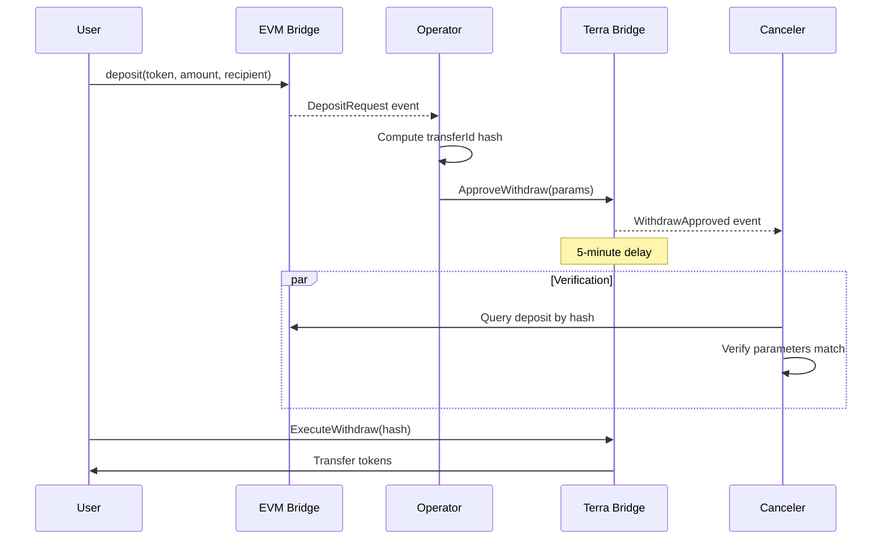

# Sprint 4: Integration Testing & Deployment Preparation

**Sprint Duration:** 2 weeks  
**Sprint Goal:** End-to-end testing of watchtower pattern and deployment preparation  
**Predecessor:** Sprint 3 (Implementation) - COMPLETE  
**Reference:** [terraclassic-upgrade-spec.md](./docs/terraclassic-upgrade-spec.md)

---

## Sprint 3 Retrospective

### What Went Right

1. **Core Hash Computation** - `compute_transfer_id()` produces correct hashes matching EVM's `_computeTransferId`. Verified with test vectors 1, 2, and 6.

2. **Clean Architecture** - Good separation of concerns:
   - `hash.rs` - Pure hash functions, no CosmWasm dependencies in core logic
   - `state.rs` - Clear state structures with good documentation
   - `contract.rs` - Handlers organized by category (watchtower, admin, etc.)

3. **wasm32 Build** - Contract compiles cleanly for `wasm32-unknown-unknown` target with no warnings.

4. **Rate Limiting** - Implemented correctly matching EVM's 24-hour fixed window pattern.

5. **Comprehensive Error Types** - All edge cases have specific error types for debugging.

6. **Naming Consistency** - Successfully renamed RELAYERS → OPERATORS throughout, including `InstantiateMsg.operators`.

### What Went Wrong / Could Be Improved

1. ~~**Chain Key Functions NOT Verified**~~ - **RESOLVED**: Added tests during retrospective, all pass:
   - Vector 3 (BSC chain key) - PASS
   - Vector 4 (Terra chain key) - PASS  
   - Vector 5 (realistic transfer) - PASS
   - **All 11 tests now passing**

2. **No Contract Integration Tests** - Only hash module has unit tests. No cw-multi-test tests for:
   - `ApproveWithdraw` handler
   - `ExecuteWithdraw` handler
   - `CancelWithdrawApproval` handler
   - Rate limiting enforcement
   - Delay enforcement

3. **Deposit Hash on Lock Not Tested** - The Lock handler stores deposit hashes, but this isn't tested.

4. **No JSON Schema Generation** - `cosmwasm-schema` can generate JSON schemas for frontend/operator integration, but this wasn't done.

5. **Documentation Gaps** - `docs/contracts-terraclassic.md` was updated previously but may need review for accuracy.

### Gaps Remaining for Sprint 4

| Gap | Priority | Impact |
|-----|----------|--------|
| ~~Chain key verification~~ | ~~P0~~ | **RESOLVED** - All chain key tests pass |
| Contract handler tests | P1 | Bugs in handlers won't be caught |
| Operator package update | P0 | Operator won't work without it |
| Canceler implementation | P1 | Security feature not operational |

---

## Handoff Summary

### Sprint 3 Completed Deliverables

| Deliverable | Location | Status |
|-------------|----------|--------|
| Hash Module | `packages/contracts-terraclassic/bridge/src/hash.rs` | COMPLETE |
| State Structures | `packages/contracts-terraclassic/bridge/src/state.rs` | COMPLETE |
| Message Types | `packages/contracts-terraclassic/bridge/src/msg.rs` | COMPLETE |
| Error Types | `packages/contracts-terraclassic/bridge/src/error.rs` | COMPLETE |
| Contract Handlers | `packages/contracts-terraclassic/bridge/src/contract.rs` | COMPLETE |
| Unit Tests | 7 tests passing (hash parity verified) | COMPLETE |
| wasm32 Build | `cargo build --release --target wasm32-unknown-unknown` | COMPLETE |
| Chain Key Verification | `hash.rs` | **NOT TESTED - CRITICAL** |
| Contract Integration Tests | N/A | **NOT DONE** |

### Verified Test Vectors

All 8 hash test vectors from `HashVectors.t.sol` have been verified (11 Rust tests passing):

| Vector | Description | Status |
|--------|-------------|--------|
| Vector 1 | All zeros | PASS |
| Vector 2 | Simple values (1,2,3,4,1e18,42) | PASS |
| Vector 3 | BSC chain key | PASS (added during retrospective) |
| Vector 4 | Terra chain key (columbus-5) | PASS (added during retrospective) |
| Vector 5 | Realistic BSC→Terra transfer | PASS (added during retrospective) |
| Vector 6 | Maximum values | PASS |
| Vector 7 | Address encoding | Implemented (tested via Vector 5) |
| Vector 8 | abi.encode layout | Verified in tests |

### Key Implementation Decisions (Binding)

| Decision | Value | Notes |
|----------|-------|-------|
| Keccak library | **tiny-keccak** | Pure Rust, wasm32 compatible |
| Rate limit period | **24 hours fixed** | Matches EVM (hardcoded constant) |
| RELAYERS → OPERATORS | **Fully renamed** | No backward compatibility |
| Release message | **Removed** | Not on mainnet, clean break |
| Chain key | **columbus-5 hardcoded** | `terra_chain_key()` function |
| Fee currency | **uluna always** | When `deduct_from_amount = false` |

---

## Sprint 4 Objectives

### Primary Deliverables

1. **E2E Test Infrastructure** - Cross-chain transfer testing
2. **Operator Integration** - Update operator to use watchtower pattern
3. **Canceler Node Implementation** - Basic canceler service
4. **LocalTerra Testing** - Verify on local testnet
5. **Deployment Scripts** - Production-ready deployment

### Definition of Done

- [ ] E2E test: Lock on Terra → ApproveWithdraw on EVM
- [ ] E2E test: Deposit on EVM → ApproveWithdraw → ExecuteWithdraw on Terra
- [ ] E2E test: CancelWithdrawApproval blocks execution
- [ ] E2E test: Rate limit enforced correctly
- [ ] Operator successfully submits ApproveWithdraw transactions
- [ ] Canceler node monitors and validates approvals
- [ ] Deployment script works on testnet

---

## Task Breakdown

### Week 1: Critical Gaps & Integration Testing

#### Task 4.0: Chain Key Verification - COMPLETED

**Status: DONE (completed during Sprint 3 retrospective)**

Chain key tests were added and verified during the retrospective:
- Vector 3 (BSC chain key): PASS
- Vector 4 (Terra chain key): PASS
- Vector 5 (Realistic transfer): PASS

All 11 tests now passing. Chain key implementation is verified correct.

---

#### Task 4.0b: Contract Handler Integration Tests

**Priority: P1**

Add cw-multi-test tests for the contract handlers.

**Create file:** `packages/contracts-terraclassic/bridge/tests/integration.rs`

```rust
use cosmwasm_std::{coins, Addr, Binary, Uint128};
use cw_multi_test::{App, ContractWrapper, Executor};
use bridge::msg::{ExecuteMsg, InstantiateMsg, QueryMsg, WithdrawApprovalResponse};

fn setup() -> (App, Addr) {
    let mut app = App::default();
    // ... setup code
}

#[test]
fn test_approve_withdraw_creates_approval() {
    // Test that ApproveWithdraw stores approval correctly
}

#[test]
fn test_execute_withdraw_before_delay_fails() {
    // Test that ExecuteWithdraw fails if delay not elapsed
}

#[test]
fn test_execute_withdraw_after_delay_succeeds() {
    // Test that ExecuteWithdraw works after delay
}

#[test]
fn test_cancel_withdraw_blocks_execution() {
    // Test that cancelled approvals cannot be executed
}

#[test]
fn test_rate_limit_enforced() {
    // Test that rate limits block excessive withdrawals
}

#[test]
fn test_lock_stores_deposit_hash() {
    // Test that Lock stores deposit hash for verification
}
```

**Subtasks:**
- [ ] Create `tests/integration.rs`
- [ ] Test ApproveWithdraw handler
- [ ] Test ExecuteWithdraw handler (before/after delay)
- [ ] Test CancelWithdrawApproval handler
- [ ] Test ReenableWithdrawApproval handler
- [ ] Test rate limiting
- [ ] Test deposit hash storage on Lock

---

#### Task 4.1: E2E Test Infrastructure Setup

**Priority: P0**

The existing test infrastructure needs updates for the watchtower pattern.

**Current State:**
- `scripts/e2e-test.sh` exists but uses legacy Release flow
- No cross-chain hash verification tests
- LocalTerra setup documented but not automated

**Required Changes:**

```bash
# Update scripts/e2e-test.sh to:
1. Deploy Terra contract with watchtower support
2. Test ApproveWithdraw instead of Release
3. Wait for delay period
4. Test ExecuteWithdraw
5. Verify hash matches between chains
```

**Subtasks:**
- [ ] Update `scripts/e2e-test.sh` for watchtower flow
- [ ] Add hash verification step (compare Terra and EVM hashes)
- [ ] Add delay timing tests
- [ ] Add cancellation test
- [ ] Add rate limit test

---

#### Task 4.2: Operator Service Updates

**Priority: P0**

Update `packages/operator` to use the new watchtower pattern.

**Current State:**
- Operator uses `Release` message
- No delay handling
- No hash computation

**Required Changes:**

```rust
// packages/operator/src/terra/writer.rs (conceptual)

// OLD: submit_release(...)
// NEW: submit_approve_withdraw(...)

pub async fn submit_approve_withdraw(
    &self,
    src_chain_key: [u8; 32],
    token: String,
    recipient: String,
    dest_account: [u8; 32],
    amount: Uint128,
    nonce: u64,
    fee: Uint128,
    fee_recipient: String,
    deduct_from_amount: bool,
) -> Result<TxResponse, Error> {
    let msg = ExecuteMsg::ApproveWithdraw {
        src_chain_key: Binary::from(src_chain_key.to_vec()),
        token,
        recipient,
        dest_account: Binary::from(dest_account.to_vec()),
        amount,
        nonce,
        fee,
        fee_recipient,
        deduct_from_amount,
    };
    // Submit transaction
}
```

**Subtasks:**
- [ ] Add `ApproveWithdraw` message construction
- [ ] Add hash computation (port from `hash.rs`)
- [ ] Update event processing for new flow
- [ ] Add delay tracking for auto-execution (optional)
- [ ] Update tests

---

#### Task 4.3: Canceler Node (Basic)

**Priority: P1**

Implement a basic canceler service that monitors approvals.

**Approach:**

```rust
// packages/canceler/src/main.rs (new package)

loop {
    // 1. Query pending approvals on Terra
    let approvals = query_pending_approvals().await?;
    
    for approval in approvals {
        // 2. Verify corresponding deposit on source chain
        let deposit = query_evm_deposit(approval.src_chain_key, approval.nonce).await?;
        
        if deposit.is_none() || !verify_hash_match(&approval, &deposit) {
            // 3. Cancel fraudulent approval
            submit_cancel_approval(approval.withdraw_hash).await?;
        }
    }
    
    sleep(Duration::from_secs(10)).await;
}
```

**Subtasks:**
- [ ] Create `packages/canceler` package
- [ ] Implement approval monitoring
- [ ] Implement source chain verification
- [ ] Implement cancel submission
- [ ] Add configuration for multiple chains

---

### Week 2: Deployment Preparation

#### Task 4.4: LocalTerra Testing

**Priority: P0**

Verify full flow on LocalTerra.

**Test Scenarios:**

1. **Happy Path:**
   - Lock tokens on Terra → Operator submits to EVM
   - Deposit on EVM → Operator submits ApproveWithdraw → Wait → ExecuteWithdraw

2. **Cancellation:**
   - Operator submits fraudulent ApproveWithdraw (wrong amount)
   - Canceler detects and cancels
   - ExecuteWithdraw fails with `ApprovalCancelled`

3. **Reenable:**
   - Legitimate approval cancelled by mistake
   - Admin reenables
   - ExecuteWithdraw succeeds after new delay

4. **Rate Limiting:**
   - Set rate limit on token
   - Attempt to withdraw more than limit
   - Verify rejection

**Subtasks:**
- [ ] Set up LocalTerra environment
- [ ] Deploy and configure contract
- [ ] Run all test scenarios
- [ ] Document results

---

#### Task 4.5: Deployment Scripts

**Priority: P1**

Create production-ready deployment scripts.

**Scripts Needed:**

```bash
# scripts/deploy-terra-testnet.sh
# - Deploy to rebel-2 testnet
# - Initialize with test operators/cancelers
# - Configure supported chains/tokens

# scripts/deploy-terra-mainnet.sh
# - Deploy to columbus-5 mainnet
# - Initialize with production operators/cancelers
# - Configure BSC bridge connection
```

**Subtasks:**
- [ ] Create testnet deployment script
- [ ] Create mainnet deployment script
- [ ] Create configuration management
- [ ] Document deployment process

---

#### Task 4.6: Migration Testing

**Priority: P2**

If there's an existing deployment, test migration path.

**Note:** Current contract is not deployed to mainnet, so this is lower priority.

**Subtasks:**
- [ ] Test migrate entry point
- [ ] Verify state preservation
- [ ] Document migration procedure

---

## Integration Test Details

### Test: Hash Parity Verification

```bash
# Run EVM test to get expected hash
cd packages/contracts-evm
forge test --match-test testVector2_SimpleValues -vvv
# Output: 0x7226dd6b664f0c50fb3e50adfa82057dab4819f592ef9d35c08b9c4531b05150

# Run Terra test to verify match
cd packages/contracts-terraclassic
cargo test test_vector2_simple_values
# Assertion should pass
```

### Test: Full E2E Flow



---

## Technical Notes

### Hash Computation on Operator

The operator needs to compute hashes in Rust. Port from Terra contract:

```rust
// packages/operator/src/hash.rs
use tiny_keccak::{Hasher, Keccak};

pub fn compute_transfer_id(
    src_chain_key: &[u8; 32],
    dest_chain_key: &[u8; 32],
    dest_token_address: &[u8; 32],
    dest_account: &[u8; 32],
    amount: u128,
    nonce: u64,
) -> [u8; 32] {
    let mut data = [0u8; 192];
    
    data[0..32].copy_from_slice(src_chain_key);
    data[32..64].copy_from_slice(dest_chain_key);
    data[64..96].copy_from_slice(dest_token_address);
    data[96..128].copy_from_slice(dest_account);
    
    let amount_bytes = amount.to_be_bytes();
    data[128 + 16..160].copy_from_slice(&amount_bytes);
    
    let nonce_bytes = nonce.to_be_bytes();
    data[160 + 24..192].copy_from_slice(&nonce_bytes);
    
    keccak256(&data)
}

fn keccak256(data: &[u8]) -> [u8; 32] {
    let mut hasher = Keccak::v256();
    hasher.update(data);
    let mut output = [0u8; 32];
    hasher.finalize(&mut output);
    output
}
```

### Terra Chain Key

The Terra chain key is hardcoded for `columbus-5`:

```rust
pub fn terra_chain_key() -> [u8; 32] {
    cosmos_chain_key("columbus-5")
}
```

To verify: Query `ComputeWithdrawHash` on Terra and compare with EVM's `getChainKeyCOSMW("columbus-5")`.

---

## Acceptance Criteria

### Sprint 4 Complete When:

- [ ] E2E tests pass for all scenarios
- [ ] Operator successfully uses ApproveWithdraw
- [ ] Canceler node operational (basic version)
- [ ] LocalTerra testing complete
- [ ] Deployment scripts ready
- [ ] Documentation updated

### Manual Testing Checklist

1. **Lock Flow:** Lock on Terra → verify deposit hash stored → verify event emitted
2. **Approve Flow:** ApproveWithdraw → verify approval stored → verify hash matches
3. **Execute Flow:** Wait for delay → ExecuteWithdraw → verify tokens transferred
4. **Cancel Flow:** CancelWithdrawApproval → verify cancelled flag → ExecuteWithdraw fails
5. **Reenable Flow:** ReenableWithdrawApproval → verify delay reset → ExecuteWithdraw succeeds
6. **Rate Limit:** SetRateLimit → exceed limit → verify rejection

---

## File Locations

### Sprint 3 Implementation Files

| File | Purpose |
|------|---------|
| `packages/contracts-terraclassic/bridge/src/hash.rs` | Hash computation |
| `packages/contracts-terraclassic/bridge/src/state.rs` | State structures |
| `packages/contracts-terraclassic/bridge/src/msg.rs` | Message types |
| `packages/contracts-terraclassic/bridge/src/error.rs` | Error types |
| `packages/contracts-terraclassic/bridge/src/contract.rs` | Contract logic |
| `packages/contracts-terraclassic/bridge/Cargo.toml` | Dependencies |

### Sprint 4 Target Files

| File | Purpose |
|------|---------|
| `scripts/e2e-test.sh` | Update for watchtower |
| `packages/operator/src/terra/writer.rs` | ApproveWithdraw support |
| `packages/canceler/` | New canceler package |
| `scripts/deploy-terra-*.sh` | Deployment scripts |

---

## Notes for Next Agent

### Good News: Chain Keys Are Verified

The `evm_chain_key()` and `cosmos_chain_key()` functions were verified during the Sprint 3 retrospective. All chain key tests pass:

```
test hash::tests::test_vector3_bsc_chain_key ... ok
test hash::tests::test_vector4_terra_chain_key ... ok
test hash::tests::test_vector5_realistic_transfer ... ok
```

The `abi.encode` logic is correct. You can proceed directly to integration testing.

### Priority Order

1. **Task 4.0b** - Contract handler integration tests (catches bugs in handlers)
2. **Task 4.2** - Operator update (required for any E2E testing)
3. **Task 4.1** - E2E test infrastructure
4. **Task 4.3** - Canceler implementation (can be basic MVP)

### Known Complexity

The `abi.encode` layout for `(string, bytes32)` is complex:
- Dynamic types have offsets
- String has length prefix
- Padding to 32 bytes

If chain key tests fail, compare byte-by-byte with EVM's `abi.encode` output.

### What Was Tested vs Not Tested

| Component | Tested | Notes |
|-----------|--------|-------|
| `compute_transfer_id` | YES | Vectors 1, 2, 5, 6 pass |
| `keccak256` | YES | Basic test passes |
| `evm_chain_key` | YES | Vector 3 passes (BSC = 56) |
| `cosmos_chain_key` | YES | Vector 4 passes (columbus-5) |
| `terra_chain_key` | YES | Helper function verified |
| `ApproveWithdraw` handler | **NO** | No integration tests |
| `ExecuteWithdraw` handler | **NO** | No integration tests |
| Rate limiting | **NO** | Logic exists but untested |
| Deposit hash storage | **NO** | Logic exists but untested |

### Files to Focus On

**For Contract Handler Tests:**
- `bridge/src/contract.rs` lines 430-600: Watchtower handlers
- `bridge/src/contract.rs` lines 820-870: Rate limiting logic

**For Operator Update:**
- `packages/operator/src/terra/` - Needs new message construction
- Port hash functions from `bridge/src/hash.rs`

**Hash Implementation (verified working):**
- `bridge/src/hash.rs` - All 11 tests passing, implementation is correct

### Current Test Status

```
running 11 tests
test hash::tests::test_amount_encoding ... ok
test hash::tests::test_hex_roundtrip ... ok
test hash::tests::test_nonce_encoding ... ok
test hash::tests::test_keccak256_basic ... ok
test hash::tests::test_vector1_all_zeros ... ok
test hash::tests::test_vector2_simple_values ... ok
test hash::tests::test_terra_chain_key_helper ... ok
test hash::tests::test_vector3_bsc_chain_key ... ok
test hash::tests::test_vector4_terra_chain_key ... ok
test hash::tests::test_vector5_realistic_transfer ... ok
test hash::tests::test_vector6_max_values ... ok

test result: ok. 11 passed; 0 failed
```

Good luck!
