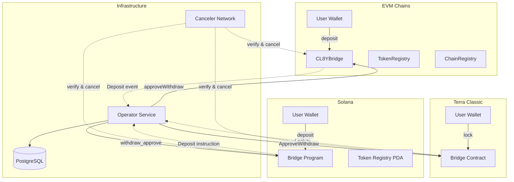
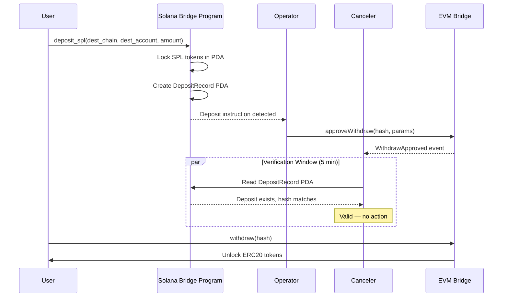

# Solana Integration Plan

**Created:** 2026-03-17
**Scope:** All packages — contracts, operator, canceler, multichain-rs, frontend, e2e
**Status:** Draft — ready for review

---

## Table of Contents

1. [Executive Summary](#1-executive-summary)
2. [Current State — What Exists Today](#2-current-state--what-exists-today)
3. [Contract Reusability Assessment](#3-contract-reusability-assessment)
4. [Solana Programs (Phase 1)](#4-solana-programs-phase-1)
5. [Address Codec Adaptation (Phase 2)](#5-address-codec-adaptation-phase-2)
6. [Operator / Indexer (Phase 3)](#6-operator--indexer-phase-3)
7. [Canceler (Phase 4)](#7-canceler-phase-4)
8. [Frontend (Phase 5)](#8-frontend-phase-5)
9. [E2E Tests & Local Dev (Phase 6)](#9-e2e-tests--local-dev-phase-6)
10. [Chain Registration & Deployment (Phase 7)](#10-chain-registration--deployment-phase-7)
11. [Architecture Diagrams](#11-architecture-diagrams)
12. [Dependency Order](#12-dependency-order)
13. [Risks & Open Questions](#13-risks--open-questions)
14. [Appendix A: Solana vs Existing Chains](#appendix-a-solana-vs-existing-chains)

---

## 1. Executive Summary

This plan covers adding Solana as a third chain type to CL8Y Bridge, enabling transfers between Solana ↔ EVM and Solana ↔ Terra Classic.

**Key conclusions from analysis:**

- Terra Classic and EVM contracts **cannot be reused** — Solana requires new programs written in Rust/Anchor
- The **protocol design** (deposit → approve → delay → execute, 7-field hash, watchtower cancelers) is fully reusable
- `CHAIN_TYPE_SOLANA = 3` is already reserved in `AddressCodecLib.sol`, `address_codec.rs`, and `multichain-rs`
- `@solana/kit` v5.5, `@solana-program/token`, and `@solana-program/system` are already installed in the frontend
- The operator/canceler follow a clean EVM/Terra split pattern that extends naturally to a third chain type
- The `UniversalAddress` format uses 20-byte raw addresses — Solana's 32-byte pubkeys require a refactor to variable-length (Option B), gated by regression tests written first

**Scope of work:**

| Area | Effort | New Code |
|------|--------|----------|
| Solana programs + tests | Large | `packages/contracts-solana/` |
| Address codec regression tests | Small | Regression tests in all three codebases (write FIRST) |
| Address codec refactor (Option B) | Medium | Modify `multichain-rs`, `AddressCodecLib.sol`, Terra `address_codec.rs` |
| Operator watcher + writer | Medium | `watchers/solana.rs`, `writers/solana.rs` |
| Canceler | Medium | `watcher.rs` Solana arm |
| Frontend wallets + UI | Medium | Solana wallet modal, chain config, hooks |
| E2E tests + local dev | Medium | `solana-test-validator` in docker-compose |
| Chain registration + deployment | Small | Register on EVM/Terra contracts |

---

## 2. Current State — What Exists Today

### 2a. Solana Chain Type Reserved

All three address codec implementations already define `CHAIN_TYPE_SOLANA = 3`:

| Codebase | File | Constant |
|----------|------|----------|
| Solidity | `contracts-evm/src/lib/AddressCodecLib.sol:35` | `uint32 public constant CHAIN_TYPE_SOLANA = 3` |
| Rust (shared) | `multichain-rs/src/address_codec.rs:35` | `pub const CHAIN_TYPE_SOLANA: u32 = 3` |
| CosmWasm | `contracts-terraclassic/bridge/src/address_codec.rs:39` | `pub const CHAIN_TYPE_SOLANA: u32 = 3` |

The operator EVM watcher already maps chain type 3 to `"solana"` in its display logic (`packages/operator/src/watchers/evm.rs:673`).

### 2b. Frontend Solana Dependencies Already Installed

The frontend `package.json` already includes (via `package-lock.json`):

- `@solana/kit` v5.5.0
- `@solana-program/system` v0.10.0
- `@solana-program/token` v0.9.0
- `@solana/web3.js` v1.98.1

These are not yet used in any source files.

### 2c. Address Format Challenge

The current `UniversalAddress` format allocates 20 bytes for the raw address:

```text
| Chain Type (4 bytes) | Raw Address (20 bytes) | Reserved (8 bytes) |
```

Solana public keys are 32 bytes (Ed25519). This requires refactoring `UniversalAddress` to support variable-length raw addresses (Option B). Critically, `AddressCodecLib.sol` is **not imported** by any bridge contract and `UniversalAddress` is **not used** in any Terra execute handler, so the blast radius is limited to the codec modules, their tests, and the shared library. The refactor is gated by writing regression tests first — see [Phase 2](#5-address-codec-adaptation-phase-2).

---

## 3. Contract Reusability Assessment

### Can Terra Classic contracts run on Solana?

**No.** They are fundamentally incompatible:

| Aspect | Terra Classic (CosmWasm) | Solana |
|--------|--------------------------|--------|
| VM | CosmWasm (Wasm) | Sealevel (BPF/SBF) |
| State model | Contract-owned storage | Account-based (PDAs) |
| Token standard | CW20 | SPL Token |
| Address format | Bech32 (20-byte canonical) | Base58 (32-byte Ed25519 pubkey) |
| Entry point style | `execute`, `query`, `instantiate` | Instruction handlers |
| Language | Rust (cosmwasm-std) | Rust (solana-program or Anchor) |

While both compile Rust, the SDK, state model, and runtime are entirely different. The CosmWasm contract cannot be compiled for Solana's BPF target.

### Can EVM contracts run on Solana?

**No.** Solidity targets the EVM. Solana does not run EVM bytecode (Neon EVM exists but is a separate ecosystem and would not provide native SPL token integration).

### What IS Reusable

| Reusable Element | Location | How It Applies to Solana |
|------------------|----------|--------------------------|
| Protocol flow | All contracts | deposit → approve → delay → execute → cancel |
| 7-field hash | `HashLib.sol`, `hash.rs` | Same `keccak256(abi.encode(...))` — implement in Solana program |
| Chain ID system | `ChainRegistry.sol` | Register Solana with a `bytes4` chain ID |
| Address encoding rules | `AddressCodecLib.sol` | Extend for 32-byte Solana pubkeys |
| Fee model | Bridge contracts | Same fee deduction before hash computation |
| Nonce tracking | Bridge contracts | Same global outgoing nonce pattern |
| Watchtower pattern | Security model | Same approve/delay/cancel with cancelers |
| Operator logic | `multichain-rs` | Hash computation, address codec, shared types |

---

## 4. Solana Programs (Phase 1)

### 4a. Package Structure

```
packages/contracts-solana/
├── Anchor.toml
├── Cargo.toml
├── programs/
│   └── cl8y-bridge/
│       ├── Cargo.toml
│       └── src/
│           ├── lib.rs                 # Program entry, declare_id!
│           ├── instructions/
│           │   ├── mod.rs
│           │   ├── initialize.rs      # Admin: init bridge state
│           │   ├── deposit_native.rs  # User: deposit SOL
│           │   ├── deposit_spl.rs     # User: deposit SPL token (lock or burn)
│           │   ├── withdraw_submit.rs # User: submit pending withdrawal
│           │   ├── withdraw_approve.rs# Operator: approve pending withdrawal
│           │   ├── withdraw_execute.rs# User: execute after delay
│           │   ├── withdraw_cancel.rs # Canceler: cancel fraudulent approval
│           │   ├── withdraw_reenable.rs# Admin: reenable cancelled withdrawal
│           │   ├── register_chain.rs  # Admin: register chain ID
│           │   ├── register_token.rs  # Admin: register token mapping
│           │   ├── set_config.rs      # Admin: update fee, delay, operator
│           │   └── add_canceler.rs    # Admin: add/remove canceler
│           ├── state/
│           │   ├── mod.rs
│           │   ├── bridge.rs          # Bridge config PDA
│           │   ├── deposit.rs         # Deposit record PDA
│           │   ├── pending_withdraw.rs# Pending withdrawal PDA
│           │   ├── chain_registry.rs  # Registered chains PDA
│           │   └── token_registry.rs  # Token mapping PDA
│           ├── hash.rs               # computeTransferHash — must match HashLib.sol
│           ├── address_codec.rs      # Solana ↔ bytes32 encoding
│           └── error.rs             # Custom error codes
├── tests/
│   ├── bridge.test.ts               # Anchor integration tests (TypeScript)
│   ├── hash_parity.test.ts          # Hash parity with EVM/Terra reference values
│   ├── deposit_withdraw.test.ts     # Full deposit → approve → execute flow
│   ├── cancel_flow.test.ts          # Cancel and reenable flows
│   └── helpers/
│       └── setup.ts                 # Test validator setup, airdrop, deploy
└── migrations/
    └── deploy.ts
```

### 4b. Program Design

#### State Accounts (PDAs)

On Solana, programs don't have internal storage like EVM contracts. Data lives in **accounts** that the program owns. A PDA (Program Derived Address) is a special account address derived from a set of **seeds** + the program ID:

```
PDA address = findProgramAddress([seed1, seed2, ...], programId)
```

No private key exists for a PDA — only the owning program can sign for it. This is conceptually similar to EVM's `mapping(bytes32 => Struct)`, where the seeds act as the mapping key.

**All PDAs must use deterministic seeds** — meaning the seeds are composed of values that the reader already has (nonce, transfer hash, pubkey, chain ID). This is a hard design requirement for two reasons:

1. **Public RPC compatibility.** The only way to scan for accounts by owning program is `getProgramAccounts`, which is blocked on public Solana RPCs (`"excluded from account secondary indexes"`). With deterministic seeds, readers derive the PDA address from known data and call `getAccountInfo` directly — no scanning needed.

2. **Cross-chain verifiability.** The canceler receives a `transfer_hash` from the approval event on the destination chain. With deterministic seeds (`["withdraw", transfer_hash]`), it can derive the exact PDA address on Solana and read it to verify the deposit exists. If seeds were non-deterministic (e.g., an opaque auto-incremented counter stored only on-chain), the canceler would have no way to find the right account without scanning.

This works because the bridge protocol already passes the key data (hash, nonce) between chains. Every party that needs to read a PDA already has the information needed to derive its address.

| PDA | Seeds | Why Deterministic | Fields |
|-----|-------|-------------------|--------|
| `BridgeConfig` | `["bridge"]` | Singleton — only one per program | `admin`, `operator`, `fee_bps`, `withdraw_delay`, `deposit_nonce`, `paused` |
| `DepositRecord` | `["deposit", nonce.to_le_bytes()]` | Nonce is in the deposit event data; canceler gets it from the destination chain's approval event | `transfer_hash`, `src_account`, `dest_chain`, `dest_account`, `token`, `amount`, `nonce`, `timestamp` |
| `PendingWithdraw` | `["withdraw", transfer_hash]` | Transfer hash is in the `WithdrawApprove` event the canceler is verifying | `transfer_hash`, `src_chain`, `src_account`, `dest_account`, `token`, `amount`, `nonce`, `approved_at`, `cancelled` |
| `ChainEntry` | `["chain", chain_id]` | Chain ID is known configuration | `chain_id: [u8; 4]`, `identifier: String` |
| `TokenMapping` | `["token", dest_chain, dest_token]` | Both values are known from token registration | `local_mint`, `dest_chain`, `dest_token`, `mode` (LockUnlock / MintBurn), `decimals` |
| `CancelerEntry` | `["canceler", pubkey]` | Pubkey is the canceler's own address | `pubkey`, `active` |

**Startup enumeration:** The one scenario deterministic seeds don't cover is "list all pending withdrawals at startup" (since you'd need to know all outstanding transfer hashes). This is handled by:
- Replaying `getSignaturesForAddress` history to rebuild state
- Querying the operator's PostgreSQL database
- Using a dedicated RPC provider that enables `getProgramAccounts`

#### Instruction Flow

**Deposit (Solana → other chain):**

```
User calls deposit_native or deposit_spl:
  1. Transfer SOL/SPL to bridge PDA (lock) or burn (if mintable)
  2. Deduct fee → compute net amount
  3. Increment deposit_nonce
  4. Compute transfer_hash = keccak256(srcChain, destChain, srcAccount, destAccount, destToken, netAmount, nonce)
  5. Create DepositRecord PDA with hash and parameters
  6. Emit DepositEvent { transfer_hash, dest_chain, dest_account, token, amount, nonce, fee }
```

**Withdrawal (other chain → Solana):**

```
Step 1 — User calls withdraw_submit:
  1. Compute transfer_hash from provided parameters
  2. Create PendingWithdraw PDA (approved = false)

Step 2 — Operator calls withdraw_approve:
  1. Verify caller == bridge.operator
  2. Set approved = true, approved_at = Clock::get()

Step 3 — (5 min delay, cancelers verify)

Step 4 — User calls withdraw_execute:
  1. Verify approved == true, cancelled == false
  2. Verify Clock::get() >= approved_at + withdraw_delay
  3. Transfer SOL/SPL from bridge PDA to user (unlock) or mint to user
  4. Close PendingWithdraw PDA (reclaim rent)
```

**Cancel:**

```
Canceler calls withdraw_cancel:
  1. Verify caller is in CancelerEntry PDAs
  2. Set PendingWithdraw.cancelled = true
```

### 4c. Hash Parity

The Solana program must compute the same 7-field keccak256 hash as all other codebases. Implementation in `programs/cl8y-bridge/src/hash.rs`:

```rust
use solana_program::keccak;

pub fn compute_transfer_hash(
    src_chain: &[u8; 4],
    dest_chain: &[u8; 4],
    src_account: &[u8; 32],
    dest_account: &[u8; 32],
    token: &[u8; 32],
    amount: u128,
    nonce: u64,
) -> [u8; 32] {
    let mut buf = [0u8; 224]; // 7 x 32 bytes

    // srcChain: 4 bytes left-aligned in 32-byte slot
    buf[0..4].copy_from_slice(src_chain);

    // destChain: 4 bytes left-aligned in 32-byte slot
    buf[32..36].copy_from_slice(dest_chain);

    // srcAccount: 32 bytes
    buf[64..96].copy_from_slice(src_account);

    // destAccount: 32 bytes
    buf[96..128].copy_from_slice(dest_account);

    // token: 32 bytes (destination token)
    buf[128..160].copy_from_slice(token);

    // amount: uint256 big-endian (u128 in upper 16 bytes of slot)
    buf[176..192].copy_from_slice(&amount.to_be_bytes());

    // nonce: uint256 big-endian (u64 in upper 8 bytes of slot)
    buf[216..224].copy_from_slice(&nonce.to_be_bytes());

    keccak::hash(&buf).to_bytes()
}
```

**Critical**: This must pass parity tests against the hardcoded reference hashes used in `contracts-evm/test/HashLib.t.sol` and `multichain-rs/src/hash.rs` tests.

### 4d. SPL Token Integration

| Mode | Mechanism |
|------|-----------|
| **Lock/Unlock** | Transfer SPL tokens to/from a bridge-owned Associated Token Account (ATA) |
| **Mint/Burn** | Bridge PDA is mint authority for bridged SPL tokens; burns on deposit, mints on withdraw |
| **Native SOL** | Wrap to WSOL (native mint) or handle directly via system transfer |

### 4e. Testing

| Test Category | Framework | What It Validates |
|---------------|-----------|-------------------|
| Hash parity | Anchor + TypeScript | Same hashes as Solidity/Rust reference values |
| Deposit flow | Anchor bankrun | SOL + SPL deposit, nonce increment, event emission |
| Withdraw flow | Anchor bankrun | submit → approve → delay → execute lifecycle |
| Cancel flow | Anchor bankrun | Canceler cancels, user cannot execute, admin reenables |
| Access control | Anchor bankrun | Only operator can approve, only cancelers can cancel |
| Fee math | Anchor bankrun | Fee deduction, net amount in hash |
| Edge cases | Anchor bankrun | Double-deposit, replay, zero amount, wrong signer |

---

## 5. Address Codec Adaptation (Phase 2)

### 5a. The Problem

Solana pubkeys are 32 bytes. The current `UniversalAddress` format allocates only 20 bytes for the raw address:

```text
Current: | Chain Type (4 bytes) | Raw Address (20 bytes) | Reserved (8 bytes) |
```

This works for EVM (20-byte addresses) and Cosmos (20-byte canonical addresses from bech32). It does not fit Solana's 32-byte Ed25519 pubkeys.

### 5b. Options

| Option | Description | Impact |
|--------|-------------|--------|
| **A: Extend into reserved** | Use reserved 8 bytes for Solana, giving 28 bytes — still not enough | Insufficient |
| **B: Variable-length raw address** | `UniversalAddress` supports 20 or 32-byte raw addresses based on chain type | Cross-cutting change, but manageable with regression tests first |
| **C: Separate encoding path** | Solana uses full 32-byte pubkey in hash fields; `UniversalAddress` stays 20-byte for EVM/Cosmos only | Avoids modifying existing code but creates a dual-path design that diverges over time |

**Chosen: Option B** — make `UniversalAddress` natively support variable-length raw addresses. This avoids a permanent architectural split where Solana addresses live outside the universal type system.

### 5c. Risk Assessment for Option B

Although Option B touches all four codebases, the actual blast radius is smaller than it appears:

| Codebase | `UniversalAddress` / `AddressCodecLib` usage in core logic | Risk |
|----------|----------------------------------------------------------|------|
| **EVM contracts** | `AddressCodecLib.sol` is **not imported** by any bridge contract (`Bridge.sol`, `TokenRegistry.sol`, etc.) — only by its own test file `AddressCodecLib.t.sol` | **Low** — bridge logic is unaffected |
| **Terra contracts** | `UniversalAddress` is re-exported from `lib.rs` but **not used** in any execute handler (`execute/*.rs`) | **Low** — bridge logic is unaffected |
| **multichain-rs** | Used in `address_codec.rs` definition, re-exported from `lib.rs`; referenced in operator EVM watcher comment | **Medium** — shared library, but operator/canceler use raw `[u8; 32]` for hash computation, not `UniversalAddress` |
| **E2E tests** | `e2e/src/tests/address_codec.rs` — extensive usage | **Medium** — tests will break and need updating |

The hash computation path (`hash.rs`, `HashLib.sol`) already operates on raw `[u8; 32]` / `bytes32` values and does **not** go through `UniversalAddress`. This means the most critical bridge functionality is unaffected by Option B changes.

### 5d. Regression Test Plan — MUST Complete Before Any Modifications

**Write and verify regression tests FIRST, before touching any `UniversalAddress` or `AddressCodecLib` code.** These tests lock in the current behavior so any Option B refactor that breaks EVM/Cosmos roundtrips is caught immediately.

#### 5d-i. Regression Tests for `multichain-rs` (`packages/multichain-rs/src/address_codec.rs`)

Add a new test module `regression_tests` (or extend existing tests) that captures exact byte-level output for known inputs. These must all pass before AND after the refactor.

| Test | Input | Asserts |
|------|-------|---------|
| `regression_evm_to_bytes32` | `from_evm("0xf39Fd6e51aad88F6F4ce6aB8827279cffFb92266")` | `to_bytes32()` produces exact known `[u8; 32]` (hardcoded) |
| `regression_evm_roundtrip` | `from_evm(addr) → to_bytes32() → from_bytes32() → to_evm_string()` | Recovers original address |
| `regression_cosmos_to_bytes32` | `from_cosmos("terra1x46rqay4d3cssq8gxxvqz8xt6nwlz4td20k38v")` | `to_bytes32()` produces exact known `[u8; 32]` (hardcoded) |
| `regression_cosmos_roundtrip` | `from_cosmos(addr) → to_bytes32() → from_bytes32() → to_terra_string()` | Recovers original address |
| `regression_bytes32_layout_evm` | `from_evm(addr).to_bytes32()` | Bytes 0..4 == `[0,0,0,1]`, bytes 4..24 == raw address, bytes 24..32 == `[0;8]` |
| `regression_bytes32_layout_cosmos` | `from_cosmos(addr).to_bytes32()` | Bytes 0..4 == `[0,0,0,2]`, bytes 4..24 == raw address, bytes 24..32 == `[0;8]` |
| `regression_strict_validation` | `from_bytes32_strict` with non-zero reserved | Returns error |
| `regression_chain_type_checks` | `is_evm()`, `is_cosmos()`, `is_valid_chain_type()` | Correct for EVM, Cosmos, unknown |
| `regression_new_with_reserved` | `new_with_reserved(EVM, addr, reserved)` | Reserved bytes preserved in `to_bytes32()` output |
| `regression_display_format` | `format!("{}", evm_addr)`, `format!("{}", cosmos_addr)` | Matches current `"EVM:..."` / `"COSMOS:..."` format |

#### 5d-ii. Regression Tests for Terra Contract (`packages/contracts-terraclassic/bridge/src/address_codec.rs`)

Same test matrix as multichain-rs (the Terra contract has its own copy of the struct). Key additions:

| Test | Input | Asserts |
|------|-------|---------|
| `regression_from_addr` | `from_addr(&Addr::unchecked("terra1..."))` | Matches `from_cosmos` output |
| `regression_cosmwasm_serde` | Serialize/deserialize through CosmWasm `StdResult` | No data loss |

#### 5d-iii. Regression Tests for EVM (`packages/contracts-evm/test/AddressCodecLib.t.sol`)

Add Foundry tests that hardcode expected encoded `bytes32` values:

| Test | Input | Asserts |
|------|-------|---------|
| `test_Regression_EncodeEvm_ExactBytes` | `encodeEvm(0xf39F...2266)` | Returns exact known `bytes32` (hardcoded literal) |
| `test_Regression_EncodeCosmos_ExactBytes` | `encodeCosmos(known_raw)` | Returns exact known `bytes32` (hardcoded literal) |
| `test_Regression_Decode_Layout` | `decode(known_encoded)` | `chainType`, `rawAddr`, `reserved` match expected |
| `test_Regression_RoundtripFuzz_Evm` | Fuzz `encodeEvm → decodeAsEvm` | Always recovers input (already exists, keep passing) |
| `test_Regression_RoundtripFuzz_Cosmos` | Fuzz `encodeCosmos → decodeAsCosmos` | Always recovers input (already exists, keep passing) |

#### 5d-iv. Cross-Codebase Parity Regression

Add tests that verify the **same input produces the same bytes32 across all three codebases** (Solidity, multichain-rs, Terra CosmWasm). Use hardcoded reference values:

```
EVM address: 0xf39Fd6e51aad88F6F4ce6aB8827279cffFb92266
Expected bytes32: 0x00000001f39fd6e51aad88f6f4ce6ab8827279cfffb922660000000000000000

Cosmos raw: (bech32 decode of terra1x46rqay4d3cssq8gxxvqz8xt6nwlz4td20k38v)
Expected bytes32: 0x00000002<20-byte-canonical>0000000000000000
```

All three codebases must produce identical output for these inputs, both before and after the refactor.

### 5e. Design: Option B in Detail

#### Struct Changes

The `UniversalAddress` struct changes to support variable-length raw addresses while maintaining backward compatibility for EVM and Cosmos:

**multichain-rs** (`packages/multichain-rs/src/address_codec.rs`):

```rust
pub struct UniversalAddress {
    pub chain_type: u32,
    raw: RawAddress,  // internal enum, access via methods
}

enum RawAddress {
    Short([u8; 20]),  // EVM, Cosmos — 20-byte addresses
    Full([u8; 32]),   // Solana — 32-byte pubkeys
}

impl UniversalAddress {
    // Existing constructors — unchanged signatures, unchanged output
    pub fn new(chain_type: u32, raw_address: [u8; 20]) -> Result<Self>;
    pub fn from_evm(addr: &str) -> Result<Self>;
    pub fn from_cosmos(addr: &str) -> Result<Self>;

    // New Solana constructor
    pub fn from_solana(pubkey: &[u8; 32]) -> Result<Self>;
    pub fn from_solana_base58(addr: &str) -> Result<Self>;

    // Existing accessors — still work for EVM/Cosmos, error for Solana
    pub fn raw_address_20(&self) -> Result<&[u8; 20]>;

    // New generic accessor
    pub fn raw_address_bytes(&self) -> &[u8];  // returns 20 or 32 bytes

    // Existing serialization — unchanged for EVM/Cosmos
    pub fn to_bytes32(&self) -> [u8; 32];
    // For EVM/Cosmos: | chain_type (4) | address (20) | reserved (8) |
    // For Solana:     | chain_type (4) | pubkey (28) |  ← first 28 bytes of pubkey
    //                 (NOT suitable for lossless roundtrip — use to_bytes for that)

    // New: variable-length serialization (lossless for all chain types)
    pub fn to_bytes(&self) -> Vec<u8>;
    // EVM/Cosmos: 32 bytes (same as to_bytes32)
    // Solana:     36 bytes — | chain_type (4) | pubkey (32) |
    pub fn from_bytes(bytes: &[u8]) -> Result<Self>;

    // For hash computation — always 32 bytes, NO chain type prefix
    // EVM/Cosmos: | 0x00 (12) | address (20) |
    // Solana:     | pubkey (32) |
    pub fn to_hash_bytes(&self) -> [u8; 32];

    // Existing formatters — unchanged
    pub fn to_evm_string(&self) -> Result<String>;
    pub fn to_cosmos_string(&self, hrp: &str) -> Result<String>;

    // New Solana formatter
    pub fn to_solana_string(&self) -> Result<String>;  // base58 encoded
}
```

**Key backward-compatibility guarantees:**

1. `from_evm().to_bytes32()` produces **identical bytes** to current implementation
2. `from_cosmos().to_bytes32()` produces **identical bytes** to current implementation
3. `from_bytes32()` correctly decodes existing EVM/Cosmos encoded addresses
4. `to_evm_string()`, `to_cosmos_string()`, `to_terra_string()` — unchanged
5. All existing tests pass without modification

#### Solidity Changes (`AddressCodecLib.sol`)

```solidity
// New: encode a Solana pubkey — uses the full bytes32 for the address
// Chain type is NOT embedded (no room in 32 bytes for 4-byte prefix + 32-byte pubkey)
// Callers must track the chain type externally when using Solana addresses
function encodeSolana(bytes32 pubkey) internal pure returns (bytes32 encoded) {
    return pubkey;
}

// New: overload encode for 32-byte raw addresses (Solana)
function encode32(uint32 chainType, bytes32 rawAddr) internal pure returns (bytes32 encoded) {
    // For 32-byte addresses, the full bytes32 IS the address
    // Chain type is tracked externally (e.g., via ChainRegistry)
    if (chainType == 0) revert InvalidChainType(chainType);
    return rawAddr;
}

// Updated validation
function isSolana(bytes32 encoded) internal pure returns (bool);

// Updated: decode is chain-type-aware
// Caller must know whether this is a 20-byte or 32-byte address
function getChainType(bytes32 encoded) internal pure returns (uint32 chainType);
```

**Note on EVM Solidity constraints:** Since Solana pubkeys are 32 bytes, they occupy the entire `bytes32` slot with no room for a chain type prefix. The EVM contracts handle this by:
- Using `ChainRegistry` to know which chain ID maps to which chain type
- The `destAccount` field in deposit/withdraw already stores raw `bytes32` — for Solana this is the full pubkey

#### Terra CosmWasm Changes

Mirror the multichain-rs struct changes. The Terra contract's copy in `bridge/src/address_codec.rs` gets the same `RawAddress` enum and new Solana methods.

### 5f. Hash Encoding Rules (Updated for Solana)

| Address Type | In Hash `bytes32` | Encoding |
|-------------|-------------------|----------|
| EVM (20-byte) | `0x000000000000000000000000{20 bytes}` | Left-pad with 12 zero bytes |
| Cosmos (20-byte bech32) | `0x000000000000000000000000{20 bytes}` | Bech32 decode → left-pad |
| Solana (32-byte pubkey) | `{32 bytes}` | Full pubkey, no padding |
| Native denom (Terra) | `keccak256(denom)` | Full 32-byte hash |
| SPL Mint (Solana) | `{32 bytes}` | Full mint pubkey |

These hash encoding rules are **unchanged from Option C** — the hash path already works with raw `[u8; 32]` and does not embed chain type prefixes. The difference with Option B is that the `UniversalAddress` type itself natively supports Solana, so there is no need for a separate `SolanaAddress` type or dual code paths at the application layer.

---

## 6. Operator / Indexer (Phase 3)

### 6a. Current Architecture

The operator uses a watcher/writer pattern per chain type:

```
WatcherManager
├── EvmWatcher (per EVM chain) — polls eth_getLogs for Deposit events
├── TerraWatcher — polls LCD tx_search for deposit txs
└── [NEW] SolanaWatcher — polls Solana RPC for bridge instructions

WriterManager
├── EvmWriter (per EVM chain) — submits approveWithdraw txs
├── TerraWriter — submits ApproveWithdraw msgs
└── [NEW] SolanaWriter — submits approve_withdraw instructions
```

### 6b. New Files

| File | Purpose |
|------|---------|
| `packages/operator/src/config.rs` | Add `SolanaConfig` struct and env loading |
| `packages/operator/src/watchers/solana.rs` | `SolanaWatcher` — poll for deposit instructions |
| `packages/operator/src/writers/solana.rs` | `SolanaWriter` — submit approval instructions |
| `packages/operator/src/watchers/mod.rs` | Register Solana watcher in `WatcherManager` |
| `packages/operator/src/writers/mod.rs` | Register Solana writer in `WriterManager` |
| DB migration | `solana_deposits` and `solana_blocks` tables |

### 6c. SolanaWatcher Design

```rust
pub struct SolanaWatcher {
    rpc_client: RpcClient,
    program_id: Pubkey,
    db: PgPool,
    last_signature: Option<Signature>,
    poll_interval: Duration,
    commitment: CommitmentConfig, // finalized recommended
}

impl SolanaWatcher {
    pub async fn run(mut self) -> Result<()> {
        loop {
            // 1. getSignaturesForAddress(program_id, { until: last_signature, limit: 1000 })
            //    - "until" excludes the named signature and returns newer ones
            //    - Max limit is 1000 per call; paginate with "before" if needed
            //    - Results come newest-first; reverse for chronological processing
            // 2. For each signature, getTransaction with:
            //    - encoding: "jsonParsed" (parses known programs like SPL Token)
            //    - maxSupportedTransactionVersion: 0 (REQUIRED — without this,
            //      versioned transactions return an error)
            //    - commitment: "finalized"
            // 3. Parse instruction data:
            //    - Our bridge program instructions are NOT auto-parsed by jsonParsed
            //      (only known programs like SPL Token are parsed)
            //    - Decode instruction data manually from base64/base58
            //    - Filter for deposit_native / deposit_spl discriminators
            //    - Anchor events are emitted as base64 in logMessages ("Program data: ...")
            // 4. Extract: nonce, sender, dest_chain, dest_account, token, amount, fee
            // 5. Compute transfer_hash
            // 6. INSERT INTO solana_deposits (idempotent on nonce)
            // 7. Update last_signature to the newest processed signature
            tokio::time::sleep(self.poll_interval).await;
        }
    }
}
```

**RPC methods used:**

| Method | Purpose | Key Constraints |
|--------|---------|-----------------|
| `getSignaturesForAddress` | Find transactions involving the bridge program | Max 1000 per call; paginate with `before` param; `until` for cursor-based polling |
| `getTransaction` | Get full transaction data with parsed instructions | **Must** pass `maxSupportedTransactionVersion: 0` or versioned txs return an error; use `jsonParsed` encoding for auto-parsed SPL Token inner instructions |
| `getSlot` | Current slot height (for block tracking) | Returns different values per commitment level |
| `getAccountInfo` | Read a single PDA (deposit record, pending withdrawal) | Use `base64` encoding; returns `null` value if account doesn't exist |
| `getMultipleAccounts` | Batch-read multiple PDAs in one call | More efficient than individual `getAccountInfo` for verifying multiple deposits |

**Methods NOT available on public RPC:**

| Method | Why Not | Workaround |
|--------|---------|------------|
| `getProgramAccounts` | **Blocked on public RPCs** for most programs ("excluded from account secondary indexes") | Use dedicated RPC provider (Helius, Triton, QuickNode) which enable this; or derive PDA addresses from known nonces and use `getMultipleAccounts` |

### 6c-i. Solana Finality & Commitment Levels

Verified empirically against mainnet RPC:

| Commitment | Lag vs Processed | Wall-clock Lag | Use For |
|------------|-----------------|----------------|---------|
| `processed` | 0 slots | ~0s | Not recommended — can be rolled back |
| `confirmed` | 0-2 slots | ~0-1s | Operator approval submission (fast, supermajority voted) |
| `finalized` | ~32 slots | **~13s** | **Recommended for deposit detection** — fully finalized, cannot be rolled back |

The ~13-second finality lag means the watcher will detect deposits ~13s after they're included in a block. This is acceptable given the 5-minute withdrawal delay window.

### 6c-ii. Anchor Event Parsing

Anchor programs emit events as base64-encoded data in transaction log messages with the prefix `"Program data: "`. The watcher must:

1. Scan `meta.logMessages` for lines matching `"Program data: <base64>"`
2. Base64-decode the data
3. Match the first 8 bytes against the Anchor event discriminator (`sha256("event:DepositEvent")[..8]`)
4. Deserialize the remaining bytes using Borsh (Anchor's default serialization)

This is preferable to parsing raw instruction data, because events can include computed values (like `transfer_hash`) that aren't in the instruction input.

### 6c-iii. Batch RPC Support

The Solana JSON-RPC supports **batch requests** (multiple JSON-RPC calls in a single HTTP POST). The watcher should batch `getTransaction` calls when processing multiple signatures from `getSignaturesForAddress`:

```json
[
  {"jsonrpc":"2.0","id":1,"method":"getTransaction","params":["sig1",{"encoding":"jsonParsed","maxSupportedTransactionVersion":0,"commitment":"finalized"}]},
  {"jsonrpc":"2.0","id":2,"method":"getTransaction","params":["sig2",{"encoding":"jsonParsed","maxSupportedTransactionVersion":0,"commitment":"finalized"}]}
]
```

This avoids N sequential HTTP roundtrips when processing a batch of deposits.

### 6d. SolanaWriter Design

```rust
pub struct SolanaWriter {
    rpc_client: RpcClient,
    program_id: Pubkey,
    keypair: Keypair, // Operator keypair
    db: PgPool,
}

impl SolanaWriter {
    pub async fn run(mut self) -> Result<()> {
        loop {
            // 1. Query DB for unprocessed deposits destined for Solana
            // 2. For each: build withdraw_approve instruction
            // 3. Submit transaction
            // 4. Mark deposit as processed in DB
            tokio::time::sleep(Duration::from_secs(5)).await;
        }
    }
}
```

### 6e. Configuration

```bash
# New env vars for operator
SOLANA_RPC_URL=https://api.mainnet-beta.solana.com
SOLANA_WS_URL=wss://api.mainnet-beta.solana.com
SOLANA_PROGRAM_ID=<bridge program pubkey>
SOLANA_KEYPAIR_PATH=/path/to/operator-keypair.json
SOLANA_POLL_INTERVAL_MS=2000
SOLANA_COMMITMENT=finalized             # finalized recommended (see 6c-i)
SOLANA_BYTES4_CHAIN_ID=0x00000005       # or whatever ID is chosen
SOLANA_MAX_SIGNATURES_PER_POLL=1000     # max is 1000 (enforced by RPC)
```

**RPC provider note:** The public `api.mainnet-beta.solana.com` endpoint blocks `getProgramAccounts` and has rate limits, but is viable for our design since all PDAs use deterministic seeds (see §4b) — no account scanning needed. A dedicated provider (Helius, Triton, QuickNode) is recommended for production reliability. Support comma-separated fallback URLs matching the existing EVM pattern (`rpc_fallback.rs`).

### 6f. Database Migration

```sql
CREATE TABLE solana_deposits (
    id BIGSERIAL PRIMARY KEY,
    nonce BIGINT NOT NULL UNIQUE,
    transfer_hash BYTEA NOT NULL,
    src_account BYTEA NOT NULL,       -- 32-byte Solana pubkey
    dest_chain BYTEA NOT NULL,        -- 4-byte chain ID
    dest_account BYTEA NOT NULL,      -- 32-byte universal address
    token BYTEA NOT NULL,             -- 32-byte dest token
    amount NUMERIC NOT NULL,
    fee NUMERIC NOT NULL,
    slot BIGINT NOT NULL,
    signature TEXT NOT NULL,          -- Solana tx signature
    processed BOOLEAN DEFAULT FALSE,
    created_at TIMESTAMPTZ DEFAULT NOW()
);

CREATE TABLE solana_blocks (
    slot BIGINT PRIMARY KEY,
    block_hash TEXT NOT NULL,
    processed_at TIMESTAMPTZ DEFAULT NOW()
);
```

### 6g. Shared Library Updates (`multichain-rs`)

| File | Change |
|------|--------|
| `src/lib.rs` | Add `pub mod solana;` |
| `src/solana/mod.rs` | New: Solana RPC client wrapper |
| `src/solana/watcher.rs` | New: Shared Solana event parsing (used by operator + canceler) |
| `src/solana/types.rs` | New: Solana-specific types (instruction data, event structs) |
| `src/address_codec.rs` | Add Solana address parsing (base58 ↔ `[u8; 32]`) |
| `src/hash.rs` | No change (already chain-agnostic) |
| `Cargo.toml` | Add `solana-sdk`, `solana-client`, `bs58` dependencies |

---

## 7. Canceler (Phase 4)

### 7a. Current Architecture

The canceler watches for approvals on destination chains and verifies them against source chain deposits. It currently handles:

- **EVM → Terra**: Watch EVM `WithdrawApprove` events, verify against Terra deposits
- **Terra → EVM**: Watch Terra approval txs, verify against EVM deposits

### 7b. New Verification Routes

Adding Solana creates six new routes:

| Source | Destination | Canceler Watches | Canceler Verifies Against |
|--------|-------------|------------------|---------------------------|
| EVM | Solana | Solana `withdraw_approve` instructions | EVM `deposits[hash]` mapping |
| Solana | EVM | EVM `WithdrawApprove` events | Solana `DepositRecord` PDAs |
| Terra | Solana | Solana `withdraw_approve` instructions | Terra `deposit_hash` query |
| Solana | Terra | Terra approval txs | Solana `DepositRecord` PDAs |
| Solana | Solana | Solana `withdraw_approve` instructions | Solana `DepositRecord` PDAs |
| EVM | EVM | (existing) | (existing) |

### 7c. Changes

| File | Change |
|------|--------|
| `packages/canceler/src/watcher.rs` | Add Solana approval monitoring arm |
| `packages/canceler/src/verifier.rs` | Add Solana deposit verification (read `DepositRecord` PDAs) |
| `packages/canceler/src/config.rs` | Add `SolanaConfig` |
| `packages/canceler/src/solana.rs` | New: Solana-specific cancel instruction submission |

### 7d. Solana Canceler Flow

```
1. Poll Solana for withdraw_approve instructions (via getSignaturesForAddress)
2. For each approval:
   a. Read PendingWithdraw PDA to get full parameters
   b. Recompute transfer_hash
   c. Verify computed hash == stored hash
   d. Query source chain (EVM/Terra/Solana) for matching deposit
   e. If no matching deposit: submit withdraw_cancel instruction
3. Also verify approvals on EVM/Terra that target Solana:
   a. Read Solana DepositRecord PDA by hash
   b. If not found: cancel on EVM/Terra
```

---

## 8. Frontend (Phase 5)

### 8a. Wallet Integration

The frontend needs a Solana wallet adapter alongside the existing EVM (wagmi) and Terra (cosmes) wallets.

**Recommended library:** `@solana/wallet-adapter-react` + `@solana/wallet-adapter-wallets`

This provides adapters for all major Solana wallets:

| Wallet | Adapter |
|--------|---------|
| Phantom | `PhantomWalletAdapter` |
| Solflare | `SolflareWalletAdapter` |
| Backpack | `BackpackWalletAdapter` |
| Coinbase | `CoinbaseWalletAdapter` |
| Ledger | `LedgerWalletAdapter` |
| WalletConnect | Via Solana WalletConnect adapter |

### 8b. New / Updated Files

| File | Action | Description |
|------|--------|-------------|
| `src/lib/solana.ts` | New | Solana connection config, cluster URLs per environment |
| `src/services/solana/connect.ts` | New | Wallet connection, disconnect, reconnect |
| `src/services/solana/transaction.ts` | New | Build + sign deposit/withdraw instructions |
| `src/services/solana/detect.ts` | New | Detect installed Solana wallets |
| `src/services/solana/address.ts` | New | Base58 ↔ bytes32 encoding |
| `src/services/solana/index.ts` | New | Barrel export |
| `src/stores/solanaWallet.ts` | New | Zustand store for Solana wallet state (mirrors `stores/wallet.ts` pattern) |
| `src/hooks/useSolanaWallet.ts` | New | Solana wallet state wrapper |
| `src/hooks/useSolanaDeposit.ts` | New | Solana → other chain deposit flow |
| `src/components/wallet/SolanaWalletModal.tsx` | New | Wallet selection modal |
| `src/components/wallet/SolanaWalletOption.tsx` | New | Single wallet row |
| `src/components/transfer/WalletStatusBar.tsx` | Update | Show Solana connection status |
| `src/utils/bridgeChains.ts` | Update | Add Solana to `BRIDGE_CHAINS` per network tier |
| `src/utils/chainlist.ts` | Update | Add Solana to chainlist mapping |
| `src/hooks/useBridgeDeposit.ts` | Update | Handle `solana` source chain type |
| `src/hooks/useWithdrawSubmit.ts` | Update | Handle `solana` destination chain type |
| `src/hooks/useTransferRouteValidation.ts` | Update | Validate solana ↔ evm/terra/solana routes |
| `src/pages/TransferPage.tsx` | Update | Include Solana wallet connect prompt |

### 8c. Chain Config

Add Solana entries to `BRIDGE_CHAINS`:

```typescript
// src/utils/bridgeChains.ts

// local
{ id: 'solana-localnet', type: 'solana', name: 'Solana Localnet',
  rpcUrl: 'http://localhost:8899', programId: '<deployed-program-id>',
  bytes4ChainId: '0x00000005' },

// testnet
{ id: 'solana-devnet', type: 'solana', name: 'Solana Devnet',
  rpcUrl: 'https://api.devnet.solana.com', programId: '<devnet-program-id>',
  bytes4ChainId: '0x00000005' },

// mainnet
{ id: 'solana', type: 'solana', name: 'Solana',
  rpcUrl: 'https://api.mainnet-beta.solana.com', programId: '<mainnet-program-id>',
  bytes4ChainId: '0x00000005' },
```

### 8d. Transfer Direction Matrix (Updated)

| Source | Destination | Source Wallet | Deposit Hook | Notes |
|--------|-------------|---------------|-------------|-------|
| EVM → Terra | EVM (wagmi) | `useBridgeDeposit` | Existing |
| Terra → EVM | Terra (cosmes) | `useTerraDeposit` | Existing |
| EVM → Solana | EVM (wagmi) | `useBridgeDeposit` | New dest chain type |
| Solana → EVM | Solana (adapter) | `useSolanaDeposit` | New |
| Terra → Solana | Terra (cosmes) | `useTerraDeposit` | New dest chain type |
| Solana → Terra | Solana (adapter) | `useSolanaDeposit` | New |
| EVM → EVM | EVM (wagmi) | `useBridgeDeposit` | Existing |
| Solana → Solana | Solana (adapter) | `useSolanaDeposit` | Possible but unlikely |

### 8e. Withdraw on Solana

When a user withdraws on Solana (receiving tokens from another chain), the frontend must:

1. Build a `withdraw_submit` instruction with the transfer parameters
2. Sign and send via the connected Solana wallet
3. Wait for operator approval (poll `PendingWithdraw` PDA)
4. After delay, build and send `withdraw_execute` instruction

This differs from EVM (wagmi `writeContract`) and Terra (cosmes `executeMsg`) — it uses Solana's instruction-based model via `@solana/web3.js` or `@solana/kit`.

---

## 9. E2E Tests & Local Dev (Phase 6)

### 9a. Docker Compose Addition

Add `solana-test-validator` to `docker-compose.yml`:

```yaml
solana:
  image: solanalabs/solana:v2.2
  command: >
    solana-test-validator
    --reset
    --bind-address 127.0.0.1
    --rpc-port 8899
    --faucet-port 9900
    --limit-ledger-size 50000000
  ports:
    - "127.0.0.1:8899:8899"
    - "127.0.0.1:8900:8900"
    - "127.0.0.1:9900:9900"
  healthcheck:
    test: ["CMD", "solana", "cluster-version", "--url", "http://localhost:8899"]
    interval: 5s
    timeout: 5s
    retries: 10
```

### 9b. E2E Test Scenarios

| Test | Route | Validates |
|------|-------|-----------|
| Solana → EVM deposit + withdraw | Solana → Anvil | Full flow: SOL deposit, operator approval, EVM withdraw |
| EVM → Solana deposit + withdraw | Anvil → Solana | Full flow: EVM deposit, operator approval, Solana withdraw |
| Solana → Terra deposit + withdraw | Solana → LocalTerra | Full flow with Cosmos destination |
| Terra → Solana deposit + withdraw | LocalTerra → Solana | Full flow with Cosmos source |
| Canceler verifies Solana deposits | Any → Solana | Canceler reads Solana PDAs, verifies or cancels |
| Canceler verifies against Solana | Solana → Any | Canceler reads Solana DepositRecord, verifies |
| SPL token lock/unlock | Solana ↔ EVM | SPL token bridging (non-mintable) |
| SPL token mint/burn | Solana ↔ EVM | Bridged SPL token (mintable) |
| Hash parity cross-chain | All pairs | Same hash computed on Solana, EVM, Terra |

### 9c. Makefile Targets

```makefile
# Solana targets
solana-build:
	cd packages/contracts-solana && anchor build

solana-test:
	cd packages/contracts-solana && anchor test

solana-deploy-local:
	cd packages/contracts-solana && anchor deploy --provider.cluster localnet

solana-validator:
	solana-test-validator --reset
```

---

## 10. Chain Registration & Deployment (Phase 7)

### 10a. Assign Solana bytes4 Chain ID

Choose a `bytes4` chain ID for Solana. Options:

| Option | Value | Rationale |
|--------|-------|-----------|
| Solana's genesis hash prefix | Variable | Non-standard |
| Sequential | `0x00000005` | Next available after LocalTerra (`0x00000002`), Anvil1 (`0x00000003`) |
| **Solana convention** | `0x01399e79` (mainnet cluster ID) | Unique but arbitrary |

**Recommendation:** Use a simple, memorable value like `0x000001a1` (mainnet) and `0x000001a2` (devnet), or just `0x00000005` for simplicity. This should be decided and documented before deployment.

### 10b. Register Solana on Existing Chains

**On each EVM chain (BSC, opBNB):**

```solidity
chainRegistry.registerChain("solana_mainnet-beta", bytes4(0x00000005));
```

**On Terra Classic:**

```json
{
  "register_chain": {
    "chain_id": "AAAAAQU=",
    "identifier": "solana_mainnet-beta"
  }
}
```

### 10c. Register Tokens

For each token that bridges to/from Solana, register the mapping on all chains:

**EVM TokenRegistry:**

```solidity
tokenRegistry.setDestToken(localERC20, solanaChainId, solanaSPLMintBytes32);
```

**Terra bridge:**

```json
{
  "set_token_destination": {
    "token": "uluna",
    "dest_chain": "AAAAAQU=",
    "dest_token_address": "<base64-encoded-solana-mint-pubkey>"
  }
}
```

**Solana program:**

```
register_token instruction with:
  local_mint: <SPL mint pubkey>
  dest_chain: <bytes4 chain ID>
  dest_token: <bytes32 encoded dest token>
  mode: LockUnlock or MintBurn
```

### 10d. Deployment Sequence

```
1. Deploy Solana program to devnet
2. Run hash parity tests (Solana ↔ EVM ↔ Terra)
3. Register Solana on EVM testnet ChainRegistry
4. Register Solana on Terra testnet bridge
5. Configure operator with Solana RPC + keypair
6. Configure cancelers with Solana RPC
7. Run E2E tests on testnet
8. Deploy Solana program to mainnet-beta
9. Register Solana on BSC + opBNB mainnet
10. Register Solana on Terra Classic mainnet
11. Enable in frontend config
```

---

## 11. Architecture Diagrams

### 11a. Updated System Architecture



### 11b. Solana Transfer Flow



---

## 12. Dependency Order

```
Phase 2a: Address Codec Regression Tests (FIRST — before any refactoring)
  ├── multichain-rs: hardcoded byte-level regression tests
  ├── Terra CosmWasm: hardcoded byte-level regression tests
  ├── EVM Foundry: hardcoded byte-level regression tests
  ├── Cross-codebase parity: same inputs → same bytes32 across all three
  └── Verify all pass on current code (baseline)

Phase 1: Solana Programs (can start parallel to Phase 2a)
  ├── Bridge program (state, instructions, hash)
  ├── Unit tests (hash parity, instruction logic)
  └── Local deploy scripts

Phase 2b: Address Codec Refactor (after Phase 2a regression tests pass)
  ├── multichain-rs: UniversalAddress → variable-length raw address
  ├── AddressCodecLib.sol: encodeSolana, encode32
  ├── Terra address_codec.rs: RawAddress enum, Solana methods
  ├── Run Phase 2a regression tests — all must still pass
  └── New Solana-specific tests (roundtrip, display, hash bytes)

Phase 3: Operator (depends on Phase 1 + 2b)
  ├── SolanaConfig
  ├── SolanaWatcher
  ├── SolanaWriter
  ├── DB migration
  └── Integration tests

Phase 4: Canceler (depends on Phase 1 + 2b)
  ├── Solana approval monitoring
  ├── Solana deposit verification
  ├── Cancel instruction submission
  └── Integration tests

Phase 5: Frontend (depends on Phase 1, can parallel with 3+4)
  ├── Solana wallet adapter integration
  ├── Chain config + type updates
  ├── Deposit/withdraw hooks
  ├── Wallet modal UI
  └── Unit + integration tests

Phase 6: E2E Tests (depends on Phase 1-5)
  ├── Docker compose with solana-test-validator
  ├── Cross-chain flow tests
  └── Hash parity E2E validation

Phase 7: Deployment (depends on Phase 1-6)
  ├── Devnet/testnet deployment + registration
  ├── Testnet validation
  └── Mainnet deployment + registration
```

**Critical path:** Phase 2a (regression tests) → Phase 2b (refactor) → Phase 3 (operator) → Phase 6 (E2E) → Phase 7 (deploy)

**Parallelizable:** Phase 1 (Solana programs) runs alongside Phase 2a/2b. Phase 5 can start once Phase 1 has a stable interface. Phases 3 and 4 can run in parallel.

---

## 13. Risks & Open Questions

### Risks

| Risk | Impact | Mitigation |
|------|--------|------------|
| `UniversalAddress` refactor to variable-length (Option B) breaks existing code | Regression in EVM/Cosmos address handling | Write and verify regression tests FIRST (Phase 2a) before any refactoring; all must pass after refactor |
| Solana RPC rate limits on mainnet | Watcher misses deposits | Use dedicated RPC provider (Helius, Triton, etc.); implement fallback URLs like EVM. **Verified:** public RPC blocks `getProgramAccounts` for most programs |
| `getProgramAccounts` unavailable on public RPCs | Cannot scan for accounts by program | Not a problem: all PDAs use deterministic seeds (see §4b), so readers derive addresses from known data (hash/nonce) and call `getAccountInfo` directly. Startup enumeration handled via `getSignaturesForAddress` replay or operator DB |
| `getTransaction` fails without `maxSupportedTransactionVersion` | Watcher silently misses versioned (v0) transactions | **Verified:** must always pass `maxSupportedTransactionVersion: 0` — without it, versioned txs return an RPC error |
| `getSignaturesForAddress` capped at 1000 | Watcher may miss deposits during high traffic | Paginate with `before` param in a loop; track last-processed signature for cursor-based polling |
| Solana transaction size limits (1232 bytes) | Complex instructions may not fit | Split into multiple instructions if needed; use address lookup tables |
| Anchor vs native Solana programs | Framework choice affects maintainability | Anchor is recommended — mature, well-documented, most Solana programs use it |
| Compute unit limits on Solana | keccak256 hash + state writes may exceed limits | Profile compute usage; request additional compute units if needed |
| Solana finality lag ~13 seconds | Deposits take ~13s longer to detect vs EVM | **Verified:** finalized commitment lags ~32 slots (~13s) behind processed. Acceptable given 5-minute delay window. Use `finalized` for safety |
| Custom program instructions not auto-parsed | `jsonParsed` encoding only parses known programs (SPL Token, System) | Parse our bridge program instructions manually from raw data; use Anchor event logs (`"Program data: ..."`) for structured event extraction |
| SPL Token 2022 vs classic SPL Token | Some tokens use Token Extensions | Support both token programs; check mint's owning program |

### Open Questions

| # | Question | Options | Impact |
|---|----------|---------|--------|
| 1 | What `bytes4` chain ID for Solana? | `0x00000005`, cluster hash prefix, other | Chain registration on all bridges |
| 2 | Anchor vs native Solana program? | Anchor (recommended), native solana-program | Development speed, audit surface |
| 3 | Which Solana cluster for testnet? | Devnet (recommended), Testnet | Faucet availability, stability |
| 4 | SPL Token 2022 support? | Yes (both programs), Classic only initially | Token compatibility |
| 5 | Solana wallet adapter library version? | `@solana/wallet-adapter-react` (v1) or build on `@solana/kit` (v5) | Frontend architecture |
| 6 | WSOL handling? | Auto-wrap native SOL to WSOL, or handle SOL natively | UX complexity |
| 7 | Multi-signature upgrade authority? | Squads multisig, single upgrade authority, immutable | Program security |
| 8 | Which mainnet RPC provider? | Helius, Triton, QuickNode, or public | Public RPC is viable with deterministic PDA seeds (no `getProgramAccounts` needed); dedicated provider recommended for production reliability and rate limits |

### Verified RPC Assumptions

The following assumptions from this plan were tested against `api.mainnet-beta.solana.com` on 2026-03-17:

| Assumption | Verified? | Finding |
|------------|-----------|---------|
| `getSlot` returns current slot per commitment | **Yes** | All three commitment levels work (`processed`, `confirmed`, `finalized`) |
| `getSignaturesForAddress` returns tx signatures for a program | **Yes** | Returns `signature`, `slot`, `blockTime`, `confirmationStatus`, `err`, `memo` |
| `getSignaturesForAddress` supports `until` for cursor-based polling | **Yes** | `until` excludes the named signature, returns newer ones |
| `getSignaturesForAddress` supports `before` for backward pagination | **Yes** | Works correctly for paginating through history |
| `getSignaturesForAddress` max limit is 1000 | **Yes** | Requesting >1000 returns error `"Invalid limit; max 1000"` |
| `getTransaction` returns full tx data with log messages | **Yes** | `meta.logMessages` contains program logs including `"Program data: ..."` for Anchor events |
| `getTransaction` requires `maxSupportedTransactionVersion: 0` | **Yes** | Without it, versioned (v0) transactions fail with explicit error message |
| `jsonParsed` encoding auto-parses SPL Token instructions | **Yes** | Inner SPL Token `transfer` instructions are parsed to `{type, info: {amount, authority, source, destination}}` |
| Custom program instructions are NOT auto-parsed | **Yes** | Our bridge program data appears as raw base64 `data` field, not parsed |
| `getAccountInfo` returns account data with owner/lamports | **Yes** | Returns `lamports`, `owner`, `executable`, `data` (base64 encoded) |
| `getMultipleAccounts` supports batch PDA reads | **Yes** | Returns array of account info; `null` for non-existent accounts |
| Batch JSON-RPC (array of requests) is supported | **Yes** | Multiple requests in one HTTP POST, each returns independently |
| `getProgramAccounts` works on public RPC | **No** | Blocked for most programs: `"excluded from account secondary indexes"` |
| Finalized commitment lags ~30s behind processed | **Partially** | Measured ~32 slots = **~13s** (not 30s as initially estimated); confirmed has near-zero lag |

---

## Appendix A: Solana vs Existing Chains

| Aspect | EVM | Terra Classic | Solana |
|--------|-----|---------------|--------|
| **Contract language** | Solidity | Rust (CosmWasm) | Rust (Anchor/native) |
| **State model** | Contract storage slots | Contract-owned state | Account-based (PDAs) |
| **Token standard** | ERC20 | CW20 / native denoms | SPL Token |
| **Address size** | 20 bytes | 20 bytes (bech32 canonical) | 32 bytes (Ed25519 pubkey) |
| **Address format** | Hex (0x...) | Bech32 (terra1...) | Base58 |
| **Block time** | ~3-12s (varies) | ~6s | ~400ms |
| **Finality** | Chain-dependent | Instant (Tendermint) | confirmed: ~0-1s, finalized: **~13s** (32 slots) |
| **Gas model** | Gas price × gas used | Gas + stability fee | Compute units + priority fee |
| **Event system** | Log topics + data | Tx attributes | Program logs + account changes |
| **Indexing** | `eth_getLogs` | LCD `tx_search` | `getSignaturesForAddress` + `getTransaction` |
| **Testing** | Foundry (forge) | cw-multi-test | Anchor bankrun / solana-program-test |
| **Wallet ecosystem** | MetaMask, WalletConnect, etc. | Station, Keplr, Leap | Phantom, Solflare, Backpack |

---

## Appendix B: Solana Gotchas for EVM/CosmWasm Developers

| # | Gotcha | What To Know |
|---|--------|-------------|
| 1 | **All accounts declared upfront** | Every account an instruction reads/writes must be passed in the transaction — no runtime storage lookups |
| 2 | **No `msg.sender`** | Caller must be passed explicitly as a `Signer` account; forgetting the check is a security hole |
| 3 | **Rent** | Accounts must hold minimum SOL proportional to data size (~0.002 SOL per 200 bytes) or get garbage-collected; refunded on close |
| 4 | **No native mappings** | Each "mapping entry" is a separate PDA account that costs rent — no `mapping(key => value)` equivalent |
| 5 | **1232-byte transaction limit** | Entire transaction (signatures + accounts + data) must fit in 1232 bytes; use Address Lookup Tables if tight |
| 6 | **Compute units** | 200K CU default per instruction (request up to 1.4M); keccak256 costs ~100 CU per 64 bytes hashed |
| 7 | **No indexed events** | No `eth_getLogs` equivalent; Anchor events are base64 in unindexed log lines — must fetch full tx and parse |
| 8 | **No try/catch** | If any instruction in a transaction fails, all revert — no partial success |
| 9 | **Account close + reinit attack** | Closed PDAs can be recreated in the same transaction with different data; use `is_closed` flags |
| 10 | **Upgradeable by default** | Programs are upgradeable unless you explicitly revoke the upgrade authority — opposite of EVM |
| 11 | **Clock drift** | `Clock::get().unix_timestamp` can drift several seconds; fine for 5-min delay, not for sub-second precision |
| 12 | **4KB stack limit** | Large structs on the stack crash with `AccessViolation`; use `Box::new()` to move to heap |

---

## Related Documentation

- [System Architecture](./architecture.md) — Component overview
- [Security Model](./security-model.md) — Watchtower pattern and roles
- [Cross-Chain Hash Parity](./crosschain-parity.md) — Hash computation and parity requirements
- [Crosschain Transfer Flows](./crosschain-flows.md) — Step-by-step transfer diagrams
- [EVM Contracts](./contracts-evm.md) — Solidity contract details
- [Terra Classic Contracts](./contracts-terraclassic.md) — CosmWasm contract details
- [Operator](./operator.md) — Operator service documentation
- [Canceler Network](./canceler-network.md) — Canceler node setup
