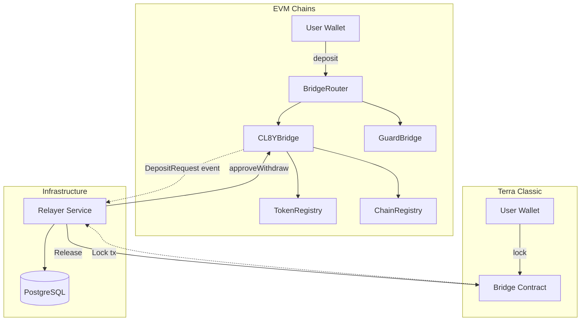
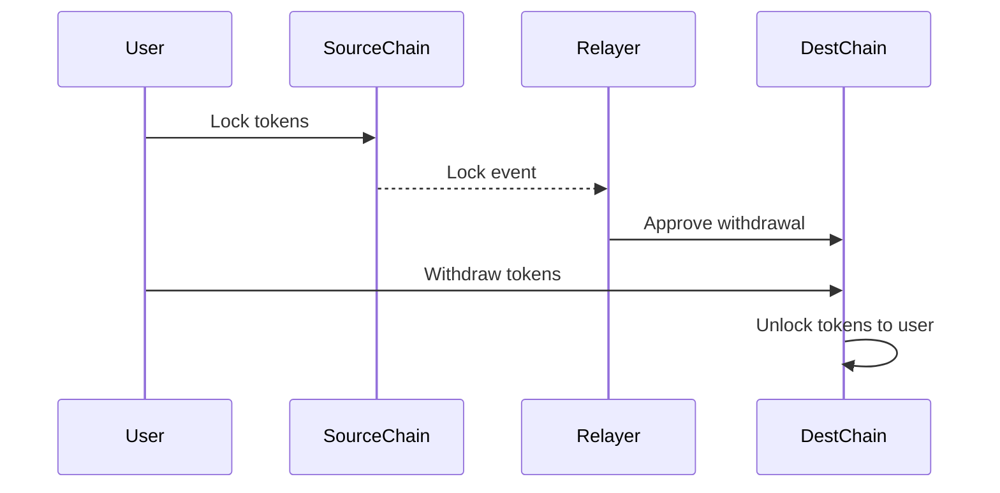

# System Architecture

This document describes the high-level architecture of the CL8Y Bridge system.

## Overview

CL8Y Bridge is a bidirectional cross-chain bridge connecting Terra Classic with EVM-compatible blockchains. It enables users to transfer tokens between chains securely and efficiently.

## Components

### Smart Contracts

#### EVM Contracts ([packages/contracts-evm/](../packages/contracts-evm/))

| Contract | Purpose | Documentation |
|----------|---------|---------------|
| `CL8YBridge.sol` | Core bridge logic: deposits, approvals, withdrawals | [contracts-evm.md](./contracts-evm.md#cl8ybridge) |
| `BridgeRouter.sol` | User entry point with guard checks | [contracts-evm.md](./contracts-evm.md#bridgerouter) |
| `TokenRegistry.sol` | Token configuration per chain | [contracts-evm.md](./contracts-evm.md#tokenregistry) |
| `ChainRegistry.sol` | Canonical chain identifiers | [contracts-evm.md](./contracts-evm.md#chainregistry) |
| `GuardBridge.sol` | Composable policy checks | [contracts-evm.md](./contracts-evm.md#guardbridge) |
| `MintBurn.sol` | Mint/burn token operations | [contracts-evm.md](./contracts-evm.md#mintburn) |
| `LockUnlock.sol` | Lock/unlock token operations | [contracts-evm.md](./contracts-evm.md#lockunlock) |

#### Terra Classic Contracts ([packages/contracts-terraclassic/](../packages/contracts-terraclassic/))

| Contract | Purpose | Documentation |
|----------|---------|---------------|
| `bridge` | Lock/release tokens, multi-relayer signatures | [contracts-terraclassic.md](./contracts-terraclassic.md) |

### Infrastructure

#### Relayer ([packages/relayer/](../packages/relayer/))

The relayer is an off-chain service that:
- Watches for deposit/lock events on both chains
- Submits approval/release transactions to complete transfers
- Tracks state in PostgreSQL for idempotency and recovery

See [Relayer Documentation](./relayer.md) for details.

## Bridge Modes

The bridge supports two modes per token:

### Lock/Unlock Mode

Used when tokens exist natively on both chains.

### Mint/Burn Mode

Used for wrapped/synthetic tokens.

## Security Model

### Multi-Signature Relayers (Terra Classic)

The Terra Classic contract requires a configurable threshold of relayer signatures to release tokens:
- Prevents single point of failure
- Signatures verified on-chain

### Withdrawal Delay (EVM)

EVM withdrawals have a configurable delay (default 5 minutes):
- Allows cancellation of fraudulent approvals
- Provides time for monitoring and intervention

### Guard Modules

Composable policy checks on EVM:
- Account blacklisting
- Per-token rate limits
- Deposit/withdrawal amount limits

## Chain Keys

Chains are identified by canonical keys:

| Chain Type | Key Format | Example |
|------------|------------|---------|
| EVM | `keccak256("EVM", chainId)` | BSC = `keccak256("EVM", 56)` |
| Cosmos | `keccak256("COSMOS", chainId, prefix)` | Terra = `keccak256("COSMOS", "columbus-5", "terra")` |

## Related Documentation

- [Crosschain Transfer Flows](./crosschain-flows.md) - Detailed step-by-step flows
- [EVM Contracts](./contracts-evm.md) - EVM contract details
- [Terra Classic Contracts](./contracts-terraclassic.md) - CosmWasm contract details
- [Relayer](./relayer.md) - Relayer service documentation
