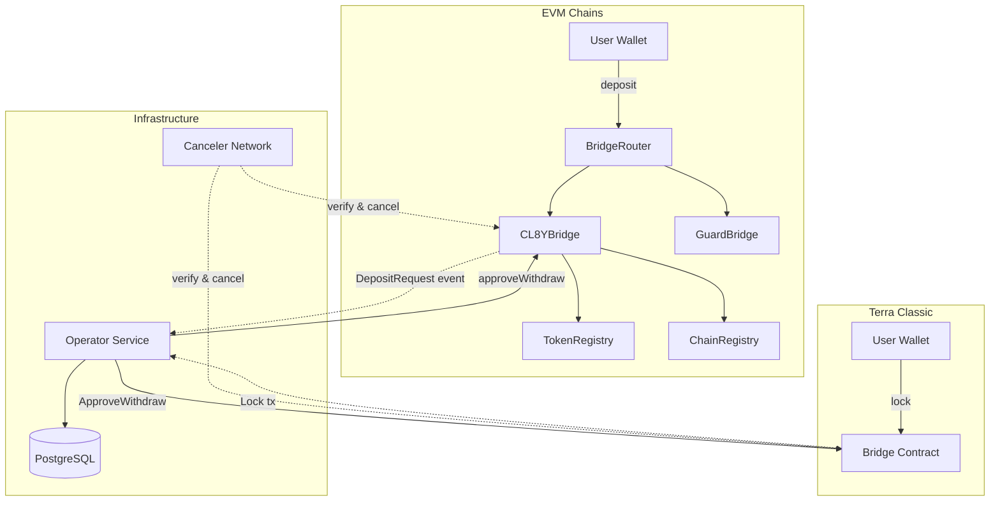
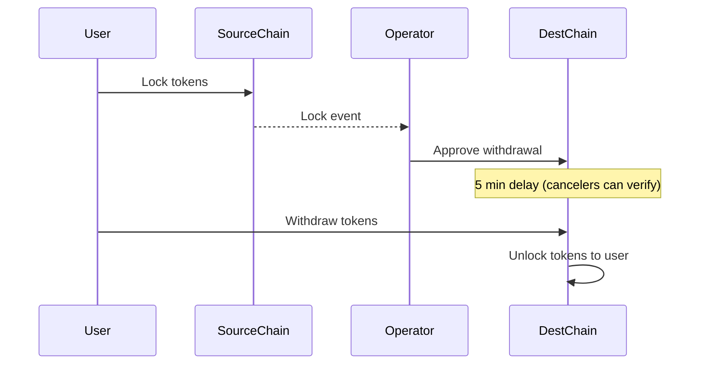
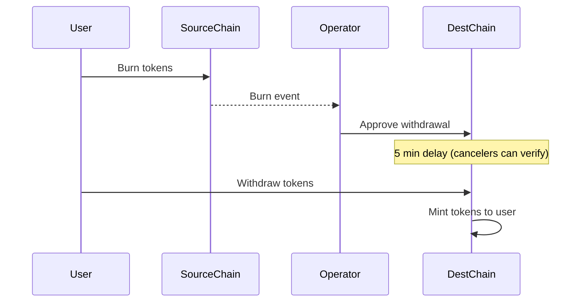
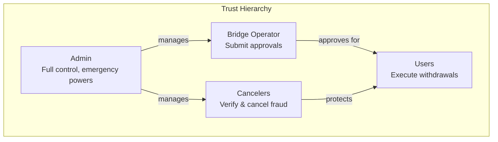

# System Architecture

This document describes the high-level architecture of the CL8Y Bridge system.

## Overview

CL8Y Bridge is a bidirectional cross-chain bridge connecting Terra Classic with EVM-compatible blockchains. It enables users to transfer tokens between chains securely and efficiently.

## Components

### Smart Contracts

#### EVM Contracts ([packages/contracts-evm/](../packages/contracts-evm/))

| Contract | Purpose | Documentation |
|----------|---------|---------------|
| `CL8YBridge.sol` | Core bridge logic: deposits, approvals, withdrawals | [contracts-evm.md](./contracts-evm.md#cl8ybridge) |
| `BridgeRouter.sol` | User entry point with guard checks | [contracts-evm.md](./contracts-evm.md#bridgerouter) |
| `TokenRegistry.sol` | Token configuration per chain | [contracts-evm.md](./contracts-evm.md#tokenregistry) |
| `ChainRegistry.sol` | Canonical chain identifiers | [contracts-evm.md](./contracts-evm.md#chainregistry) |
| `GuardBridge.sol` | Composable policy checks | [contracts-evm.md](./contracts-evm.md#guardbridge) |
| `MintBurn.sol` | Mint/burn token operations | [contracts-evm.md](./contracts-evm.md#mintburn) |
| `LockUnlock.sol` | Lock/unlock token operations | [contracts-evm.md](./contracts-evm.md#lockunlock) |

#### Terra Classic Contracts ([packages/contracts-terraclassic/](../packages/contracts-terraclassic/))

| Contract | Purpose | Documentation |
|----------|---------|---------------|
| `bridge` | Lock/release tokens, watchtower security | [contracts-terraclassic.md](./contracts-terraclassic.md) |

### Infrastructure

#### Operator ([packages/operator/](../packages/operator/))

The operator is an off-chain service that:
- Watches for deposit/lock events on both chains
- Submits approval transactions to destination chains
- Tracks state in PostgreSQL for idempotency and recovery
- Works with the canceler network for security

See [Operator Documentation](./operator.md) for details.

#### Canceler Network

Independent nodes that:
- Monitor approval events on destination chains
- Verify approvals against source chain deposits
- Cancel fraudulent approvals during the delay window

See [Canceler Network](./canceler-network.md) for details.

## Bridge Modes

The bridge supports two modes per token:

### Lock/Unlock Mode

Used when tokens exist natively on both chains.

### Mint/Burn Mode

Used for wrapped/synthetic tokens.

## Security Model

CL8Y Bridge uses a **watchtower security model** that provides strong security guarantees while maintaining fast transfer times. See [Security Model](./security-model.md) for comprehensive documentation.

### Trust Model

| Role | Trust Requirement | Can Cause |
|------|-------------------|-----------|
| **Admin** | Fully trusted | Configuration changes, fund recovery |
| **Operator** | Semi-trusted | Approval delays (not theft - cancelers prevent) |
| **Cancelers** | Minimally trusted | False-positive cancellations (admin can reenable) |
| **Users** | Untrusted | Only self-harm possible |

### Watchtower Pattern

The core security mechanism:

1. **Operator approves** a withdrawal based on source chain deposit
2. **5-minute delay** begins before execution is possible
3. **Cancelers verify** the approval against source chain state
4. **Cancel if fraud** detected, otherwise withdrawal proceeds

**Key Insight**: An attacker must fool **all** cancelers. A defender only needs **one** honest canceler.

### Canonical Hash Verification

Transfers are identified by deterministic hashes computed from:
- Source chain key
- Destination chain key  
- Token address
- Recipient address
- Amount
- Nonce

This enables cancelers to verify approvals against source chain deposits with cryptographic certainty.

### Defense in Depth

| Layer | Mechanism | Protection |
|-------|-----------|------------|
| 1 | Operator approval | Only authorized operators can approve |
| 2 | Delay window | Time for detection and response |
| 3 | Canceler network | Decentralized fraud detection |
| 4 | Hash verification | Cryptographic proof of validity |
| 5 | Rate limiting | Caps exposure per time period |
| 6 | Admin intervention | Emergency pause and recovery |

### Multi-Signature (Terra Classic - Current)

The current Terra Classic contract uses multi-sig verification (being upgraded to watchtower model):
- Configurable signature threshold for releases
- Signatures verified on-chain
- **Note**: Being replaced with approve-delay-cancel pattern for parity with EVM

**Note**: Terra Classic is being upgraded to the watchtower model for parity with EVM. See [Gap Analysis](./gap-analysis-terraclassic.md).

### Withdrawal Delay (EVM)

EVM withdrawals have a configurable delay (default 5 minutes):
- Allows cancellation of fraudulent approvals
- Provides time for monitoring and intervention
- Reenabling cancelled approvals resets the timer

### Guard Modules

Composable policy checks on EVM:
- Account blacklisting
- Per-token rate limits
- Deposit/withdrawal amount limits

## Chain Keys

Chains are identified by canonical keys:

| Chain Type | Key Format | Example |
|------------|------------|---------|
| EVM | `keccak256("EVM", chainId)` | BSC = `keccak256("EVM", 56)` |
| Cosmos | `keccak256("COSMOS", chainId, prefix)` | Terra = `keccak256("COSMOS", "columbus-5", "terra")` |

## Related Documentation

- [Security Model](./security-model.md) - Watchtower pattern and roles
- [Crosschain Transfer Flows](./crosschain-flows.md) - Detailed step-by-step flows
- [EVM Contracts](./contracts-evm.md) - EVM contract details
- [Terra Classic Contracts](./contracts-terraclassic.md) - CosmWasm contract details
- [Gap Analysis](./gap-analysis-terraclassic.md) - Terra Classic security gaps
- [Cross-Chain Parity](./crosschain-parity.md) - Parity requirements
- [Operator](./operator.md) - Operator service documentation
- [Canceler Network](./canceler-network.md) - Canceler node setup
