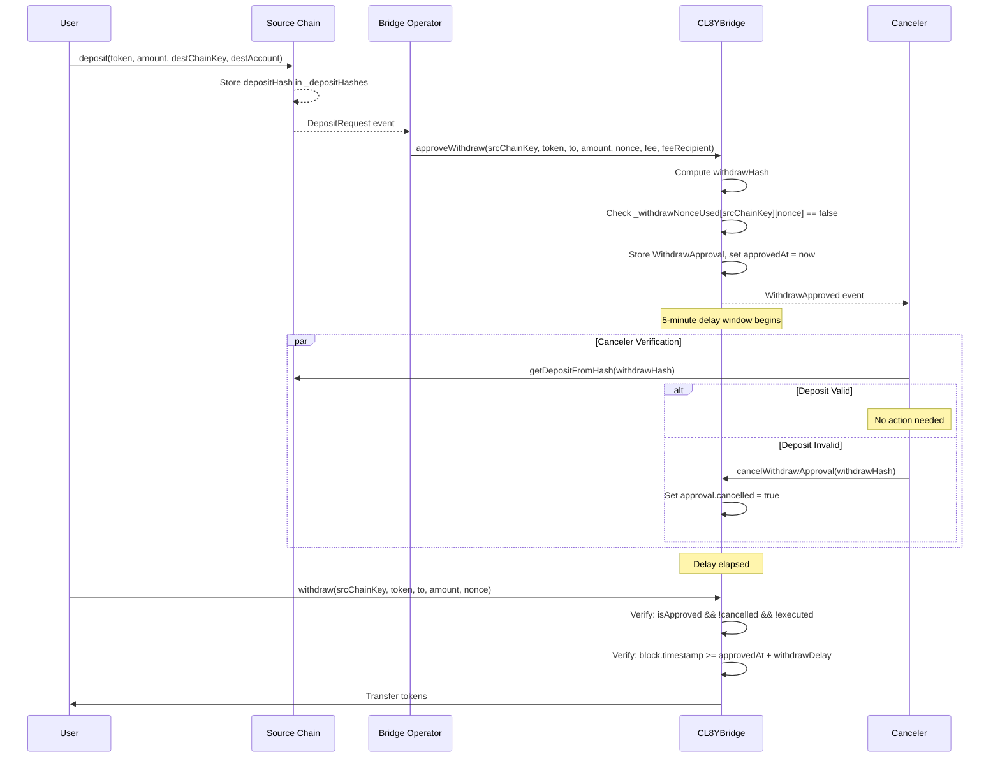
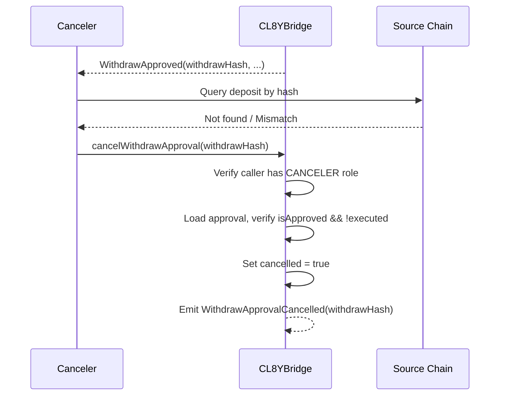
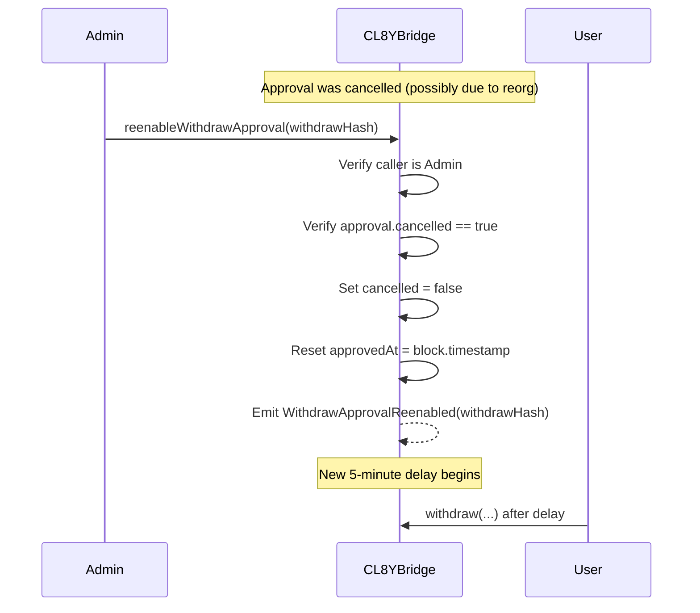

# EVM Contracts

This document describes the Solidity smart contracts deployed on EVM-compatible chains (BSC, Ethereum, Polygon, etc.).

**Source:** [packages/contracts-evm/src/](../packages/contracts-evm/src/)

## Overview

The EVM bridge consists of modular contracts that separate concerns:


## Core Contracts

### CL8YBridge

**Source:** [src/CL8YBridge.sol](../packages/contracts-evm/src/CL8YBridge.sol)

The core bridge state machine handling deposits, approvals, and withdrawals.

#### Key Functions

```solidity
// Deposit tokens for bridging to another chain
function deposit(
    address payer,
    address token,
    uint256 amount,
    bytes32 destChainKey,
    bytes32 destAccount
) external returns (uint256 nonce);

// Approve a withdrawal (called by bridge operator)
function approveWithdraw(
    bytes32 srcChainKey,
    address token,
    address to,
    uint256 amount,
    uint256 nonce,
    uint256 fee,
    address feeRecipient,
    bool deductFromAmount
) external;

// Execute a withdrawal (called by user after delay)
function withdraw(
    bytes32 srcChainKey,
    address token,
    address to,
    uint256 amount,
    uint256 nonce
) external payable;

// Cancel a pending approval
function cancelWithdrawApproval(bytes32 withdrawHash) external;

// Re-enable a cancelled approval
function reenableWithdrawApproval(bytes32 withdrawHash) external;
```

#### Events

```solidity
event DepositRequest(
    bytes32 indexed destChainKey,
    bytes32 indexed destTokenAddress,
    bytes32 indexed destAccount,
    address token,
    uint256 amount,
    uint256 nonce
);
```

### BridgeRouter

**Source:** [src/BridgeRouter.sol](../packages/contracts-evm/src/BridgeRouter.sol)

User-facing entry point that applies guard checks and handles native token wrapping.

#### Key Functions

```solidity
// Deposit ERC20 tokens
function deposit(
    address token,
    uint256 amount,
    bytes32 destChainKey,
    bytes32 destAccount
) external;

// Deposit native currency (ETH/BNB)
function depositNative(
    bytes32 destChainKey,
    bytes32 destAccount
) external payable;

// Withdraw ERC20 tokens
function withdraw(
    bytes32 srcChainKey,
    address token,
    address to,
    uint256 amount,
    uint256 nonce
) external payable;

// Withdraw as native currency
function withdrawNative(
    bytes32 srcChainKey,
    uint256 amount,
    uint256 nonce,
    address to
) external;
```

### TokenRegistry

**Source:** [src/TokenRegistry.sol](../packages/contracts-evm/src/TokenRegistry.sol)

Manages token configuration including bridge mode and cross-chain mappings.

#### Key Functions

```solidity
// Add a new token
function addToken(address token, BridgeType bridgeType) external;

// Add destination chain mapping for a token
function addTokenDestChainKey(
    address token,
    bytes32 destChainKey,
    bytes32 destChainTokenAddress,
    uint8 destChainTokenDecimals
) external;

// Get token info for a destination chain
function getTokenDestChainKey(
    address token,
    bytes32 destChainKey
) external view returns (bytes32 destToken, uint8 destDecimals);
```

#### Bridge Types

```solidity
enum BridgeType {
    MintBurn,   // Mint on destination, burn on source
    LockUnlock  // Lock on source, unlock on destination
}
```

### ChainRegistry

**Source:** [src/ChainRegistry.sol](../packages/contracts-evm/src/ChainRegistry.sol)

Maintains canonical chain identifiers.

```solidity
// Generate EVM chain key
function getChainKeyEVM(uint256 chainId) public pure returns (bytes32);

// Generate Cosmos chain key
function getChainKeyCosmos(
    string memory chainId,
    string memory addressPrefix
) public pure returns (bytes32);
```

### GuardBridge

**Source:** [src/GuardBridge.sol](../packages/contracts-evm/src/GuardBridge.sol)

Composable policy enforcement with pluggable guard modules.

```solidity
// Check if an account is allowed
function checkAccount(address account) external view;

// Check if a deposit is allowed
function checkDeposit(address token, uint256 amount, address sender) external view;

// Check if a withdrawal is allowed
function checkWithdraw(address token, uint256 amount, address sender) external view;
```

## Token Contracts

### MintBurn

**Source:** [src/MintBurn.sol](../packages/contracts-evm/src/MintBurn.sol)

Handles mint/burn operations for wrapped tokens.

```solidity
function mint(address to, address token, uint256 amount) external;
function burn(address from, address token, uint256 amount) external;
```

### LockUnlock

**Source:** [src/LockUnlock.sol](../packages/contracts-evm/src/LockUnlock.sol)

Handles lock/unlock operations for native tokens.

```solidity
function lock(address from, address token, uint256 amount) external;
function unlock(address to, address token, uint256 amount) external;
```

### TokenCl8yBridged

**Source:** [src/TokenCl8yBridged.sol](../packages/contracts-evm/src/TokenCl8yBridged.sol)

ERC20 implementation for bridged tokens with mint/burn capabilities.

### FactoryTokenCl8yBridged

**Source:** [src/FactoryTokenCl8yBridged.sol](../packages/contracts-evm/src/FactoryTokenCl8yBridged.sol)

Factory for deploying new bridged token contracts.

## Access Control

### AccessManagerEnumerable

**Source:** [src/AccessManagerEnumerable.sol](../packages/contracts-evm/src/AccessManagerEnumerable.sol)

Extended OpenZeppelin AccessManager with role enumeration.

### Roles

| Role | Permissions |
|------|-------------|
| Admin | Full access, role management, `reenableWithdrawApproval` |
| Bridge Operator | `approveWithdraw`, `cancelWithdrawApproval` |
| Canceler | `cancelWithdrawApproval` only |
| Guard Manager | Add/remove guard modules |
| Token Manager | Add/update tokens in registry |

---

## Security Model

The EVM contracts implement a **watchtower security model** with approve-delay-cancel mechanics. See [Security Model](./security-model.md) for comprehensive documentation.

### Canonical TransferId Hash

Every transfer is identified by a unique hash enabling cross-chain verification:

```solidity
bytes32 transferId = keccak256(abi.encode(
    srcChainKey,        // Source chain identifier
    destChainKey,       // Destination chain identifier  
    destTokenAddress,   // Token address on destination (bytes32)
    destAccount,        // Recipient account (bytes32)
    amount,             // Normalized amount
    nonce               // Unique nonce from source chain
));
```

This hash is computed identically on both source and destination chains, allowing cancelers to verify approvals against deposits.

### Withdrawal Flow with Security



### Cancel Flow

Cancelers call `cancelWithdrawApproval` when they detect a fraudulent or invalid approval:



### Reenable Flow

Admin can reenable cancelled approvals (e.g., after a blockchain reorg resolves):



### Nonce Tracking

Nonces are tracked per source chain to prevent duplicate approvals:

```solidity
// Key: srcChainKey => nonce => used
mapping(bytes32 => mapping(uint256 => bool)) private _withdrawNonceUsed;

// In approveWithdraw:
require(!_withdrawNonceUsed[srcChainKey][nonce], "NonceAlreadyUsed");
_withdrawNonceUsed[srcChainKey][nonce] = true;
```

This prevents:
- Same deposit being approved twice from the same source chain
- Replay attacks using old nonces

## Guard Modules

### BlacklistBasic

**Source:** [src/BlacklistBasic.sol](../packages/contracts-evm/src/BlacklistBasic.sol)

Simple address blacklisting.

### TokenRateLimit

**Source:** [src/TokenRateLimit.sol](../packages/contracts-evm/src/TokenRateLimit.sol)

Per-token rate limiting for deposits and withdrawals.

## Deployment

### Addresses

#### BSC Mainnet (v1.4)

| Contract | Address |
|----------|---------|
| AccessManagerEnumerable | `0x745120275A70693cc1D55cD5C81e99b0D2C1dF57` |

See [deployment-guide.md](./deployment-guide.md) for full deployment addresses.

### Deployment Scripts

Located in [packages/contracts-evm/script/](../packages/contracts-evm/script/):

- `DeployPart1.s.sol` - Initial deployment
- Uses CREATE2 for deterministic addresses

## Testing

```bash
cd packages/contracts-evm
forge test        # Run all tests
forge test -vvv   # Verbose output
forge coverage    # Coverage report
```

Test files in [packages/contracts-evm/test/](../packages/contracts-evm/test/).

## Related Documentation

- [Security Model](./security-model.md) - Watchtower pattern and security guarantees
- [Bridge Operator Implementation Guide](../packages/contracts-evm/DOC.md) - Detailed technical spec
- [System Architecture](./architecture.md) - Overall system design
- [Crosschain Flows](./crosschain-flows.md) - Transfer flow diagrams
- [Terra Classic Contracts](./contracts-terraclassic.md) - Partner chain contracts
- [Gap Analysis](./gap-analysis-terraclassic.md) - Security parity analysis
- [Cross-Chain Parity](./crosschain-parity.md) - Parity requirements
