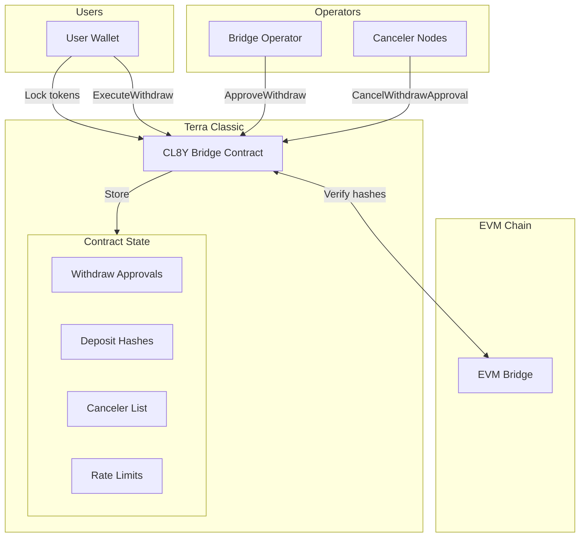
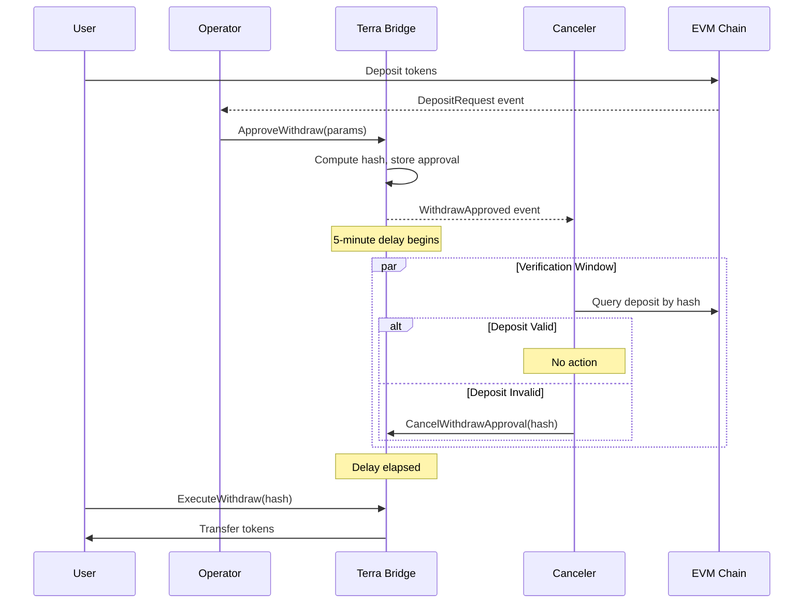

# Terra Classic Contracts

This document describes the CosmWasm smart contracts deployed on Terra Classic.

**Source:** [packages/contracts-terraclassic/](../packages/contracts-terraclassic/)  
**Upgrade Spec:** [terraclassic-upgrade-spec.md](./terraclassic-upgrade-spec.md)

## Overview

The Terra Classic bridge contract handles:
- Locking native tokens (LUNC, USTC) and CW20 tokens for bridging out
- **Approve-delay-execute pattern** for incoming withdrawals (watchtower security)
- Canceler-based fraud prevention during delay window
- Rate limiting per token
- Fee collection and administration

## Architecture



## Contract Structure

```
packages/contracts-terraclassic/
├── bridge/                    # Main bridge contract
│   ├── src/
│   │   ├── contract.rs       # Entry points and logic
│   │   ├── msg.rs            # Message types
│   │   ├── state.rs          # Storage definitions
│   │   ├── error.rs          # Error types
│   │   └── lib.rs            # Library exports
│   └── Cargo.toml
├── packages/
│   └── common/               # Shared types
│       └── src/
│           ├── lib.rs
│           └── asset.rs      # Asset info types
└── Cargo.toml               # Workspace config
```

## Messages

### InstantiateMsg

```rust
pub struct InstantiateMsg {
    pub admin: String,
    pub operators: Vec<String>,
    pub min_signatures: u32,
    pub min_bridge_amount: Uint128,
    pub max_bridge_amount: Uint128,
    pub fee_bps: u32,
    pub fee_collector: String,
}
```

### ExecuteMsg

#### Lock Native Tokens

Lock native tokens (LUNC, USTC) for bridging to EVM:

```rust
ExecuteMsg::Lock {
    dest_chain_id: u64,
    recipient: String,  // EVM address as hex string
}
```

Call with funds attached:
```bash
terrad tx wasm execute $BRIDGE_ADDR \
  '{"lock":{"dest_chain_id":56,"recipient":"0x..."}}' \
  --amount 1000000uluna \
  --from $WALLET
```

#### Lock CW20 Tokens

CW20 tokens use the Receive interface:

```rust
// First, call CW20 contract
cw20::Cw20ExecuteMsg::Send {
    contract: bridge_addr,
    amount,
    msg: to_binary(&ReceiveMsg::Lock {
        dest_chain_id,
        recipient,
    })?,
}
```

### Watchtower Pattern Messages (v2.0)

The watchtower pattern replaces immediate release with approve-delay-execute:

#### ApproveWithdraw

Called by operator to create a pending approval:

```rust
ExecuteMsg::ApproveWithdraw {
    src_chain_key: Binary,      // 32 bytes
    token: String,
    recipient: String,
    dest_account: Binary,       // 32 bytes (for hash verification)
    amount: Uint128,
    nonce: u64,
    fee: Uint128,
    fee_recipient: String,
    deduct_from_amount: bool,
}
```

**Flow:**
1. Operator detects deposit on source chain
2. Operator calls `ApproveWithdraw` with matching parameters
3. Contract computes canonical hash and stores approval
4. 5-minute delay window begins
5. Cancelers verify approval against source chain
6. If valid, user/operator calls `ExecuteWithdraw` after delay

#### ExecuteWithdraw

Called by anyone (typically user) after delay has elapsed:

```rust
ExecuteMsg::ExecuteWithdraw {
    withdraw_hash: Binary,      // 32-byte transferId
}
```

**Requirements:**
- Approval exists and is not cancelled
- Delay has elapsed (`block_time >= approved_at + withdraw_delay`)
- Rate limits not exceeded

#### CancelWithdrawApproval

Called by cancelers to block fraudulent approvals:

```rust
ExecuteMsg::CancelWithdrawApproval {
    withdraw_hash: Binary,
}
```

**When to cancel:**
- No matching deposit found on source chain
- Parameter mismatch (amount, recipient, etc.)
- Suspicious activity detected

#### ReenableWithdrawApproval

Called by admin to restore cancelled approvals (reorg recovery):

```rust
ExecuteMsg::ReenableWithdrawApproval {
    withdraw_hash: Binary,
}
```

**Effect:** Clears `cancelled` flag and resets delay timer.



### Legacy Messages (v1.x - Deprecated)

#### Release Tokens (DEPRECATED)

The immediate `Release` message is deprecated in favor of `ApproveWithdraw` + `ExecuteWithdraw`:

```rust
// DEPRECATED - Do not use in new integrations
ExecuteMsg::Release {
    nonce: u64,
    sender: String,
    recipient: String,
    token: String,
    amount: Uint128,
    source_chain_id: u64,
    signatures: Vec<String>,
}
```

### Canceler Management Messages

```rust
// Add a canceler address (admin only)
ExecuteMsg::AddCanceler { address: String }

// Remove a canceler address (admin only)
ExecuteMsg::RemoveCanceler { address: String }

// Set withdrawal delay (admin only, 60-86400 seconds)
ExecuteMsg::SetWithdrawDelay { delay_seconds: u64 }

// Set rate limit for a token (admin only)
ExecuteMsg::SetRateLimit {
    token: String,
    max_per_transaction: Uint128,
    max_per_period: Uint128,
    period_duration: u64,
}
```

### Admin Messages

```rust
// Chain management
ExecuteMsg::AddChain { chain_id, name, bridge_address }
ExecuteMsg::UpdateChain { chain_id, name, bridge_address, enabled }

// Token management
ExecuteMsg::AddToken { token, is_native, evm_token_address, terra_decimals, evm_decimals }
ExecuteMsg::UpdateToken { token, evm_token_address, enabled }

// Operator management
ExecuteMsg::AddOperator { operator }
ExecuteMsg::RemoveOperator { operator }
ExecuteMsg::UpdateMinSignatures { min_signatures }

// Configuration
ExecuteMsg::UpdateLimits { min_bridge_amount, max_bridge_amount }
ExecuteMsg::UpdateFees { fee_bps, fee_collector }

// Operations
ExecuteMsg::Pause {}
ExecuteMsg::Unpause {}

// Admin transfer (7-day timelock)
ExecuteMsg::ProposeAdmin { new_admin }
ExecuteMsg::AcceptAdmin {}
ExecuteMsg::CancelAdminProposal {}

// Emergency recovery (only when paused)
ExecuteMsg::RecoverAsset { asset, amount, recipient }
```

### QueryMsg

```rust
// Core queries
QueryMsg::Config {}                    // Returns ConfigResponse
QueryMsg::Status {}                    // Returns StatusResponse
QueryMsg::Stats {}                     // Returns StatsResponse
QueryMsg::Chain { chain_id }           // Returns ChainResponse
QueryMsg::Chains { start_after, limit } // Returns ChainsResponse
QueryMsg::Token { token }              // Returns TokenResponse
QueryMsg::Tokens { start_after, limit } // Returns TokensResponse
QueryMsg::Relayers {}                  // Returns RelayersResponse
QueryMsg::NonceUsed { nonce }          // Returns NonceUsedResponse
QueryMsg::CurrentNonce {}              // Returns NonceResponse
QueryMsg::Transaction { nonce }        // Returns TransactionResponse
QueryMsg::LockedBalance { token }      // Returns LockedBalanceResponse
QueryMsg::PendingAdmin {}              // Returns Option<PendingAdminResponse>
QueryMsg::SimulateBridge { token, amount, dest_chain_id } // Returns SimulationResponse

// Watchtower queries (v2.0)
QueryMsg::WithdrawApproval { withdraw_hash } // Returns WithdrawApprovalResponse
QueryMsg::ComputeWithdrawHash { ... }  // Returns ComputeHashResponse
QueryMsg::DepositHash { deposit_hash } // Returns Option<DepositInfoResponse>
QueryMsg::DepositByNonce { nonce }     // Returns Option<DepositInfoResponse>
QueryMsg::Cancelers {}                 // Returns CancelersResponse
QueryMsg::IsCanceler { address }       // Returns IsCancelerResponse
QueryMsg::WithdrawDelay {}             // Returns WithdrawDelayResponse
QueryMsg::RateLimit { token }          // Returns Option<RateLimitResponse>
QueryMsg::PeriodUsage { token }        // Returns PeriodUsageResponse
```

## State

### Config

```rust
pub struct Config {
    pub admin: Addr,
    pub paused: bool,
    pub min_signatures: u32,
    pub min_bridge_amount: Uint128,
    pub max_bridge_amount: Uint128,
    pub fee_bps: u32,
    pub fee_collector: Addr,
}
```

### Storage Keys

| Key | Type | Description |
|-----|------|-------------|
| `CONFIG` | `Config` | Contract configuration |
| `RELAYERS` | `Map<Addr, bool>` | Registered operators/relayers |
| `RELAYER_COUNT` | `u32` | Number of active operators |
| `CHAINS` | `Map<String, ChainConfig>` | Supported chains |
| `TOKENS` | `Map<String, TokenConfig>` | Supported tokens |
| `OUTGOING_NONCE` | `u64` | Next outgoing nonce |
| `USED_NONCES` | `Map<u64, bool>` | Used incoming nonces (legacy) |
| `TRANSACTIONS` | `Map<u64, BridgeTransaction>` | Transaction history |
| `LOCKED_BALANCES` | `Map<String, Uint128>` | Locked token balances |
| `STATS` | `Stats` | Bridge statistics |
| `PENDING_ADMIN` | `PendingAdmin` | Pending admin transfer |

### Watchtower State (v2.0)

| Key | Type | Description |
|-----|------|-------------|
| `WITHDRAW_DELAY` | `u64` | Delay in seconds (default 300) |
| `WITHDRAW_APPROVALS` | `Map<[u8;32], WithdrawApproval>` | Pending approvals by hash |
| `WITHDRAW_NONCE_USED` | `Map<([u8;32], u64), bool>` | Per-source-chain nonce tracking |
| `DEPOSIT_HASHES` | `Map<[u8;32], DepositInfo>` | Outgoing deposits for verification |
| `CANCELERS` | `Map<Addr, bool>` | Authorized canceler addresses |
| `RATE_LIMITS` | `Map<String, RateLimitConfig>` | Per-token rate limits |
| `PERIOD_TOTALS` | `Map<(String, u64), Uint128>` | Rate limit period tracking |

### WithdrawApproval Structure

```rust
pub struct WithdrawApproval {
    pub src_chain_key: [u8; 32],
    pub token: String,
    pub recipient: Addr,
    pub dest_account: [u8; 32],
    pub amount: Uint128,
    pub nonce: u64,
    pub fee: Uint128,
    pub fee_recipient: Addr,
    pub approved_at: Timestamp,
    pub is_approved: bool,
    pub deduct_from_amount: bool,
    pub cancelled: bool,
    pub executed: bool,
}
```

## Security Features

### Watchtower Security Model

- Configurable `min_signatures` threshold
- Operators submit approval transactions
- 5-minute delay before execution (configurable)
- Cancelers can block fraudulent approvals during delay
- See [Security Model](./security-model.md) for details

### Admin Timelock

- 7-day delay for admin transfers
- Prevents immediate malicious takeover
- Can be cancelled by current admin

### Amount Limits

- `min_bridge_amount`: Minimum per-transaction
- `max_bridge_amount`: Maximum per-transaction
- Configurable by admin

### Pause Mechanism

- Admin can pause all bridge operations
- Emergency asset recovery only available when paused

## Fee Structure

Fees are calculated in basis points (bps):
- 1 bps = 0.01%
- 100 bps = 1%

```rust
let fee_amount = amount.multiply_ratio(fee_bps as u128, 10000u128);
let net_amount = amount - fee_amount;
```

Fees are sent to `fee_collector` address.

## Transaction Attributes

Lock transactions emit attributes for operator observation:

| Attribute | Description |
|-----------|-------------|
| `method` | `"lock"` or `"lock_cw20"` |
| `nonce` | Transaction nonce |
| `sender` | Terra sender address |
| `recipient` | EVM recipient address |
| `token` | Token denom or CW20 address |
| `amount` | Net amount after fees |
| `fee` | Fee amount |
| `dest_chain_id` | Destination chain ID |

## Building

```bash
cd packages/contracts-terraclassic

# Build
cargo build --release --target wasm32-unknown-unknown

# Optimize for deployment
docker run --rm -v "$(pwd)":/code \
  --mount type=volume,source="$(basename "$(pwd)")_cache",target=/target \
  --mount type=volume,source=registry_cache,target=/usr/local/cargo/registry \
  cosmwasm/optimizer:0.15.0
```

Output: `artifacts/bridge.wasm`

## Deployment

See [packages/contracts-terraclassic/scripts/README.md](../packages/contracts-terraclassic/scripts/README.md) for deployment instructions.

### Networks

| Network | Chain ID | RPC |
|---------|----------|-----|
| Mainnet | `columbus-5` | `https://terra-classic-rpc.publicnode.com` |
| Testnet | `rebel-2` | `https://terra-classic-testnet-rpc.publicnode.com` |

## Related Documentation

- [Terra Classic Upgrade Spec](./terraclassic-upgrade-spec.md) - Complete v2.0 technical specification
- [System Architecture](./architecture.md) - Overall system design
- [Crosschain Flows](./crosschain-flows.md) - Transfer flow diagrams
- [EVM Contracts](./contracts-evm.md) - Partner chain contracts
- [Operator](./operator.md) - Off-chain operator service
- [Security Model](./security-model.md) - Watchtower pattern
- [Gap Analysis](./gap-analysis-terraclassic.md) - Security gap analysis
- [Cross-Chain Parity](./crosschain-parity.md) - Parity requirements
