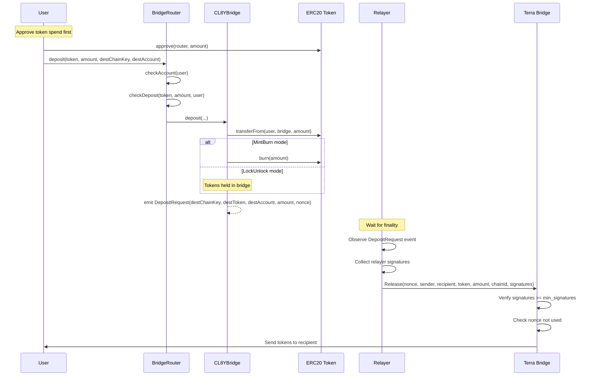
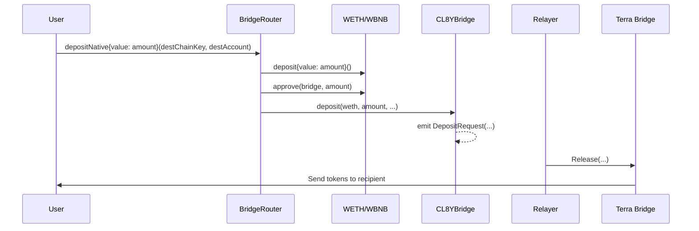
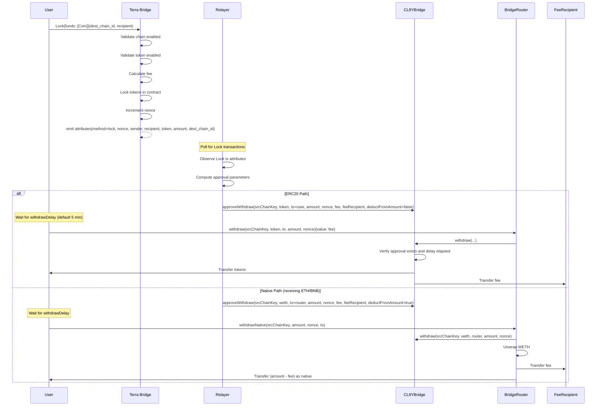
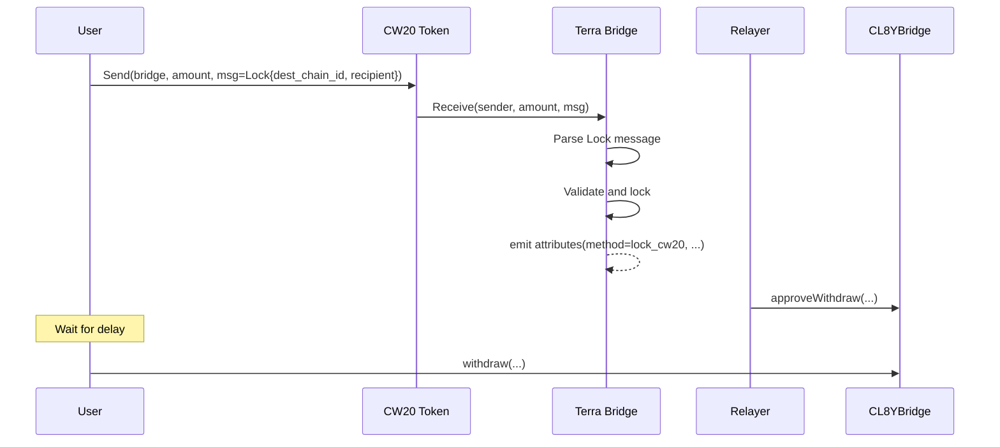

# Crosschain Transfer Flows

This document details the step-by-step flows for transferring tokens between EVM chains and Terra Classic.

## EVM to Terra Classic

### ERC20 Token Flow



### Native ETH/BNB Flow



## Terra Classic to EVM

### Native Token Flow (LUNC, USTC)



### CW20 Token Flow



## Key Identifiers

### Nonces

| Chain | Nonce Source | Uniqueness Scope |
|-------|--------------|------------------|
| EVM | `CL8YBridge.depositNonce` | Per bridge contract |
| Terra Classic | `OUTGOING_NONCE` | Per bridge contract |

### Chain Keys

```solidity
// EVM chain key
bytes32 chainKey = keccak256(abi.encode("EVM", chainId));

// Cosmos chain key
bytes32 chainKey = keccak256(abi.encode("COSMOS", chainId, addressPrefix));
```

### Withdraw Hash

Used to identify and look up withdrawal approvals:

```solidity
bytes32 withdrawHash = keccak256(abi.encode(
    srcChainKey,
    token,
    to,
    amount,
    nonce
));
```

## Fee Handling

### ERC20 Path

- `deductFromAmount = false`
- User pays fee as `msg.value` when calling `withdraw()`
- Full `amount` minted/unlocked to user

### Native Path

- `deductFromAmount = true`
- Fee deducted from bridged amount
- User receives `amount - fee` as native currency

## Error Handling

### Common Errors

| Error | Cause | Resolution |
|-------|-------|------------|
| `WithdrawNotApproved` | Approval missing or parameters mismatch | Verify approval exists with correct parameters |
| `WithdrawDelayNotElapsed` | User tried to withdraw before delay | Wait for delay period |
| `NonceAlreadyUsed` | Replay attack or duplicate | Nonce already processed |
| `InsufficientSignatures` | Not enough relayer signatures | Wait for more relayers to sign |

### Reorg Handling

If a deposit is reorged out:

1. Relayer calls `cancelWithdrawApproval(withdrawHash)` on destination
2. If deposit reappears, relayer calls `reenableWithdrawApproval(withdrawHash)`
3. Reenabling resets the delay timer

## Related Documentation

- [System Architecture](./architecture.md) - Component overview
- [EVM Contracts](./contracts-evm.md) - Contract interfaces
- [Terra Classic Contracts](./contracts-terraclassic.md) - CosmWasm messages
- [Relayer](./relayer.md) - Relayer operation details
