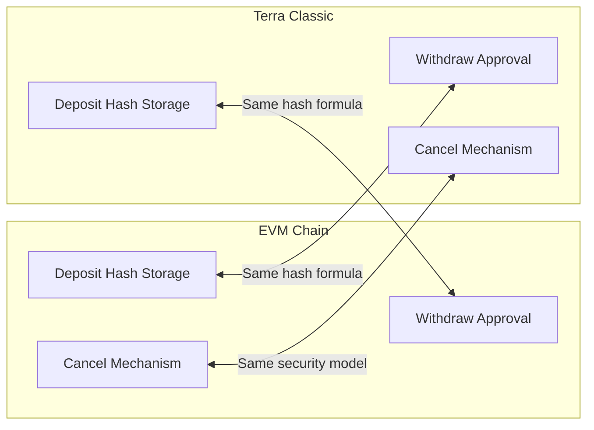
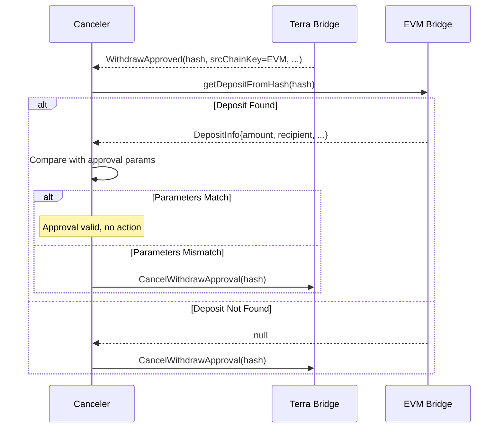
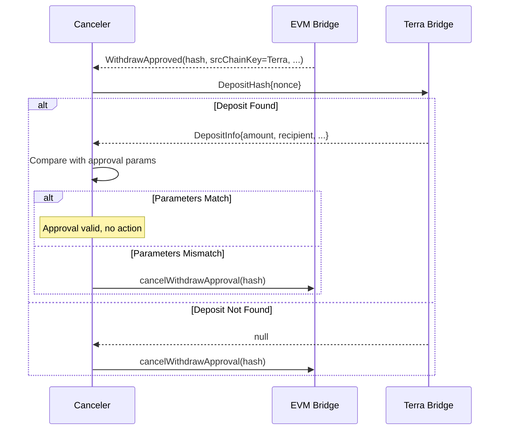

# Cross-Chain Parity Requirements

This document defines what security parity means for CL8Y Bridge and specifies the target state for Terra Classic to achieve equivalent security guarantees with EVM.

## Definition of Parity

**Cross-chain parity** means that transfers in both directions (EVM → Terra and Terra → EVM) have equivalent security guarantees:

1. **Same verification mechanism**: Canonical hash enables verification against source chain
2. **Same security layers**: Delay window, canceler network, rate limiting
3. **Same attack resistance**: Both chains protect against the same threat vectors
4. **Bidirectional verification**: Cancelers can verify transfers in either direction



---

## Parity Requirements

### P1: Hash Computation Parity

**Requirement**: Both chains compute identical hashes from identical inputs.

| Component | EVM | Terra Classic |
|-----------|-----|---------------|
| Algorithm | keccak256 | keccak256 |
| Encoding | abi.encode (32-byte slots) | Matching byte layout |
| Address format | 20 bytes, left-padded to 32 | 20 bytes canonical, left-padded to 32 |
| Amount format | uint256, big-endian | u128, left-padded to 32 bytes BE |
| Nonce format | uint256, big-endian | u64, left-padded to 32 bytes BE |

**Verification Test**:
```
Given: srcChainKey, destChainKey, destToken, destAccount, amount, nonce
EVM: computeTransferId(inputs) → hash_evm
Terra: compute_transfer_id(inputs) → hash_terra
Required: hash_evm == hash_terra
```

### P2: Delay Window Parity

**Requirement**: Both chains enforce the same delay period before withdrawal execution.

| Aspect | EVM | Terra Classic |
|--------|-----|---------------|
| Default delay | 5 minutes | 5 minutes |
| Configurable | Yes (admin) | Yes (admin) |
| Reset on reenable | Yes | Yes |
| Timer precision | Block timestamp | Block timestamp |

### P3: Cancel Mechanism Parity

**Requirement**: Both chains support cancellation by authorized cancelers during the delay window.

| Aspect | EVM | Terra Classic |
|--------|-----|---------------|
| Cancel function | `cancelWithdrawApproval(hash)` | `CancelWithdrawApproval { withdraw_hash }` |
| Authorization | CANCELER role | Canceler in CANCELERS map |
| Effect | Sets `cancelled = true` | Sets `cancelled = true` |
| Timing | Anytime before execution | Anytime before execution |

### P4: Reenable Mechanism Parity

**Requirement**: Both chains allow admin to restore cancelled approvals.

| Aspect | EVM | Terra Classic |
|--------|-----|---------------|
| Reenable function | `reenableWithdrawApproval(hash)` | `ReenableWithdrawApproval { withdraw_hash }` |
| Authorization | Admin role | Admin only |
| Effect | Clears cancelled, resets timer | Clears cancelled, resets timer |

### P5: Nonce Tracking Parity

**Requirement**: Both chains track nonces per source chain to prevent duplicates.

| Aspect | EVM | Terra Classic |
|--------|-----|---------------|
| Storage | `_withdrawNonceUsed[srcChainKey][nonce]` | `WITHDRAW_NONCE_USED[(src_chain_key, nonce)]` |
| Key format | (bytes32, uint256) | ([u8; 32], u64) |
| Check | During approveWithdraw | During ApproveWithdraw |

### P6: Deposit Hash Storage Parity

**Requirement**: Both chains store deposit hashes for cross-chain verification.

| Aspect | EVM | Terra Classic |
|--------|-----|---------------|
| Storage | `_depositHashes` set | `DEPOSIT_HASHES` map |
| Query | `getDepositFromHash(hash)` | `DepositHash { nonce }` |
| Purpose | Cancelers verify Terra→EVM | Cancelers verify EVM→Terra |

### P7: Rate Limiting Parity

**Requirement**: Both chains enforce per-token rate limits.

| Aspect | EVM | Terra Classic |
|--------|-----|---------------|
| Per-transaction limit | TokenRateLimit guard | Rate limit check in execute |
| Per-period limit | TokenRateLimit guard | Rate limit check in execute |
| Configuration | Per-token | Per-token |

---

## Target State: Terra Classic

### New Messages

```rust
// Execute messages
pub enum ExecuteMsg {
    // ... existing messages ...
    
    /// Approve a withdrawal (replaces Release, called by operator)
    ApproveWithdraw {
        src_chain_key: Binary,      // 32 bytes
        token: String,
        recipient: String,
        dest_account: Binary,       // 32 bytes (for hash computation)
        amount: Uint128,
        nonce: u64,
        fee: Uint128,
        fee_recipient: String,
        deduct_from_amount: bool,
    },
    
    /// Execute a withdrawal after delay (called by user or operator)
    ExecuteWithdraw {
        withdraw_hash: Binary,      // 32-byte transferId
    },
    
    /// Cancel a pending withdrawal approval (called by canceler)
    CancelWithdrawApproval {
        withdraw_hash: Binary,
    },
    
    /// Reenable a cancelled approval (called by admin)
    ReenableWithdrawApproval {
        withdraw_hash: Binary,
    },
    
    /// Add a canceler address (admin only)
    AddCanceler {
        address: String,
    },
    
    /// Remove a canceler address (admin only)
    RemoveCanceler {
        address: String,
    },
    
    /// Set the withdrawal delay (admin only)
    SetWithdrawDelay {
        delay_seconds: u64,
    },
    
    /// Set rate limit for a token (admin only)
    SetRateLimit {
        token: String,
        max_per_transaction: Uint128,
        max_per_period: Uint128,
        period_duration: u64,
    },
}
```

### New Queries

```rust
pub enum QueryMsg {
    // ... existing queries ...
    
    /// Get withdrawal approval by hash
    WithdrawApproval {
        withdraw_hash: Binary,
    },
    
    /// Compute withdraw hash without storing (for verification)
    ComputeWithdrawHash {
        src_chain_key: Binary,
        dest_chain_key: Binary,
        dest_token_address: Binary,
        dest_account: Binary,
        amount: Uint128,
        nonce: u64,
    },
    
    /// Get deposit hash for an outgoing transfer
    DepositHash {
        nonce: u64,
    },
    
    /// List all cancelers
    Cancelers {},
    
    /// Get current withdraw delay
    WithdrawDelay {},
    
    /// Get rate limit config for a token
    RateLimit {
        token: String,
    },
}
```

### New State

```rust
use cw_storage_plus::{Item, Map};

/// Withdrawal approval tracking
#[derive(Serialize, Deserialize, Clone, Debug, PartialEq, JsonSchema)]
pub struct WithdrawApproval {
    pub src_chain_key: [u8; 32],
    pub token: String,
    pub recipient: Addr,
    pub dest_account: [u8; 32],
    pub amount: Uint128,
    pub nonce: u64,
    pub fee: Uint128,
    pub fee_recipient: Addr,
    pub approved_at: Timestamp,
    pub is_approved: bool,
    pub deduct_from_amount: bool,
    pub cancelled: bool,
    pub executed: bool,
}

/// Deposit info for outgoing transfers
#[derive(Serialize, Deserialize, Clone, Debug, PartialEq, JsonSchema)]
pub struct DepositInfo {
    pub dest_chain_key: [u8; 32],
    pub dest_token_address: [u8; 32],
    pub dest_account: [u8; 32],
    pub amount: Uint128,
    pub nonce: u64,
    pub deposited_at: Timestamp,
}

/// Rate limit configuration
#[derive(Serialize, Deserialize, Clone, Debug, PartialEq, JsonSchema)]
pub struct RateLimitConfig {
    pub max_per_transaction: Uint128,
    pub max_per_period: Uint128,
    pub period_duration: u64,
}

// State items
pub const WITHDRAW_DELAY: Item<u64> = Item::new("withdraw_delay");

// State maps
pub const WITHDRAW_APPROVALS: Map<&[u8], WithdrawApproval> = Map::new("withdraw_approvals");
pub const WITHDRAW_NONCE_USED: Map<(&[u8], u64), bool> = Map::new("withdraw_nonce_used");
pub const DEPOSIT_HASHES: Map<&[u8], DepositInfo> = Map::new("deposit_hashes");
pub const CANCELERS: Map<&Addr, bool> = Map::new("cancelers");
pub const RATE_LIMITS: Map<&str, RateLimitConfig> = Map::new("rate_limits");
pub const PERIOD_TOTALS: Map<(&str, u64), Uint128> = Map::new("period_totals");
```

### Configuration Updates

```rust
#[derive(Serialize, Deserialize, Clone, Debug, PartialEq, JsonSchema)]
pub struct Config {
    // ... existing fields ...
    
    /// Withdrawal delay in seconds (default: 300 = 5 minutes)
    pub withdraw_delay: u64,
}

impl Default for Config {
    fn default() -> Self {
        Self {
            // ... existing defaults ...
            withdraw_delay: 300,
        }
    }
}
```

---

## Verification Flows

### EVM → Terra Verification

Cancelers on Terra Classic verify approvals against EVM deposits:



### Terra → EVM Verification

Cancelers on EVM verify approvals against Terra deposits:



---

## Chain Key Computation

Both chains must compute chain keys identically.

### EVM Chain Key

```solidity
// EVM
function getChainKeyEVM(uint256 chainId) public pure returns (bytes32) {
    return keccak256(abi.encode("EVM", chainId));
}
```

```rust
// Terra
fn evm_chain_key(chain_id: u64) -> [u8; 32] {
    let mut data = Vec::new();
    // "EVM" as bytes, padded to 32 bytes
    let mut evm_bytes = [0u8; 32];
    evm_bytes[29..32].copy_from_slice(b"EVM");
    data.extend_from_slice(&evm_bytes);
    // chain_id as uint256
    let mut chain_id_bytes = [0u8; 32];
    chain_id_bytes[24..].copy_from_slice(&chain_id.to_be_bytes());
    data.extend_from_slice(&chain_id_bytes);
    keccak256(&data)
}
```

### Cosmos Chain Key

```solidity
// EVM
function getChainKeyCosmos(string memory chainId, string memory prefix) public pure returns (bytes32) {
    return keccak256(abi.encode("COSMOS", chainId, prefix));
}
```

```rust
// Terra
fn cosmos_chain_key(chain_id: &str, prefix: &str) -> [u8; 32] {
    // Match Solidity's abi.encode for strings
    // This includes length prefix and padding
    keccak256(&abi_encode_cosmos_key(chain_id, prefix))
}
```

---

## Keccak256 Implementation

**Decision**: Use cosmwasm-crypto if available, otherwise tiny-keccak.

### Option 1: cosmwasm-crypto (Preferred)

```toml
[dependencies]
cosmwasm-crypto = "1.5"
```

```rust
use cosmwasm_crypto::keccak256;

fn compute_hash(data: &[u8]) -> [u8; 32] {
    keccak256(data)
}
```

### Option 2: tiny-keccak (Fallback)

```toml
[dependencies]
tiny-keccak = { version = "2.0", features = ["keccak"] }
```

```rust
use tiny_keccak::{Hasher, Keccak};

fn keccak256(data: &[u8]) -> [u8; 32] {
    let mut hasher = Keccak::v256();
    hasher.update(data);
    let mut output = [0u8; 32];
    hasher.finalize(&mut output);
    output
}
```

---

## Parity Verification Checklist

Before deployment, verify:

- [ ] **Hash Parity**: Same inputs produce same hash on both chains
- [ ] **Delay Parity**: Same delay period configured
- [ ] **Cancel Parity**: Cancelers can cancel on both chains
- [ ] **Reenable Parity**: Admin can reenable on both chains
- [ ] **Nonce Parity**: Per-source-chain nonce tracking works
- [ ] **Rate Limit Parity**: Limits enforced on both chains
- [ ] **Query Parity**: Verification queries work bidirectionally

### Test Vectors

Generate from EVM and verify on Terra:

```json
{
  "test_vectors": [
    {
      "inputs": {
        "srcChainKey": "0x1234...",
        "destChainKey": "0x5678...",
        "destTokenAddress": "0xabcd...",
        "destAccount": "0xef01...",
        "amount": "1000000000000000000",
        "nonce": 42
      },
      "expected_hash": "0x9876..."
    }
  ]
}
```

---

## Implementation Decisions Summary

| Question | Decision |
|----------|----------|
| Deprecate `Release`? | Yes, fully deprecate (not on mainnet) |
| Initial cancelers? | Team-operated only for launch |
| Default withdraw delay? | 5 minutes (match EVM) |
| Include rate limiting? | Yes, in this implementation |
| Keccak implementation? | cosmwasm-crypto if available, else tiny-keccak |
| Store deposit hashes? | Yes, full parity |
| Address encoding? | Cosmos canonical bytes (20), left-padded to 32 |

---

## Related Documentation

- [Security Model](./security-model.md) - Watchtower pattern explanation
- [Gap Analysis](./gap-analysis-terraclassic.md) - Current gaps and risks
- [EVM Contracts](./contracts-evm.md) - Reference implementation
- [Terra Classic Contracts](./contracts-terraclassic.md) - Implementation target
