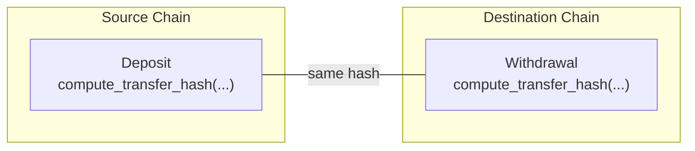
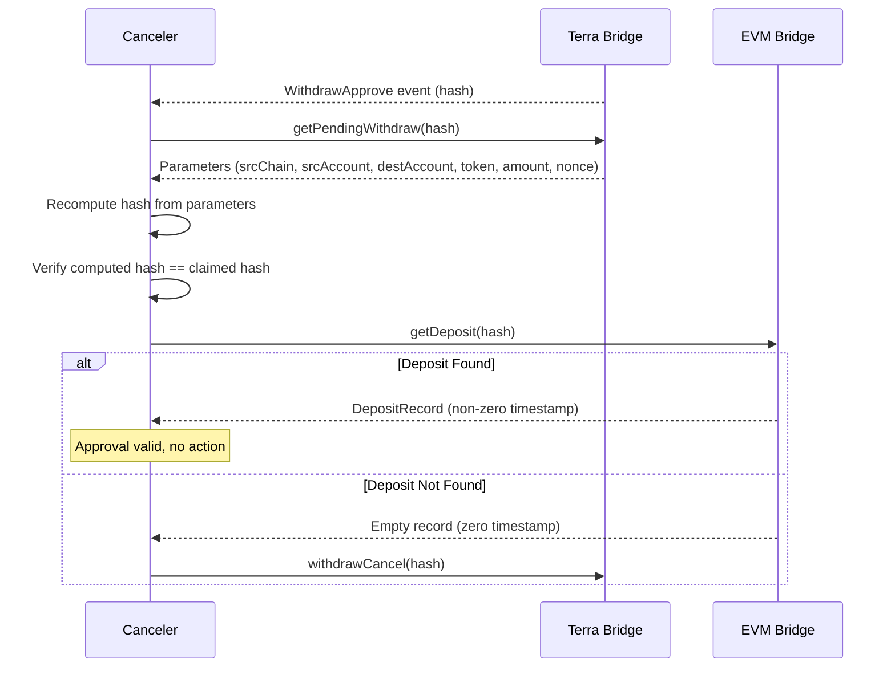
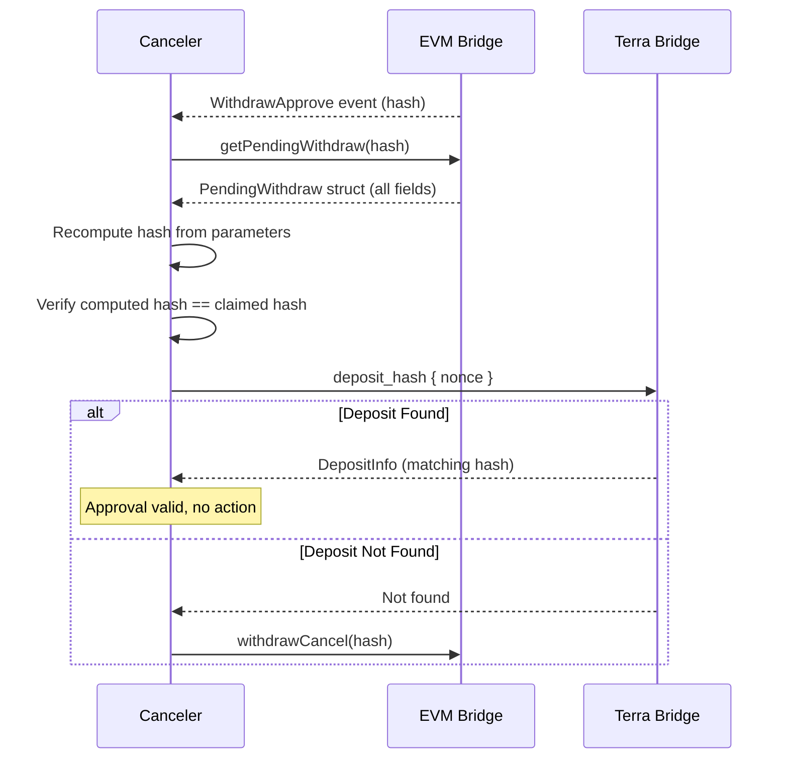

# Cross-Chain Hash Parity

This document defines how CL8Y Bridge maintains hash parity across chains so that deposits on one chain can be cryptographically verified against withdrawals on another. It covers the V2 unified transfer hash, token encoding rules, address encoding, and the test coverage that validates parity across all four codebases.

## Overview

Every cross-chain transfer produces a single canonical **transfer hash** that is identical whether computed on the source chain (as a "deposit hash") or the destination chain (as a "withdraw hash"). This hash is the primary key for cross-chain verification: cancelers compare the hash stored at the deposit source against the hash stored at the withdrawal destination.



**Key invariant**: `deposit_hash == withdraw_hash` for the same transfer, regardless of which chains are involved (EVM↔EVM, EVM↔Terra, Terra↔EVM).

---

## V2 Transfer Hash (7-Field Unified)

Both deposits and withdrawals use the same 7-field keccak256 hash:

```solidity
// Solidity (HashLib.sol)
bytes32 transferHash = keccak256(abi.encode(
    bytes32(srcChain),    // 4-byte chain ID, left-aligned in 32 bytes
    bytes32(destChain),   // 4-byte chain ID, left-aligned in 32 bytes
    srcAccount,           // bytes32 - depositor address
    destAccount,          // bytes32 - recipient address
    token,                // bytes32 - DESTINATION token (always)
    amount,               // uint256 - NET amount (post-fee)
    uint256(nonce)        // uint256 - deposit nonce from source chain
));
```

```rust
// Rust (multichain-rs/src/hash.rs)
fn compute_transfer_hash(
    src_chain: &[u8; 4],      // 4-byte chain ID
    dest_chain: &[u8; 4],     // 4-byte chain ID
    src_account: &[u8; 32],   // depositor address
    dest_account: &[u8; 32],  // recipient address
    token: &[u8; 32],         // DESTINATION token (always)
    amount: u128,              // NET amount (post-fee)
    nonce: u64,                // deposit nonce from source chain
) -> [u8; 32]
```

The ABI encoding produces a fixed 224-byte buffer (7 x 32 bytes) that is then keccak256-hashed.

### Deposit vs Withdraw: Same Hash, Different Perspective

On deposit (source chain):
- `srcChain` = this chain's ID
- `srcAccount` = msg.sender (depositor)
- `destChain`, `destAccount`, `token` = from user-provided parameters

On withdrawal (destination chain):
- `srcChain`, `srcAccount` = from the original deposit
- `destChain` = this chain's ID
- `destAccount` = recipient
- `token` = destination token address

Since all seven parameters are identical, the hash is identical.

---

## Token Encoding

The `token` field in the transfer hash is **always the destination token** encoded as `bytes32`. The encoding depends on the token type:

### ERC20 Addresses (EVM)

```
bytes32(uint256(uint160(address)))
```

The 20-byte address is placed in the **last 20 bytes** (positions 12..31), with the first 12 bytes as zeros.

```
Positions: [0..11: 0x00] [12..31: address bytes]
Example:   0x000000000000000000000000aabbccdd...eeff
```

### Native Denoms (Terra Classic)

Native denominations like `"uluna"` and `"uusd"` are encoded as:

```
keccak256(denom_string_as_bytes)
```

Example: `keccak256("uluna")` → `0x02ba7fc7bf3e0a68f6f3a37987aa6b4e36ed3cfd1e58cf0b8e54f82e8b864a41`

### CW20 Token Addresses (Terra Classic)

CW20 contract addresses (bech32 format like `"terra1qg5ega6dykkxc307y25pecuufrjkxkaggmx2n8"`) are encoded by:

1. Bech32-decode to get the raw 20-byte canonical address
2. Left-pad with zeros to 32 bytes (address in positions 12..31)

```
Positions: [0..11: 0x00] [12..31: canonical bytes from bech32 decode]
```

This matches the EVM `bytes32(uint256(uint160(...)))` format.

### Token Encoding Summary

| Token Type | Encoding | Positions |
|-----------|----------|-----------|
| ERC20 address | `bytes32(uint256(uint160(address)))` | 12..31 |
| CW20 address | bech32 decode → left-pad to 32 | 12..31 |
| Native denom | `keccak256(denom.as_bytes())` | full 32 bytes |

### Critical Rule: Token Is Always the Destination Token

The `token` parameter in the transfer hash is **always** the token address on the **destination** chain, not the source chain. This is enforced by:

- **EVM deposit**: `destToken = tokenRegistry.getDestToken(sourceToken, destChain)`
- **Terra deposit**: `dest_token_address` from the token configuration's `evm_token_address`
- **EVM withdrawSubmit**: User passes the local token address
- **Terra withdrawSubmit**: User passes the local token string

---

## Address Encoding

All addresses are encoded as `bytes32` (left-padded with zeros):

### EVM Addresses

```
bytes32(uint256(uint160(evmAddress)))
```

20-byte address in positions 12..31:

```
[0x00 * 12] [20 bytes of address]
```

### Terra Bech32 Addresses

1. Bech32-decode `"terra1..."` to get the 20-byte canonical address
2. Left-pad with zeros to 32 bytes

```
[0x00 * 12] [20 bytes from bech32 decode]
```

This is the same layout as EVM addresses, ensuring consistent encoding.

---

## Chain ID Encoding

Chain IDs are 4-byte big-endian unsigned integers, **left-aligned** in the 32-byte slot:

```
Positions: [0..3: chain_id bytes] [4..31: 0x00]
```

Examples:
- Chain ID 1 (Ethereum): `[0x00, 0x00, 0x00, 0x01, 0x00 * 28]`
- Chain ID 56 (BSC): `[0x00, 0x00, 0x00, 0x38, 0x00 * 28]`
- Chain ID 5 (LocalTerra): `[0x00, 0x00, 0x00, 0x05, 0x00 * 28]`

---

## Amount: Always Net (Post-Fee)

The `amount` field in the hash is **always the net amount after fee deduction**:

- **EVM deposit**: `netAmount = amount - fee`; hash uses `netAmount`
- **Terra deposit**: `net_amount = amount - fee_amount`; hash uses `net_amount`
- **Withdrawal**: User passes the net amount received from the deposit event

This ensures the deposit hash and withdrawal hash use the same amount value.

---

## Implementation Locations

The hash computation is implemented identically in four codebases:

| Codebase | File | Function |
|----------|------|----------|
| Solidity (EVM) | `contracts-evm/src/lib/HashLib.sol` | `computeTransferHash()` |
| Rust (shared library) | `multichain-rs/src/hash.rs` | `compute_transfer_hash()` |
| CosmWasm (Terra) | `contracts-terraclassic/bridge/src/hash.rs` | `compute_transfer_hash()` |
| Operator/Canceler | Via `multichain-rs` dependency | `compute_transfer_hash()` |

All four must produce identical output for the same input.

---

## Operator and Canceler Hash Usage

### Operator

The operator approves withdrawals using transfer hashes:

- **Terra Writer (EVM→Terra)**: Uses hash-matching. Reads the `withdraw_hash` stored on-chain by the user's `withdrawSubmit` call, verifies it against the EVM `getDeposit(hash)` record, and approves by hash. **No hash recomputation needed.**

- **EVM Writer (Terra→EVM)**: Computes the transfer hash from Terra deposit data to call `withdrawApprove(hash)` on EVM. The hash must match the pending withdrawal submitted by the user via `withdrawSubmit`.

### Canceler

The canceler verifies approvals by:

1. Observing `WithdrawApprove` events on destination chains
2. Querying the full withdrawal parameters from the destination contract
3. Recomputing the hash from those parameters using `compute_transfer_hash`
4. Verifying the recomputed hash matches the claimed `withdraw_hash`
5. Querying the source chain to verify the deposit exists with the same hash
6. Cancelling if no matching deposit is found (fraud detection)

---

## Parity Requirements

### P1: Hash Computation Parity

Both chains compute identical hashes from identical inputs.

| Component | EVM (Solidity) | Terra (Rust/CosmWasm) |
|-----------|---------------|----------------------|
| Algorithm | keccak256 | keccak256 (tiny_keccak) |
| Encoding | `abi.encode` (32-byte slots) | Matching byte layout |
| Chain ID | bytes4 left-aligned in bytes32 | `[u8; 4]` left-aligned in `[u8; 32]` |
| Address | left-padded to bytes32 | left-padded to `[u8; 32]` |
| Amount | uint256, big-endian | u128, left-padded to 32 bytes BE |
| Nonce | uint256, big-endian | u64, left-padded to 32 bytes BE |
| Token | bytes32 (dest token) | `[u8; 32]` (dest token) |

### P2: Delay Window Parity

| Aspect | EVM | Terra Classic |
|--------|-----|---------------|
| Default delay | 5 minutes | 5 minutes |
| Configurable | Yes (admin) | Yes (admin) |
| Timer precision | Block timestamp | Block timestamp |

### P3: Cancel Mechanism Parity

| Aspect | EVM | Terra Classic |
|--------|-----|---------------|
| Cancel function | `withdrawCancel(hash)` | `withdraw_cancel { withdraw_hash }` |
| Authorization | CANCELER role | Canceler in CANCELERS map |
| Effect | Sets `cancelled = true` | Sets `cancelled = true` |

### P4: Nonce Tracking Parity

| Aspect | EVM | Terra Classic |
|--------|-----|---------------|
| Storage | `depositNonce` counter | `OUTGOING_NONCE` counter |
| Per-chain | Single global counter | Single global counter |
| Used in hash | Yes (7th field) | Yes (7th field) |

### P5: Deposit Hash Storage Parity

| Aspect | EVM | Terra Classic |
|--------|-----|---------------|
| Storage | `deposits[hash]` mapping | `DEPOSIT_HASHES` map |
| Query | `getDeposit(hash)` | `deposit_hash { nonce }` |
| Purpose | Cancelers verify Terra→EVM | Cancelers verify EVM→Terra |

---

## Test Coverage

Cross-chain hash parity is verified by unit tests across all four codebases. Each test computes the transfer hash independently and asserts identical results against hardcoded reference values.

### Test Matrix

| Route | Token Type | Solidity | Rust (multichain-rs) | Operator | Terra Contract |
|-------|-----------|----------|---------------------|----------|---------------|
| EVM→EVM | ERC20 | `test_DepositWithdraw_EvmToEvm_Erc20` | `test_deposit_withdraw_match_evm_to_evm_erc20` | `test_deposit_withdraw_match_evm_to_evm_erc20` | -- |
| EVM→Terra | Native (uluna) | `test_DepositWithdraw_EvmToTerra_Uluna` | `test_deposit_withdraw_match_evm_to_terra_uluna` | `test_deposit_withdraw_match_evm_to_terra_uluna` | `test_deposit_withdraw_match_evm_to_terra_uluna` |
| EVM→Terra | CW20 | `test_DepositWithdraw_EvmToTerra_Cw20` | `test_deposit_withdraw_match_evm_to_terra_cw20` | `test_deposit_withdraw_match_evm_to_terra_cw20` | `test_deposit_withdraw_match_evm_to_terra_cw20` |
| Terra→EVM | Native (uluna)→ERC20 | `test_DepositWithdraw_TerraToEvm_UlunaErc20` | `test_deposit_withdraw_match_terra_to_evm_uluna` | `test_deposit_withdraw_match_terra_to_evm_uluna` | `test_deposit_withdraw_match_terra_to_evm_uluna` |
| Terra→EVM | CW20→ERC20 | `test_DepositWithdraw_TerraToEvm_Cw20Erc20` | `test_deposit_withdraw_match_terra_to_evm_cw20` | `test_deposit_withdraw_match_terra_to_evm_cw20` | `test_deposit_withdraw_match_terra_to_evm_cw20` |

### Running the Tests

```bash
# Solidity (38 tests including 5 deposit/withdraw parity)
cd packages/contracts-evm && forge test --match-contract HashLibTest -v

# Rust shared library (18 tests including 5 deposit/withdraw parity)
cd packages/multichain-rs && cargo test hash::tests

# Operator integration tests (29 tests including 5 deposit/withdraw parity)
cd packages/operator && cargo test hash_parity

# Terra contract (tests including 5 deposit/withdraw parity)
cd packages/contracts-terraclassic/bridge && cargo test --lib hash::tests
```

### What the Tests Verify

1. **Token encoding**: ERC20 addresses, CW20 addresses, and native denoms produce the correct `bytes32` encoding
2. **Address encoding**: EVM and Terra addresses are correctly left-padded to `bytes32`
3. **Hash consistency**: The same parameters produce identical hashes across Solidity, Rust, and CosmWasm
4. **Deposit/withdraw parity**: For each route and token type, `deposit_hash == withdraw_hash`
5. **Cross-codebase parity**: Hardcoded reference hashes match across all four codebases

---

## Common Pitfalls

These are the most common sources of hash mismatch, based on bugs caught during development:

### 1. Using Source Token Instead of Destination Token

The `token` field must be the **destination** token. On EVM, the bridge calls `tokenRegistry.getDestToken(sourceToken, destChain)`. On Terra, the deposit handler looks up the `evm_token_address` from the token configuration.

**Wrong**: Using the deposited token address directly
**Right**: Looking up the registered destination token for the target chain

### 2. Using Gross Amount Instead of Net Amount

The hash must use the **post-fee** amount. Both the EVM and Terra contracts deduct fees before computing the hash.

**Wrong**: `hash(amount)` where `amount` is the user's deposited value
**Right**: `hash(amount - fee)` using the net value after fee deduction

### 3. Wrong Address Encoding

Terra addresses must be bech32-decoded to canonical bytes and left-padded. A common mistake is encoding them with a chain-type prefix or placing the bytes at the wrong positions.

**Wrong**: `[chain_type(4 bytes), address(20 bytes), zeros(8 bytes)]` (positions 0..23)
**Right**: `[zeros(12 bytes), address(20 bytes)]` (positions 12..31)

### 4. Wrong Token Type for Native Denoms

Native denominations like `"uluna"` use `keccak256("uluna")` which produces a full 32-byte hash. CW20 addresses use bech32-decode + left-pad. Mixing these up produces different `bytes32` values for the same conceptual token.

### 5. Wrong ABI Function Signature

When querying the EVM bridge for withdrawal data, the function signature must exactly match the contract. The auto-generated getter for `mapping(bytes32 => PendingWithdraw) public pendingWithdraws` returns all struct fields in order. Using `getPendingWithdraw(bytes32)` is the explicit alternative. Wrong signatures cause ABI decoding errors where returned fields are misaligned.

---

## Verification Flows

### Canceler: EVM → Terra Verification



### Canceler: Terra → EVM Verification



---

## Related Documentation

- [System Architecture](./architecture.md) - Component overview
- [Security Model](./security-model.md) - Watchtower pattern and roles
- [Crosschain Transfer Flows](./crosschain-flows.md) - Step-by-step transfer diagrams
- [EVM Contracts](./contracts-evm.md) - Solidity contract details
- [Terra Classic Contracts](./contracts-terraclassic.md) - CosmWasm contract details
- [Operator](./operator.md) - Operator service documentation
- [Canceler Network](./canceler-network.md) - Canceler node setup
