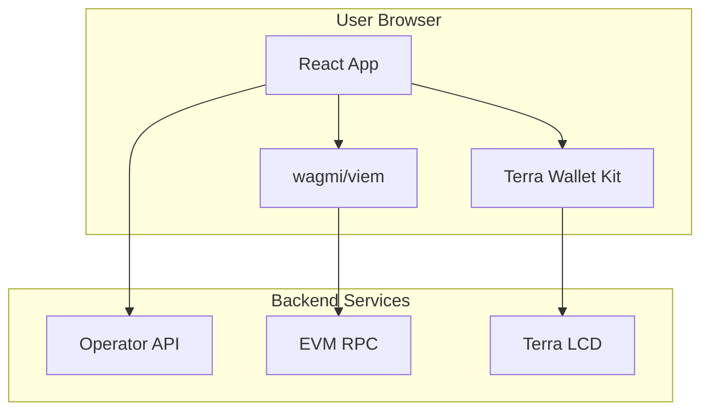

# Frontend

The CL8Y Bridge frontend is a React-based web application that provides a user interface for cross-chain transfers between Terra Classic and EVM-compatible chains.

**Source:** [packages/frontend/](../packages/frontend/)

## Overview



## Tech Stack

| Technology | Version | Purpose |
|------------|---------|---------|
| React | 18 | UI framework |
| TypeScript | 5.x | Type safety |
| Vite | 5.x | Build tool |
| TailwindCSS | 3.x | Styling |
| wagmi | 2.x | EVM wallet connection |
| viem | 2.x | EVM interactions |
| @tanstack/react-query | 5.x | Data fetching |

## Project Structure

```
packages/frontend/
├── src/
│   ├── components/
│   │   ├── ConnectWallet.tsx    # Wallet connection UI
│   │   ├── BridgeForm.tsx       # Bridge transfer form
│   │   └── TransactionHistory.tsx # Transaction list
│   ├── lib/
│   │   ├── wagmi.ts             # wagmi configuration
│   │   └── chains.ts            # Chain definitions
│   ├── App.tsx                  # Main application
│   ├── main.tsx                 # Entry point
│   └── index.css                # Global styles
├── package.json
├── vite.config.ts
├── tailwind.config.js
└── tsconfig.json
```

## Components

### ConnectWallet

Handles EVM wallet connection using wagmi hooks.

```tsx
// Usage
<ConnectWallet />
```

Features:
- MetaMask and WalletConnect support
- Displays connected address (truncated)
- Shows wallet balance
- Disconnect functionality

### BridgeForm

Main bridge interface for initiating transfers.

```tsx
// Usage
<BridgeForm />
```

Features:
- Source chain selection (Terra, Ethereum, BSC)
- Destination chain selection
- Amount input with validation
- Optional recipient address
- Fee breakdown display
- Transaction submission

### TransactionHistory

Displays user's bridge transactions.

```tsx
// Usage
<TransactionHistory />
```

Features:
- Lists pending and completed transfers
- Status indicators (pending, confirmed, failed)
- Transaction hash links to explorers
- Auto-refresh for pending transactions

## Configuration

### Supported Chains

Defined in `src/lib/chains.ts`:

```typescript
export const supportedChains: ChainInfo[] = [
  {
    id: 'ethereum',
    name: 'Ethereum',
    type: 'evm',
    chainId: 1,
    icon: '⟠',
    explorerUrl: 'https://etherscan.io',
    nativeCurrency: { name: 'Ether', symbol: 'ETH', decimals: 18 },
  },
  {
    id: 'bsc',
    name: 'BNB Chain',
    type: 'evm',
    chainId: 56,
    icon: '⬡',
    explorerUrl: 'https://bscscan.com',
    nativeCurrency: { name: 'BNB', symbol: 'BNB', decimals: 18 },
  },
  {
    id: 'terra',
    name: 'Terra Classic',
    type: 'cosmos',
    chainId: 'columbus-5',
    icon: '🌙',
    explorerUrl: 'https://finder.terra.money/classic',
    nativeCurrency: { name: 'Luna Classic', symbol: 'LUNC', decimals: 6 },
  },
];
```

### Wagmi Configuration

Defined in `src/lib/wagmi.ts`:

```typescript
import { createConfig, http } from 'wagmi';
import { mainnet, bsc, polygon, sepolia } from 'wagmi/chains';
import { injected, walletConnect } from 'wagmi/connectors';

export const config = createConfig({
  chains: [mainnet, bsc, polygon, sepolia, anvil],
  connectors: [
    injected(),
    walletConnect({ projectId: import.meta.env.VITE_WC_PROJECT_ID }),
  ],
  transports: {
    [mainnet.id]: http(),
    [bsc.id]: http(),
    // ...
  },
});
```

### Environment Variables

Create `.env.local`:

```bash
# WalletConnect Project ID (get from cloud.walletconnect.com)
VITE_WC_PROJECT_ID=your_project_id

# API endpoints
VITE_API_URL=http://localhost:9090
VITE_EVM_RPC_URL=http://localhost:8545
VITE_TERRA_LCD_URL=http://localhost:1317

# Contract addresses
VITE_EVM_BRIDGE_ADDRESS=0x...
VITE_TERRA_BRIDGE_ADDRESS=terra1...
```

## Development

### Setup

```bash
cd packages/frontend

# Install dependencies
npm install

# Start dev server
npm run dev
```

The app runs at http://localhost:3000.

### Building

```bash
# Production build
npm run build

# Preview production build
npm run preview
```

### Linting

```bash
npm run lint
```

## Styling

The app uses TailwindCSS with a dark theme. Key design tokens:

```css
/* src/index.css */
:root {
  --background: 15 23 42;      /* slate-900 */
  --foreground: 248 250 252;   /* slate-50 */
  --primary: 99 102 241;       /* indigo-500 */
  --accent: 168 85 247;        /* purple-500 */
}
```

### Theme Colors

| Element | Color | Tailwind Class |
|---------|-------|----------------|
| Background | Dark slate | `bg-slate-900` |
| Cards | Slightly lighter | `bg-slate-800` |
| Primary button | Indigo gradient | `bg-gradient-to-r from-indigo-500 to-purple-500` |
| Text primary | White | `text-white` |
| Text secondary | Gray | `text-gray-400` |

## API Integration

### Operator Status

```typescript
// Fetch operator status
const response = await fetch(`${API_URL}/status`);
const status = await response.json();
// { uptime: 3600, pending_deposits: 5, ... }
```

### Transaction History

```typescript
// Fetch pending transactions
const response = await fetch(`${API_URL}/pending`);
const pending = await response.json();
// [{ id: 1, tx_hash: "0x...", status: "pending", ... }]
```

## Current Status

### Implemented
- [x] Project setup (Vite, React, TypeScript)
- [x] TailwindCSS configuration
- [x] Wagmi wallet configuration
- [x] Chain definitions
- [x] ConnectWallet component
- [x] BridgeForm component (UI only)
- [x] TransactionHistory component (UI only)
- [x] Responsive design
- [x] Dark theme

### TODO (Sprint 5+)
- [ ] Actual wallet connection testing
- [ ] Bridge transaction submission
- [ ] Terra wallet integration (@terra-money/wallet-kit)
- [ ] Real-time transaction status updates
- [ ] Error handling and validation
- [ ] Loading states
- [ ] Mobile optimization
- [ ] E2E tests with Playwright

## Related Documentation

- [System Architecture](./architecture.md) - Overall system design
- [Local Development](./local-development.md) - Development environment setup
- [EVM Contracts](./contracts-evm.md) - Smart contract documentation
- [Operator](./operator.md) - Backend API documentation
