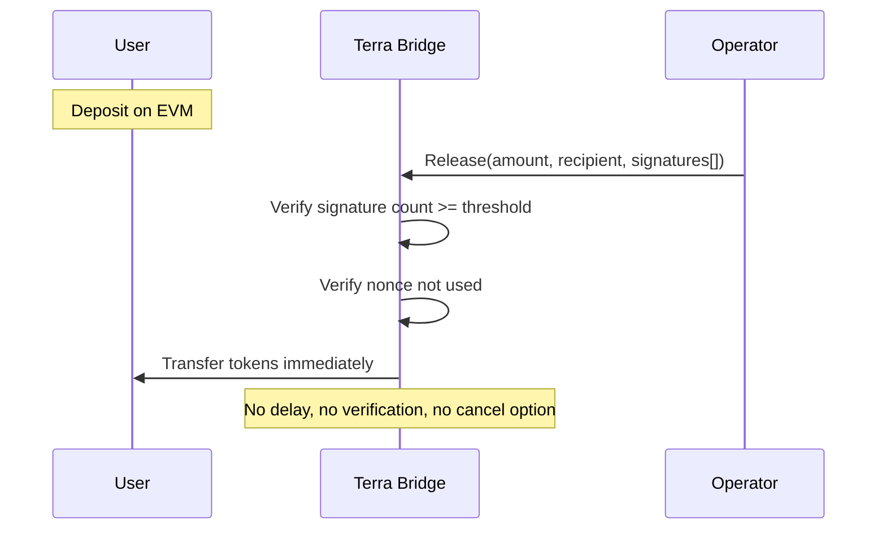
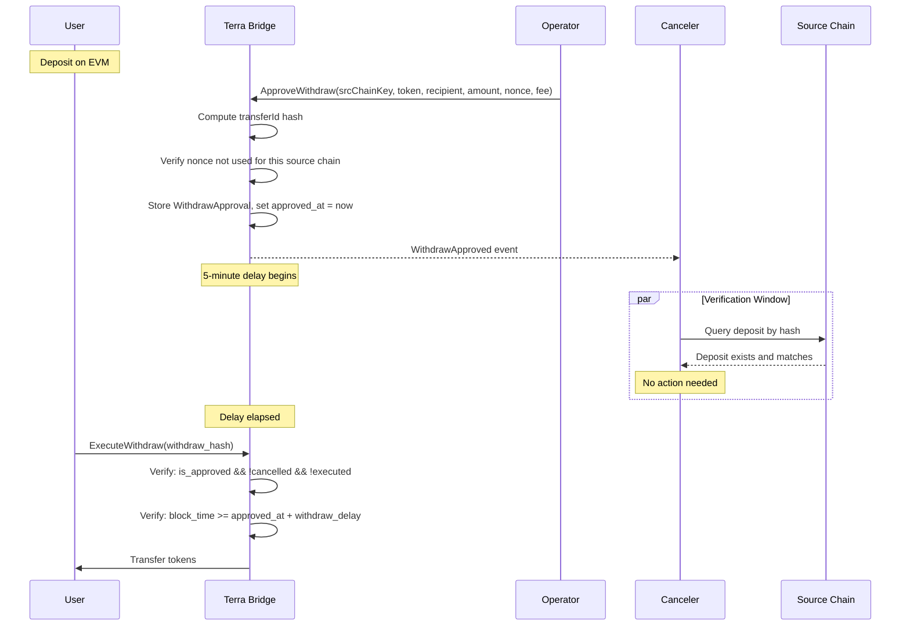

# Gap Analysis: Terra Classic Contract

This document provides a formal gap analysis between the EVM and Terra Classic bridge contracts, identifying security model differences and required upgrades.

## Executive Summary

The Terra Classic contract currently uses **immediate release** with multi-signature verification, while the EVM contract uses the **watchtower pattern** with approve-delay-cancel mechanics. This creates a security model asymmetry that must be resolved for cross-chain parity.

**Critical Finding**: Terra Classic lacks the watchtower security layer, meaning a compromised operator could drain funds immediately without any intervention window.

---

## Feature Comparison

### Core Security Features

| Feature | EVM | Terra Classic | Gap Severity |
|---------|-----|---------------|--------------|
| **Canonical TransferId Hash** | ✅ `_computeTransferId()` | ❌ Missing | 🔴 Critical |
| **Deposit Hash Storage** | ✅ `_depositHashes` set | ❌ Missing | 🔴 Critical |
| **Withdraw Hash Storage** | ✅ `_withdrawHashes` set | ❌ Missing | 🔴 Critical |
| **Approve Step** | ✅ `approveWithdraw()` | ❌ Missing | 🔴 Critical |
| **Delay Period** | ✅ `withdrawDelay` (5 min) | ❌ Missing | 🔴 Critical |
| **Cancel Functionality** | ✅ `cancelWithdrawApproval()` | ❌ Missing | 🔴 Critical |
| **Canceler Role** | ✅ Implemented | ❌ Missing | 🔴 Critical |
| **Cross-chain Verification** | ✅ Hash-based queries | ❌ Missing | 🔴 Critical |
| **Reenable Functionality** | ✅ `reenableWithdrawApproval()` | ❌ Missing | 🟡 High |
| **Nonce per Source Chain** | ✅ `_withdrawNonceUsed[srcChainKey][nonce]` | ⚠️ Global only | 🟡 High |
| **Rate Limiting** | ✅ `TokenRateLimit` guard | ❌ Missing | 🟡 High |

### Current Terra Classic Implementation

| Feature | Implementation | Notes |
|---------|----------------|-------|
| `Release` | Single-step immediate release | Bypasses all security layers |
| Signature Verification | Multi-sig threshold | Only protection layer |
| Nonce Tracking | `USED_NONCES` | Global, not per source chain |
| Token Release | Immediate on valid signatures | No delay window |

---

## Security Implications

### Attack Scenarios Without Watchtower

#### 1. Compromised Operator Attack

**Current State (Terra Classic)**:
```
Attacker compromises operator (single point)
    ↓
Attacker calls Release with forged parameters
    ↓
Tokens immediately transferred to attacker
    ↓
No intervention possible
```

**With Watchtower**:
```
Attacker compromises operator
    ↓
Attacker calls ApproveWithdraw with forged parameters
    ↓
5-minute delay begins
    ↓
Canceler queries source chain: no matching deposit
    ↓
Canceler calls CancelWithdrawApproval
    ↓
Attack blocked
```

#### 2. Amount Manipulation Attack

**Current State**:
- Operator submits `Release(amount=1000)` when deposit was `100`
- No verification mechanism
- If signatures valid, funds released

**With Watchtower**:
- Amount included in canonical hash
- Canceler computes expected hash from source chain
- Mismatch detected → cancellation

#### 3. Recipient Theft Attack

**Current State**:
- Operator submits `Release(recipient=attacker)` instead of real user
- No verification mechanism
- Funds sent to attacker

**With Watchtower**:
- Recipient included in canonical hash
- Hash mismatch detected
- Cancellation before execution

### Risk Assessment Matrix

| Attack Type | Current Risk (Terra) | Risk with Watchtower | Reduction |
|-------------|---------------------|---------------------|-----------|
| Compromised Operator | 🔴 Critical | 🟢 Low | 90%+ |
| Amount Manipulation | 🔴 Critical | 🟢 Low | 95%+ |
| Recipient Theft | 🔴 Critical | 🟢 Low | 95%+ |
| Double Spend | 🟡 Medium | 🟢 Low | 80%+ |
| Replay Attack | 🟢 Low | 🟢 Low | - |

---

## Current vs Target State

### Terra Classic - Current Architecture



### Terra Classic - Target Architecture



---

## Required Changes

### New State Structures

```rust
/// Withdrawal approval tracking (keyed by transferId hash)
pub struct WithdrawApproval {
    pub src_chain_key: [u8; 32],
    pub token: String,
    pub recipient: Addr,
    pub dest_account: [u8; 32],  // For hash computation
    pub amount: Uint128,
    pub nonce: u64,
    pub fee: Uint128,
    pub fee_recipient: Addr,
    pub approved_at: Timestamp,
    pub is_approved: bool,
    pub deduct_from_amount: bool,
    pub cancelled: bool,
    pub executed: bool,
}

// State maps
WITHDRAW_APPROVALS: Map<[u8; 32], WithdrawApproval>  // hash → approval
WITHDRAW_NONCE_USED: Map<([u8; 32], u64), bool>     // (srcChainKey, nonce) → used
DEPOSIT_HASHES: Map<[u8; 32], DepositInfo>          // For outgoing deposits
CANCELERS: Map<&Addr, bool>                          // Authorized cancelers
```

### New Messages

| Message | Purpose | Authorization |
|---------|---------|---------------|
| `ApproveWithdraw` | First step of withdrawal (replaces `Release`) | Operator |
| `ExecuteWithdraw` | Complete withdrawal after delay | Anyone (typically user) |
| `CancelWithdrawApproval` | Cancel suspicious approval | Canceler |
| `ReenableWithdrawApproval` | Restore cancelled approval | Admin |
| `AddCanceler` | Register canceler address | Admin |
| `RemoveCanceler` | Unregister canceler address | Admin |
| `SetWithdrawDelay` | Configure delay period | Admin |

### New Queries

| Query | Purpose |
|-------|---------|
| `WithdrawApproval { withdraw_hash }` | Get approval status by hash |
| `ComputeWithdrawHash { ... }` | Compute hash without storing |
| `DepositHash { nonce }` | Get hash for outgoing deposit |
| `Cancelers {}` | List all cancelers |
| `WithdrawDelay {}` | Get current delay configuration |

### Configuration Changes

| Config Field | Type | Default | Description |
|--------------|------|---------|-------------|
| `withdraw_delay` | `u64` | `300` | Delay in seconds (5 minutes) |

---

## Deprecation: `Release` Message

**Decision**: Fully deprecate the `Release` message.

**Rationale**:
- CL8Y Bridge is not deployed to mainnet yet
- No migration path needed for existing users
- Clean break enables better security model

**Implementation**:
- Remove `Release` handler from contract
- Update operator to use `ApproveWithdraw` + `ExecuteWithdraw`
- No backward compatibility layer needed

---

## Hash Computation Parity

### EVM Formula

```solidity
bytes32 transferId = keccak256(abi.encode(
    srcChainKey,        // bytes32
    destChainKey,       // bytes32
    destTokenAddress,   // bytes32 (padded)
    destAccount,        // bytes32 (padded)
    amount,             // uint256
    nonce               // uint256
));
```

### Terra Classic Formula (Required)

```rust
fn compute_transfer_id(
    src_chain_key: &[u8; 32],
    dest_chain_key: &[u8; 32],
    dest_token_address: &[u8; 32],
    dest_account: &[u8; 32],
    amount: Uint128,
    nonce: u64,
) -> [u8; 32] {
    // Must match EVM's abi.encode layout exactly
    let mut data = Vec::with_capacity(192);
    data.extend_from_slice(src_chain_key);
    data.extend_from_slice(dest_chain_key);
    data.extend_from_slice(dest_token_address);
    data.extend_from_slice(dest_account);
    
    // uint256 amount - left-padded to 32 bytes
    let mut amount_bytes = [0u8; 32];
    let amount_u128 = amount.u128().to_be_bytes();
    amount_bytes[16..].copy_from_slice(&amount_u128);
    data.extend_from_slice(&amount_bytes);
    
    // uint256 nonce - left-padded to 32 bytes
    let mut nonce_bytes = [0u8; 32];
    let nonce_u64 = nonce.to_be_bytes();
    nonce_bytes[24..].copy_from_slice(&nonce_u64);
    data.extend_from_slice(&nonce_bytes);
    
    keccak256(&data)
}
```

### Address Encoding

**Decision**: Use Cosmos canonical address bytes (20 bytes), left-padded to 32 bytes.

```rust
fn encode_terra_address(addr: &Addr) -> [u8; 32] {
    let canonical = deps.api.addr_canonicalize(addr.as_str())?;
    let mut result = [0u8; 32];
    let bytes = canonical.as_slice();
    // Left-pad: put address bytes at the end
    result[32 - bytes.len()..].copy_from_slice(bytes);
    result
}
```

This matches EVM's approach where 20-byte addresses are left-padded to 32 bytes.

---

## Rate Limiting (Included)

Per the implementation decisions, rate limiting will be included in this upgrade.

### Configuration

```rust
pub struct RateLimitConfig {
    pub max_per_transaction: Uint128,
    pub max_per_period: Uint128,
    pub period_duration: u64,  // seconds
}

// State
RATE_LIMITS: Map<String, RateLimitConfig>     // token → config
PERIOD_TOTALS: Map<(String, u64), Uint128>    // (token, period) → total
```

### Enforcement

Rate limits checked during `ExecuteWithdraw`:
1. Verify `amount <= max_per_transaction`
2. Compute current period: `block_time / period_duration`
3. Verify `period_total + amount <= max_per_period`
4. Update `period_total`

---

## Implementation Priority

| Priority | Item | Justification |
|----------|------|---------------|
| P0 | Hash computation function | Foundation for all verification |
| P0 | `ApproveWithdraw` message | Replaces immediate release |
| P0 | `ExecuteWithdraw` message | Completes withdrawal after delay |
| P0 | `CancelWithdrawApproval` message | Enables fraud prevention |
| P0 | Delay enforcement | Core security mechanism |
| P1 | `ReenableWithdrawApproval` message | Reorg recovery |
| P1 | Canceler role management | Access control |
| P1 | Rate limiting | Defense in depth |
| P2 | Deposit hash storage | Enables bidirectional verification |
| P2 | Query endpoints | Developer experience |

---

## Testing Requirements

### Hash Parity Tests (Critical)

1. Generate test vectors from EVM contract
2. Verify Terra produces identical hashes
3. Test edge cases: max values, zero values, various address formats

### Security Tests

1. Verify delay enforcement (cannot execute early)
2. Verify cancel functionality
3. Verify nonce-per-source-chain tracking
4. Verify unauthorized access blocked
5. Verify rate limit enforcement

### Integration Tests

1. End-to-end EVM → Terra with new flow
2. Canceler verification simulation
3. Reorg handling (cancel + reenable)

---

## Related Documentation

- [Security Model](./security-model.md) - Watchtower pattern explanation
- [Cross-Chain Parity](./crosschain-parity.md) - Parity requirements
- [EVM Contracts](./contracts-evm.md) - Reference implementation
- [Terra Classic Contracts](./contracts-terraclassic.md) - Current implementation
