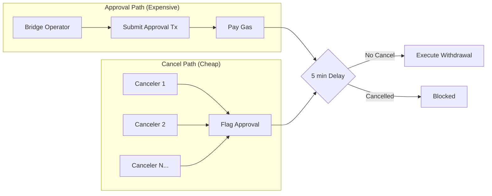
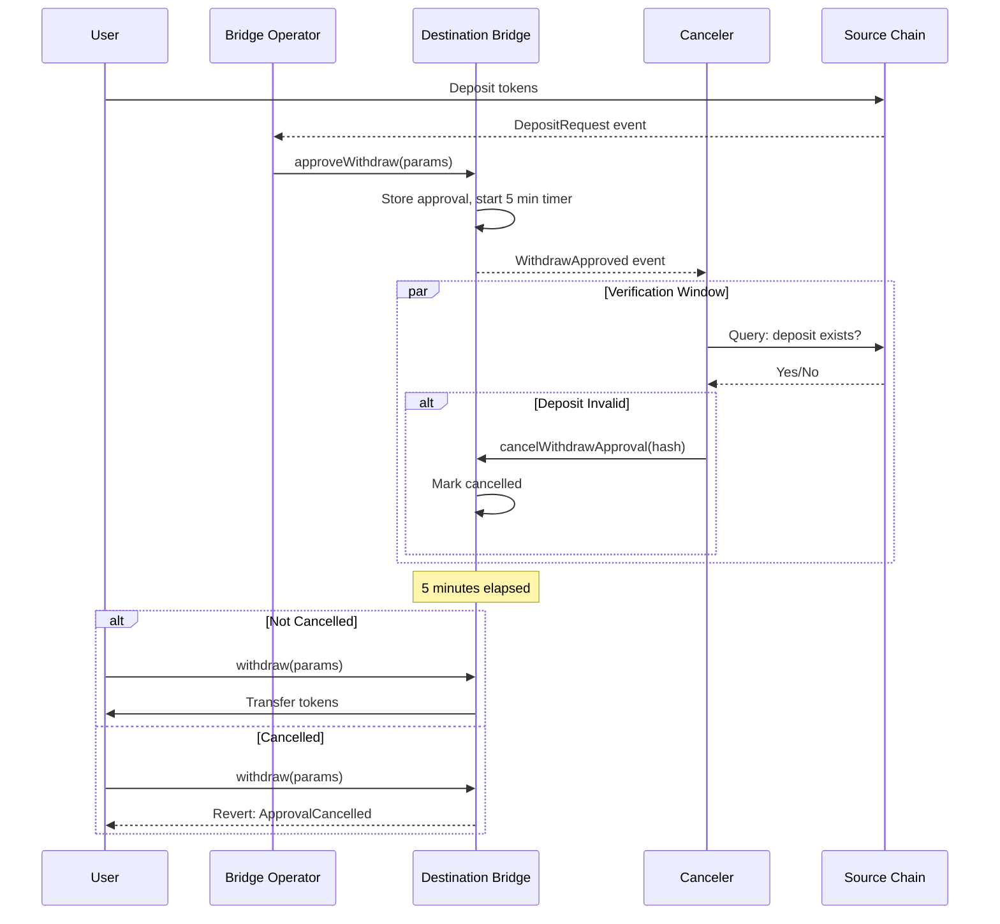
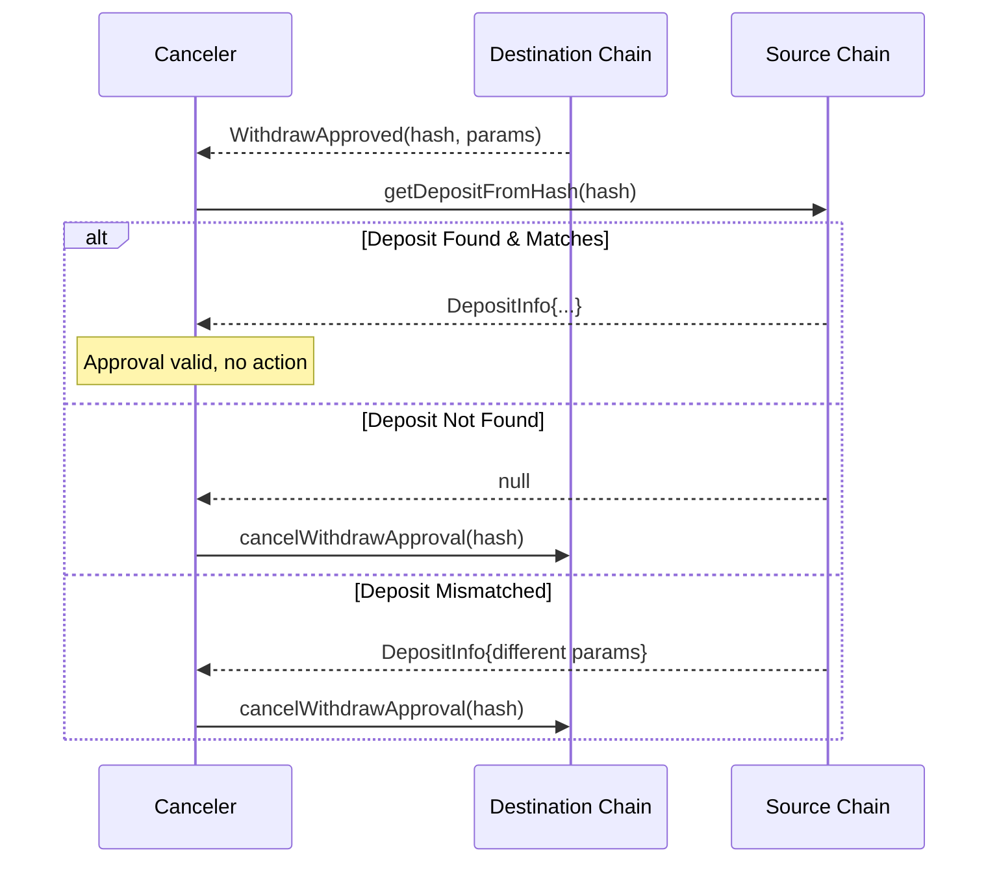
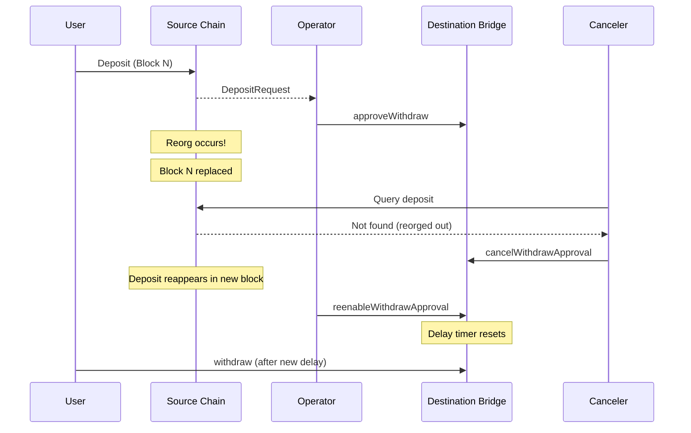

# Security Model

This document describes the watchtower security model used by CL8Y Bridge to protect cross-chain transfers.

## Overview

CL8Y Bridge uses a **watchtower security model** that provides strong security guarantees while maintaining fast transfer times and low costs. The key insight is that **canceling is cheap, approving is expensive** — creating an asymmetry that favors defenders.



## The Watchtower Pattern

### How It Works

1. **Approval**: The bridge operator calls `approveWithdraw` to approve a pending withdrawal
2. **Delay Window**: A mandatory delay period (default 5 minutes) begins
3. **Monitoring**: Cancelers watch for approvals and verify them against source chain deposits
4. **Cancel or Execute**: Either a canceler cancels a fraudulent approval, OR the user executes after the delay



### Why This Is Secure

| Attack Scenario | Prevention |
|-----------------|------------|
| Compromised operator approves fake withdrawal | Cancelers detect missing deposit, cancel before execution |
| Operator manipulates amount or recipient | Hash includes all params; mismatch triggers cancellation |
| Double-spend attempt | Nonce tracking per source chain prevents duplicate approvals |
| Race to drain funds | 5-minute window gives ample time for any canceler to act |

**Key Insight**: An attacker must fool **all** cancelers. A defender only needs **one** honest canceler to succeed.

---

## Centralized Operator + Decentralized Cancelers

CL8Y Bridge intentionally uses a **single centralized operator** for approvals, secured by a **decentralized network of cancelers**.

### Why a Single Operator?

| Benefit | Explanation |
|---------|-------------|
| **Speed** | No waiting for multiple signatures—transactions process immediately |
| **Cost** | One approval transaction instead of N signatures |
| **Simplicity** | Clear accountability; operator reputation is at stake |
| **UX** | Users don't wait for quorum or deal with stuck transactions |

### Why This Is Secure

Security comes from the **asymmetry between approving and canceling**:

- **Approving is expensive**: The operator must submit a valid on-chain transaction with gas
- **Canceling is cheap**: Any canceler can flag a suspicious approval with minimal gas
- **One honest canceler wins**: Only one canceler needs to catch fraud to protect users
- **Delay window**: All approvals wait before execution—plenty of time to cancel

### Comparison with Traditional Multisig

```
Traditional Multisig:
  ┌─────┐ ┌─────┐ ┌─────┐
  │Sig 1│ │Sig 2│ │Sig 3│ ──► 3-of-5 consensus ──► Execute
  └─────┘ └─────┘ └─────┘
  
  Problem: Slow, expensive, requires coordination
           If 3 keys compromised, funds at risk

CL8Y Watchtower Model:
  ┌──────────┐
  │ Operator │──► Approve ──► 5 min Delay ──► Execute
  └──────────┘                   ↑
                                 │ Any canceler can stop
  ┌──────────┐ ┌──────────┐      │
  │Canceler 1│ │Canceler 2│ ─────┴──► Cancel if fraud detected
  └──────────┘ └──────────┘
  (Raspberry Pi nodes on opBNB)
  
  Advantage: Fast approval, cheap monitoring, same security
             Only need 1 honest canceler out of N
```

---

## Roles and Permissions

### Bridge Operator

The operator is responsible for approving legitimate withdrawals.

| Responsibility | Details |
|----------------|---------|
| Monitor deposits | Watch source chain for DepositRequest events |
| Submit approvals | Call `approveWithdraw` with correct parameters |
| Handle reorgs | Cancel approvals for reorged deposits, reenable if they reappear |
| Pay gas costs | Cover transaction fees for approvals |

**Trust Requirement**: The operator can delay approvals but cannot steal funds (cancelers prevent this).

**Permission**: `approveWithdraw`, `cancelWithdrawApproval`, `reenableWithdrawApproval`

### Canceler

Cancelers are the security backbone—they verify approvals and stop fraudulent ones.

| Responsibility | Details |
|----------------|---------|
| Monitor approvals | Watch destination chain for WithdrawApproved events |
| Verify deposits | Query source chain to confirm deposit exists |
| Cancel fraud | Call `cancelWithdrawApproval` for invalid approvals |
| Run reliably | Maintain uptime during all bridge operations |

**Trust Requirement**: Cancelers cannot steal funds. They can only delay legitimate withdrawals (which admin can reenable).

**Permission**: `cancelWithdrawApproval` only

### Admin

The admin manages the bridge configuration and can recover from false-positive cancellations.

| Responsibility | Details |
|----------------|---------|
| Manage cancelers | Add/remove canceler addresses |
| Configure delay | Set withdrawal delay period |
| Reenable approvals | Restore cancelled approvals that were false positives |
| Emergency response | Pause bridge if needed |

**Permission**: All configuration functions, `reenableWithdrawApproval`

---

## Canonical TransferId Hash

Every transfer is identified by a unique hash computed from its parameters. This enables cross-chain verification.

### Hash Computation

```solidity
bytes32 transferId = keccak256(abi.encode(
    srcChainKey,        // Source chain identifier
    destChainKey,       // Destination chain identifier  
    destTokenAddress,   // Token address on destination (bytes32)
    destAccount,        // Recipient account (bytes32)
    amount,             // Normalized amount
    nonce               // Unique nonce from source chain
));
```

### Why Each Field Matters

| Field | Purpose | Attack Prevented |
|-------|---------|------------------|
| `srcChainKey` | Identifies source chain | Cross-chain replay |
| `destChainKey` | Identifies destination chain | Wrong-chain replay |
| `destTokenAddress` | Token on destination | Token substitution |
| `destAccount` | Recipient address | Recipient manipulation |
| `amount` | Transfer amount | Amount manipulation |
| `nonce` | Unique sequence number | Double-spend/replay |

### Cross-Chain Verification

Cancelers verify approvals by:

1. Observe `WithdrawApproved` event with `withdrawHash`
2. Query source chain: `bridge.getDepositFromHash(withdrawHash)`
3. If deposit exists and matches → approval is valid
4. If deposit missing or mismatched → call `cancelWithdrawApproval(withdrawHash)`



---

## Delay Window

The delay window is the critical security mechanism that gives cancelers time to act.

### Configuration

| Parameter | Default | Range |
|-----------|---------|-------|
| `withdrawDelay` | 5 minutes | 1 min - 24 hours |

### Timing Guarantees

- Delay timer starts when `approveWithdraw` is called
- `withdraw` reverts with `WithdrawDelayNotElapsed` if called early
- Reenabling a cancelled approval resets the timer
- Delay applies to all transfers regardless of amount

### Why 5 Minutes?

| Consideration | Analysis |
|---------------|----------|
| Block finality | Most EVM chains finalize in < 1 minute |
| Source chain query | Round-trip RPC call < 10 seconds |
| Canceler processing | Detection + tx submission < 30 seconds |
| Safety margin | 4+ minutes of buffer |
| User experience | Acceptable wait time for security |

---

## Reorg Handling

Blockchain reorgs can cause deposits to temporarily disappear. The watchtower pattern handles this gracefully.

### Scenario: Deposit Reorged Out



### Key Points

- **Cancel is safe**: If deposit is truly gone, cancellation was correct
- **Reenable recovers**: If deposit reappears, admin can restore the approval
- **Timer resets**: Reenabling gives cancelers another chance to verify
- **No fund loss**: User's deposit is either completed or refundable on source

---

## Canceler Infrastructure

The canceler network is designed for **maximum accessibility** so anyone can participate.

### Hardware Requirements

| Component | Specification |
|-----------|---------------|
| **Device** | Raspberry Pi 4 (4GB RAM) or equivalent |
| **Power** | ~5W continuous |
| **Storage** | < 1GB (no blockchain sync) |
| **Bandwidth** | < 1 Mbps (event monitoring only) |
| **Uptime** | 24/7 recommended |

### Why Raspberry Pi?

- **Cost**: ~$50-100 one-time hardware cost
- **Power**: Runs on minimal electricity
- **Accessibility**: No data center or cloud required
- **Decentralization**: Home nodes worldwide
- **Reliability**: Solid-state, no moving parts

### Chain Choice: opBNB

Canceler transactions are submitted to opBNB (BNB Chain L2) for minimal costs.

| Metric | Value |
|--------|-------|
| **Gas cost** | ~$0.001 per cancel transaction |
| **Block time** | Sub-second finality |
| **RPC access** | Public endpoints available |
| **Security** | Secured by BNB Chain validators |

### Why opBNB?

- **100-1000x cheaper** than mainnet gas
- **Fast finality** ensures cancellations process quickly
- **No full node required** — RPC endpoints sufficient
- **Aligned with BSC ecosystem** (primary bridge target)

### Running a Canceler

A canceler node performs these operations in a loop:

```
1. Subscribe to WithdrawApproved events on destination chain
2. For each approval:
   a. Extract withdrawHash and parameters
   b. Query source chain for matching deposit
   c. If no match: submit cancelWithdrawApproval(hash)
3. Handle errors gracefully (retry, alert)
4. Maintain heartbeat/health checks
```

---

## Rate Limiting

In addition to the watchtower pattern, rate limiting provides defense-in-depth.

### Per-Token Limits

| Limit Type | Purpose |
|------------|---------|
| Per-transaction max | Caps single transfer size |
| Per-period max | Caps total volume over time window |
| Per-address limit | Prevents single-actor abuse |

### How It Works

Rate limits are enforced by guard modules:

```solidity
// TokenRateLimit guard
function checkWithdraw(address token, uint256 amount, address sender) {
    require(amount <= maxPerTransaction[token], "Exceeds tx limit");
    require(periodTotal[token] + amount <= maxPerPeriod[token], "Exceeds period limit");
    periodTotal[token] += amount;
}
```

### Configuration

Rate limits are configured per token in the GuardBridge:

| Parameter | Description |
|-----------|-------------|
| `maxPerTransaction` | Maximum single transfer amount |
| `maxPerPeriod` | Maximum total amount per time window |
| `periodDuration` | Time window length (e.g., 1 hour) |

---

## Security Properties Summary

| Property | Mechanism | Guarantee |
|----------|-----------|-----------|
| **No double-spend** | Nonce per source chain | Same deposit cannot be approved twice |
| **No fake withdrawals** | Hash verification | Must have matching deposit on source |
| **No amount manipulation** | Amount in hash | Mismatch triggers cancellation |
| **No recipient theft** | Recipient in hash | Mismatch triggers cancellation |
| **Time to respond** | 5-minute delay | Cancelers have window to act |
| **Decentralized defense** | Multiple cancelers | Only need 1 honest participant |
| **Low barrier to entry** | Raspberry Pi + opBNB | Anyone can run a canceler |
| **Volume protection** | Rate limiting | Caps exposure even if breach occurs |

---

## Related Documentation

- [EVM Contracts](./contracts-evm.md) - Contract implementation details
- [Terra Classic Contracts](./contracts-terraclassic.md) - CosmWasm implementation
- [Crosschain Flows](./crosschain-flows.md) - Transfer flow diagrams
- [Gap Analysis](./gap-analysis-terraclassic.md) - Security parity analysis
